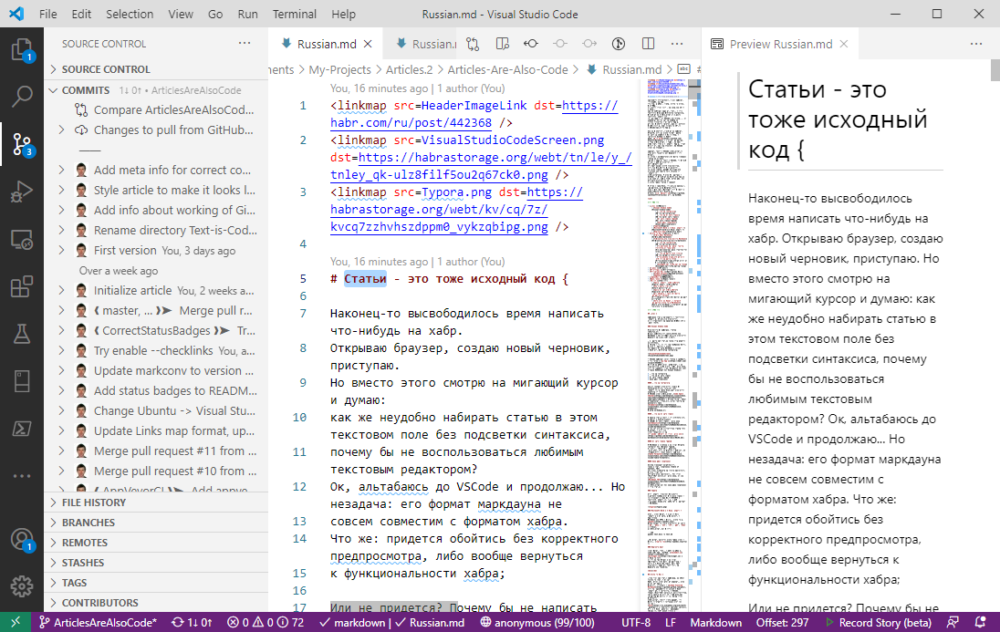
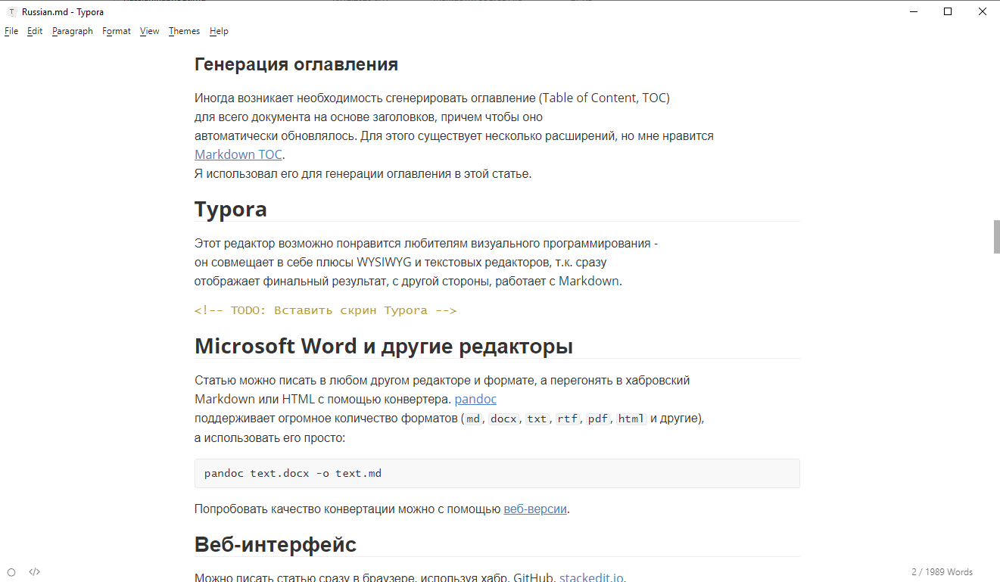

<linkmap src=HeaderImageLink dst=https://habr.com/ru/post/442368 />
<linkmap src=Title.png dst=https://habrastorage.org/webt/kb/pg/vy/kbpgvydehjm8ih1p6cxvq5oujpa.png />
<linkmap src=TextEditor.png dst=https://habrastorage.org/webt/jf/za/y8/jfzay8zzy7obtzbq6ebuy_kjgv4.png />
<linkmap src=TableFormatter.gif dst=https://habrastorage.org/webt/6u/jv/sk/6ujvskmanixihuhuzv8oha5kf1o.gif />
<linkmap src=MarkdownTOC.gif dst=https://habrastorage.org/webt/qb/sh/hd/qbshhd8at4jyxjh4aatyesenefy.gif />
<linkmap src=Typora.png dst=https://habrastorage.org/webt/kv/cq/7z/kvcq7zzhvhszdppm0_vykzqbipg.png />
<linkmap src=Markdown.png dst=https://habrastorage.org/webt/kk/oh/h_/kkohh_fcdlzf86dpjilyf5zkgrm.png />
<linkmap src=Git.png dst=https://habrastorage.org/webt/up/fb/cc/upfbccnjegpdo3rcuxozxmc1k-g.png />
<linkmap src=Proofreading.png dst=https://habrastorage.org/webt/hf/q_/sf/hfq_sfwlch0vnzt2trubq33py8s.png />
<linkmap src=GitHubActions.png dst=https://habrastorage.org/webt/fi/ej/fv/fiejfv_uv0n-wurxfhygtzcykua.png />
<linkmap src=Habr.png dst=https://habrastorage.org/webt/cf/ei/1k/cfei1ka04yu5e021ovuhsrlsr-s.png />

# Статьи - это тоже исходный код {



Открываю VS Code и начинаю набирать статью с самого начала.
Но вот незадача - формат маркдауна не совсем совместим с имеющимся форматом Хабра.
Получается выхода нет и придётся возвращаться к встроенному редактору Хабра;

> Или не придется?

В голову пришла идея написать утилиту, которая конвертирует разные форматы маркдаунов друг в друга,
например, из формата GitHub в формат Habr;

Такую
[программу](https://github.com/KvanTTT/MarkConv)
я в итоге и разработал.
Теперь не надо копировать статьи в редактор Хабра, чтобы посмотреть как она выглядит,
можно продолжать писать в любимом VS Code;

Хотя я и использую множество плагинов VS Code, но мысли о неэффективном процессе написания статей не исчезли.
Раз уж я набираю текст в VS Code, то почему бы сразу не делать коммиты контента в гит-репозиторий?

Это дало бы немало новых возможностей, которыми пользуются программисты:
версионирование, бекапы на локальные носители или веб-сервисы, правки от редакторов и пользователей.
А еще можно внедрить CD/CI;

В итоге, я написал небольшой гайд для разработчиков, как писать техническую документацию в редакторах, используя мою утилиту.
Саму утилиту можно посмотреть в
[моём репозитории](https://github.com/KvanTTT/Articles) на GitHub;

<cut>

<!-- TOC -->

- [Пишем {](#пишем-)
    - [Visual Studio Code](#visual-studio-code)
        - [Проверка синтаксиса](#проверка-синтаксиса)
        - [Проверка форматирования](#проверка-форматирования)
        - [Форматирование таблиц](#форматирование-таблиц)
        - [Генерация оглавления](#генерация-оглавления)
    - [Typora](#typora)
    - [Веб-интерфейс как редактор](#веб-интерфейс-как-редактор)
    - [Pandoc, как универсальный конвертер](#pandoc-как-универсальный-конвертер)
- [Конвертируем {](#конвертируем-)
    - [Используем MarkConv](#используем-markconv)
        - [Проверка синтаксиса с помощью MarkConv](#проверка-синтаксиса-с-помощью-markconv)
        - [Ограничение на размер текста относительно тега `cut`](#ограничение-на-размер-текста-относительно-тега-cut)
        - [Проверка абсолютных ссылок](#проверка-абсолютных-ссылок)
        - [Замена отображения локальных адресов ресурсов на абсолютные](#замена-отображения-локальных-адресов-ресурсов-на-абсолютные)
        - [Кликабельная титульная картинка](#кликабельная-титульная-картинка)
- [Храним {](#храним-)
- [Вычитываем {](#вычитываем-)
- [Автоматизируем {](#автоматизируем-)
    - [GitHub Actions](#github-actions)
    - [AppVeyor](#appveyor)
- [Публикуем {](#публикуем-)
- [Заключение {](#заключение-)

<!-- /TOC -->

<cut>

## Пишем {


Написание статьи начинается с выбора текстового редактора.
Существует большое количество специальных текстовых редакторов и всех их рассмотреть очень трудно,
поэтому я остановился на наиболее популярных и разнородных;

### Visual Studio Code

Возможности по написанию статей внушительны, тут и поддержка Markdown и разнообразие плагинов под любую задачу.
Также есть подсветка синтаксиса кода;

Интерфейс VS Code удобно разделён на окна: слева отображается код текста,
а справа - визуализация кода, работающая в реальном времени;

О VS Code написано много статей и гайдов, в том числе и
[на Хабре](https://habr.com/ru/post/442666/),
поэтому не буду много расписывать о возможностях редактора, а перечислю плагины,
которые оказались очень полезными для меня:

- Проверка синтаксиса
- Проверка форматирования
- Форматирование таблиц
- Генерация оглавления

#### Проверка синтаксиса

Проверка синтаксиса позволяет снизить количество ошибок по невнимательности,
экономит силы редакторов, а также уменьшает количество негатива от читателей;

В VS Code, для проверки синтаксиса, я использую
[Code Spell Checker](https://marketplace.visualstudio.com/items?itemName=streetsidesoftware.code-spell-checker) (русский словарь необходимо устанавливать отдельно),
и
[Grammarly](https://marketplace.visualstudio.com/items?itemName=znck.grammarly);

#### Проверка форматирования

В данной статье текст - это исходный код, а значит к нему применимы принципы форматирования.
Расширение
[markdownlint](https://marketplace.visualstudio.com/items?itemName=DavidAnson.vscode-markdownlint)
проверяет код на соответствие стандартным правилам, с которыми можно ознакомиться на
[странице репозитория этого расширения](https://github.com/markdownlint/markdownlint/blob/master/docs/RULES.md);

#### Форматирование таблиц


В Markdown громоздкий и не особо удобный синтаксис для описания таблиц.
К счастью, существуют различные расширения,
которые позволяют улучшить процесс создания и форматирования таблиц,
например, расширение
[Table Formatter](https://marketplace.visualstudio.com/items?itemName=shuworks.vscode-table-formatter);

#### Генерация оглавления


Иногда возникает необходимость сгенерировать оглавление (Table of Content, TOC)
для всего документа на основе заголовков, причем чтобы оглавление автоматически обновлялось.
Для этого существует несколько расширений,
но мне нравится плагин [Markdown TOC](https://marketplace.visualstudio.com/items?itemName=AlanWalk.markdown-toc).
Данный плагин я использовал для генерации оглавления в этой статье;

### Typora

[Typora](https://typora.io/) возможно понравится любителям визуального программирования, так как
совмещает в себе плюсы `WYSIWYG` и текстовых редакторов и позволяет сразу
увидеть финальное представление текста в документе. Typora поддерживает Markdown;



### Веб-интерфейс как редактор

Можно писать статьи сразу в веб-браузере, используя, например, Хабр, GitHub,
[stackedit.io](https://stackedit.io),
[dillinger.io](https://dillinger.io)
и другие сервисы.
Хотя это не так удобно и не особо вписывается в процессы разработчика,
зато дает возможность набирать текст хоть на планшете или телефоне;

### Pandoc, как универсальный конвертер

[Pandoc](https://pandoc.org/)
универсальная утилита, позволяющая конвертировать одни текстовые файловые форматы в другие.
Можно использовать word или latex как основной текстовый редактор и в дальнейшем,
с помощью pandoc, конвертить один формат в другой.
Pandoc поддерживает огромное количество форматов, например, `md`, `docx`, `txt`, `rtf`, `pdf`, `html` и другие.
При этом, pandoc очень прост в использовании и позволяет форматировать один файл в другой с помощью одной команды, например:

```bash
pandoc text.docx -o text.md
```

Также есть
[веб-версия](http://pandoc.org/try/),
позволяющая воспользоваться возможностью конвертации в режиме онлайн;

<h2>}</h2>

## Конвертируем {


После того как статья написана, её нужно сконвертировать в Markdown-формат Хабра.
Этого можно было бы избежать, если бы markdown-синтаксис Хабра полностью сочетался с
[GitHub Flavored Markdown](https://github.github.com/gfm/),
который реализуется во многих других редакторах, в частности, в VS Code;

Однако существует несколько несоответствий, самое важное из которых - неправильная обработка переносов строк.
Из-за этого приходится использовать однострочные абзацы,
что плохо сочетается с системами контроля версий -
[diff](https://ru.wikipedia.org/wiki/Diff)
раздувается и становится малоинформативным.
Есть и другие различия: спойлеры, относительные ссылки, которые часто
используются в оглавлении. С
[полным списком](https://github.com/limonte/dear-habr/issues?q=is:issue+is:open+label:markdown)
можно ознакомиться на странице issues в репозитории dear-habr.
MarkConv разрешает эти несоответствия;

### Используем MarkConv

Конвертировать правильно можно с помощью утилиты
[MarkConv](https://github.com/KvanTTT/MarkConv)
следующим образом:

1. Устанавливаем [.NET Core](https://dotnet.microsoft.com/download) (если его еще нет).

2. Устанавливаем `.NET Tool` следующим образом:

  ```
  dotnet tool install -g MarkConv.Cli --version 1.0.0 --add-source https://www.myget.org/F/mark-conv/api/v3/index.json
  ```

3. Конвертируем статью в формат маркдаун-синтаксиса Хабра следующим образом:

  ```bash
  markconv -f <article.md> -o Habr
  ```

Утилиту можно запускать и в batch-режиме из папки с md-файлами,
что позволит запустить конвертацию сразу нескольких файлов одновременно;

По завершению процесса конвертирования статью можно публиковать на Хабр;

Стоит отметить, что MarkConv конвертирует не только в формат Хабра,
но и в формат
[dev.to](https://dev.to/),
а также делает другие полезные проверки и замены;

#### Проверка синтаксиса с помощью MarkConv

В тексте в формате Markdown нет формальных ошибок - уместна любая последовательность символов.
Это и достоинство и недостаток - текст всегда можно прочитать,
но какие-то вещи могут ненамеренно отображаться некорректно;

Однако в таком тексте могут использоваться HTML-секции,
в которых могут быть ошибки типа незакрытых тегов.
В своих статьях я сразу нашел несколько, например:

```log
[INFO] Converting of file /home/appveyor/projects/articles/Modern-Presentations-Format/Russian.md...
[WARN] Incorrect nesting: element </href> at [358,162..166) closes <a> at [358,14..15)
```

#### Ограничение на размер текста относительно тега `cut`

На Хабре есть резонные ограничения на размер текста до и после использования тега `cut`.
MarkConv проверяет эти правила и выводит ошибку при нарушении, например:

```log
You need to insert <cut/> tag if the text contains more than 1000 characters
```

#### Проверка абсолютных ссылок

Использование ключа `--checklinks` позволит запустить утилиту MarkConv на проверку всех ссылкок вида `http://`;

На данный момент это работает с некоторой задержкой и не всегда корректно,
возможно таким образом на внешних сервисах реализована защита от DDoS-атак;

#### Замена отображения локальных адресов ресурсов на абсолютные

Чтобы ресурсы не зависели от внешних сервисов (например, картинки),
то имеет смысл использовать тег `linkmap` следующим образом:

```md
<linkmap src=Markdown.svg dst=https://habrastorage.org/getpro/habr/post_images/a40/f88/64c/a40f8864c5f8db7888076cf30f5411f5.svg />
```

где: `src` - адрес локального ресурса, а `dst` - удалённого.

При этом картинку нужно еще дублировать на сторонний сервис.
Таким образом, статья всегда будет правильно открываться локально,
даже если сервер с картинками упал, в том числе и
[Habrastorage](https://web.habrastorage.org/en#ready);

Посмотреть как это работает можно на примере
[одной из моих статей](https://github.com/KvanTTT/Articles/edit/master/Modern-Presentations-Format/Links.ignore.md);

Этот метод также можно использовать для редиректа ссылок на локальные статьи -
одна статья будет всегда ссылаться на другую;

#### Кликабельная титульная картинка

Часто заглавную картинку делают кликабельной, чтобы при клике открывалась
сама статья. Для этого достаточно добавить такую строчку в исходник текста:

```md
<linkmap src=HeaderImageLink dst=https://habr.com/путь-к-статье />
```

<h2>}</h2>

## Храним {


Исходники текста написаны, а публикуемые файлы получены с помощью конвертера.
Теперь хотелось бы их сохранить в репозитории, но сначала необходимо определиться
с структурой репозитория. Я разработал такую структуру:<br><br><br>

- Каждая статья хранится в определенной папке. Название этой папки -
  перевод заголовка статьи, в котором пробелы заменены на дефисы, а
  запрещенные в url-символы игнорируются, например, для этой статьи названием будет являться следующее имя: `Article-is-also-code`;
- Сам `md` файл внутри этой папки именуется языком, на котором эта статья написана, например, `Russian.md` или `English.md`;
- Опционально. Локальные картинки и ресурсы хранятся либо в корневой
  папке статьи, либо в подпапке `Images` и маппятся с помощью утилиты MarkConv;

Использование такой структуры позволяет понять о чем статья и на каком языке она написана.
Например, для этой статьи ссылка такая:
<https://gitlab.ptsecurity.com/writers/Articles/blob/master/Article-is-also-code/Russian.md>;

В качестве навигации по документам, расположенным в репозитории,
можно использовать файл `README`.md в корне репозитория,
который содержит в себе список статей в хронологическом порядке, даты и порталы публикаций,
описания и другую информацию;

Также имеет смысл хранить статью в приватном репозиторий до её публикации.
А после публикации пушить ветку в зеркальный публичный репозиторий.
В GitHub и GitLab такая возможность предоставляется бесплатно;

<h2>}</h2>

## Вычитываем {


После того, как исходники статьи написаны и запушены,
редакторы могут сделать "ревью" статьи, т.е. вычитку.
Можно использовать знакомые для программиста инструменты: создавать `issue`,
предлагать `pull request` и даже принимать участие в дискуссиях - новой возможности GitHub;

После публикации статьи предлагать изменения сможет не только ограниченный круг лиц,
но и все зарегистрированные пользователи.
Так можно удобно исправлять имеющиеся опечатки;

<h2>}</h2>

## Автоматизируем {


Непрерывная интеграция - вишенка на торте любого более менее зрелого процесса разработки.
Благодаря ей, сторонние сервисы после каждого коммита проверяют,
конвертируют и архивируют статьи, а затем выкладывают их в собственное хранилище;

Готовый результат можно сразу копировать в черновик Хабра, минуя запуск утилиты
на локальном компьютере.
Таким образом, становится возможным править статьи с помощью веб-браузера;

Я использую сервисы
[GitHub Actions](https://github.com/features/actions)
и
[AppVeyor](https://www.appveyor.com/);

### GitHub Actions

GitHub Actions удобно использовать когда вся разработка ведется на GitHub,
к тому же он работает на приватных репозиториях даже в базовом бесплатном варианте;

В репозитории со статьями достаточно создать файл по аналогии с
[данным примером](https://github.com/KvanTTT/Articles/blob/master/.github/workflows/publish-articles.yml):

<details>
<summary>publish-articles.yml</summary>

```yml
name: Articles Converting and Publishing

on: [push, pull_request]

jobs:
  build:
    # Можно использовать и windows
    runs-on: ubuntu-latest

    steps:
      # Checks-out your repository under $GITHUB_WORKSPACE, so your job can access it
      - uses: actions/checkout@v2

      # Установка .NET Core
      - name: Install .NET Core
        uses: actions/setup-dotnet@v1
        with:
          dotnet-version: 3.1.101

      # Установка .NET Core Tool
      - name: Install MarkConv
        run: dotnet tool install -g MarkConv.Cli --version 1.2.0 --add-source https://www.myget.org/F/mark-conv/api/v3/index.json

      # Запуск утилиты MarkConv на все статьях в корневой папке
      - name: Run MarkConv
        run: markconv -f ./ -o Habr --checklinks

      # Публикация сконвертированных статей
      - name: Deploy Articles
        uses: actions/upload-artifact@v2
        with:
          name: articles
          path: ./_Output
```

</details>

### AppVeyor

Данный сервис для меня даже оказался удобней, поскольку он может публиковать статьи по файлам, а не единым архивом.
Конфигурация сервиса находится в файле
[appveyor.yml](https://github.com/KvanTTT/Articles/blob/master/appveyor.yml);

<details>
<summary>appveyor.yml</summary>

```yml
image:
- Ubuntu
version: "{build}"
skip_branch_with_pr: true

before_build:
- ps: |
    dotnet tool install -g MarkConv.Cli --version 1.2.0 --add-source https://www.myget.org/F/mark-conv/api/v3/index.json
build_script:
- ps: |
    markconv -f ./ -o Habr --checklinks
after_test:
- ps: |
    cd ./_Output
    foreach ($file in Get-ChildItem ./)
    {
        Push-AppveyorArtifact $file.Name
    }
```

</details>

<h2>}</h2>

## Публикуем {


Артефакты получены, теперь можно копировать их на Хабр и публиковать.
К сожалению, этот шаг пока что невозможно автоматизировать, потому что
["API Хабра закрыт на реконструкцию"](https://habr.com/ru/docs/help/api/);

Надеюсь, в будущем публичный доступ восстановится,
и процесс публикации статей станет более автоматизированным;

<h2>}</h2>

## Заключение {

Итак, я пишу статьи в VS Code, храню их в Git, использую GitHub для разработки и
автоматизирую с помощью GitHub Actions - неплохой набор для программиста;

Я нашел для себя описанные наработки удобными для технических статей,
но пока что слишком громоздким для одноразовых статей типа новостных.
Мне нравится воспринимать статьи не просто как статический
текст, который пишется один раз, а средство коммуникации, которое включает в себя
меняющийся со временем контент и фидбек от других пользователей.
Первого можно достичь, если представлять текст статьи в виде кода,
второе предоставляет Хабр и другие социальные сервисы.
Кроме того, собственный репозиторий со статьями - надежный способ бекапа,
т.к. хранить его можно как на локальном диске, так и на GitHub;

Чтобы понять, удобны ли данные наработки для вас, я подготовил
несколько опросов, после которых станет понятней,
стоит ли дальше развивать эту концепцию;

В следующей статье я хотел бы рассказать о том,
как разрабатывалась утилита для конвертации MarkConv,
о ее технических деталях и возможном развитии;

<h2>}</h2>

