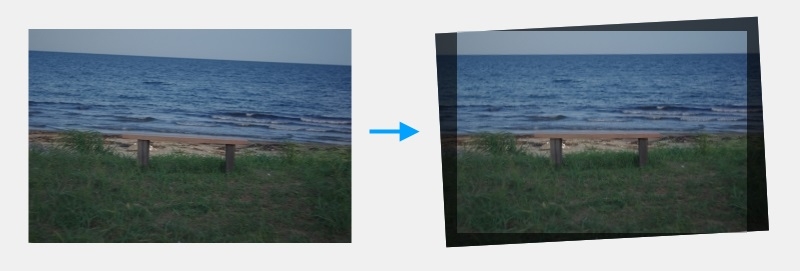
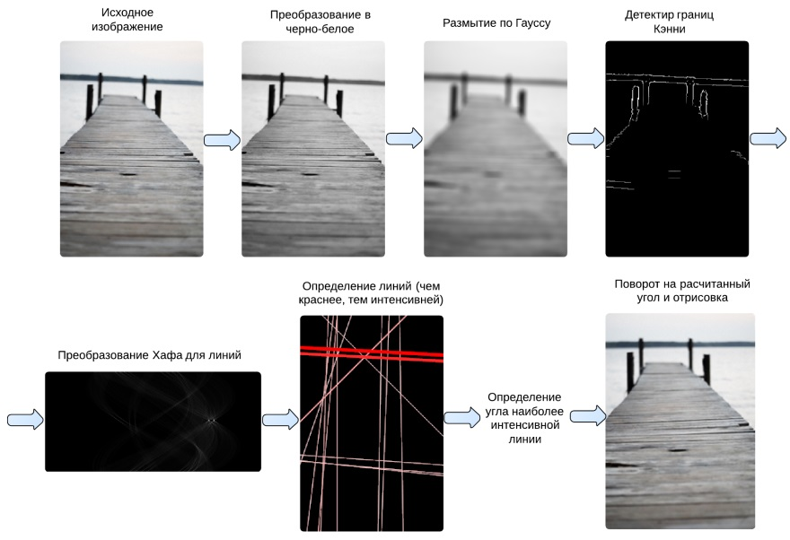
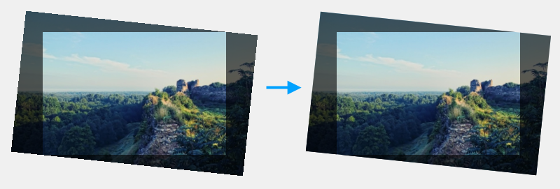

# Algorithm for Automatic Skyline Alignment

*Disclaimer. The original article was written in 2013, so some of this material may be irrelevant in 2017.*

The implemented method works for both square and rectangular images.
It is also capable of keeping the original proportions as well as stretching the image 
to make it cover the entire area when rotated. A simple program was written to illustrate this article.
If alignment is unsatisfactory, the angle can be manually changed by rotating the image
or drawing the skyline. In 2013, this technique was implemented at an online photo service Gfranq.

[](http://habrahabr.ru/post/194580/)

## Stages of the algorithm

To ensure the automatic skyline alignment is performed properly for most images, the process was 
divided into the following steps:

1. Edge detection
2. Detection of straight lines
3. Selection of the most intense line
4. Calculation of an angle between the selected line and the center of the image
5. Rotation of the image by a calculated angle
6. Calculation of the resulting inscribed rectangle

These steps will be described in detail in the following sections.

### Edge detection

It was decided to utilize the [Canny edge detector](https://en.wikipedia.org/wiki/Canny_edge_detector)
on the basis of both subjective and objective considerations. The process of Canny edge detection 
algorithm can be divided to the following steps:

1. Converting the image to black and white
2. Applying Gaussian filter to smooth the image in order to remove the noise
3. Finding the intensity gradients of the image
4. Applying non-maximum suppression to get rid of spurious response 
to edge detection and double threshold to determine potential edges

Since there is a detailed description on Wikipedia, we will not go into the specifics of above-mentioned steps.

### Detection of straight lines

After the edges were detected (by identifying points at which image brightness changes sharply
or has discontinuities), the algorithm for 
selecting straight lines is applied because the skyline appears as 
a straight or almost straight line, possibly affected by noise.
It was decided to use [Hough transform technique](https://en.wikipedia.org/wiki/Hough_transform).

Such a transformation returns an image (matrix) in which
slope coefficients of lines are calculated on their horizontal projection, and the distance from 
the image center to these lines is calculated vertically.
This creates inconvenience when performing further steps.

To solve this problem, the function for converting polar coordinates to rectangular coordinates was written:

```CSharp
private static WeightedLine HoughLineToTwoPointLine(double theta, short radius, double intensity, int width, int height)
{
    int r = radius;
    double t = theta;

    if (r < 0)
    {
        t += 180;
        r = -r;
    }

    t = (t / 180) * Math.PI;
    int w2 = width / 2;
    int h2 = height / 2;
    double x0 = 0, x1 = 0, y0 = 0, y1 = 0;
    if (theta != 0)
    {
        x0 = -w2;
        x1 = w2;
        double sint = Math.Sin(t);
        double cost = Math.Cos(t);
        y0 = (-cost * x0 + r) / sint;
        y1 = (-cost * x1 + r) / sint;
    }
    else
    {
        x0 = radius;
        x1 = radius;
        y0 = h2;
        y1 = -h2;
    }

    return new WeightedLine(x0 + w2, h2 - y0, x1 + w2, h2 - y1, intensity);
}
```

### Selection of the most intense line

Hough transform technique returns several lines, but there is only one horizon.
Therefore, it is necessary to select this line by some criterion.
The discussed approach is based on selection of the line with maximum intensity.

### Calculation of an angle between the selected line and the center of the image

At this step, the angle between the lines passing through the center of the image 
with the dimensions of `width` and` height` is calculated.
The first line is exactly vertical, while the second line is perpendicular 
to the segment `x1`,` y1`, `x2`, `y2`.

In other words, we calculate the angle by which the image needs to be 
rotated so that the segment `x1`,` y1`, `x2`,` y2` becomes horizontally aligned.

```CSharp
public static double CalculateAngle(int width, int height, double x1, double y1, double x2, double y2)
{
    double dx = x2 - x1;
    double dy = y2 - y1;
    double x3 = width / 2;
    double y3 = height / 2;
    double r = dx * dx + dy * dy;
    double nx = (dx * (x3 * dx - dy * y1) + dy * (dx * y3 + x1 * dy)) / r - x3;
    double ny = (dx * (y1 * dx - x1 * dy) + dy * (dx * x3 + dy * y3)) / r - y3;
    double result = Math.Atan2(ny, nx) + Math.PI / 2;
    if (result > Math.PI)
        result = result - Math.PI * 2;
    return result;
}
```

Also note that if the calculated angle exceeds a certain predetermined value 
(in our case, it is 45), then the automatic rotation will not be performed.

### Rotation of the image by a calculated angle

There are various algorithms to rotate the image in a proper manner.
Typically, they are all based on the use of [rotation matrix](https://en.wikipedia.org/wiki/Rotation_matrix) 
and an algorithm for smoothing. Fortunately, there are already functions that work 
at the hardware level with both browsers and desktop applications.

### Calculation of the resulting inscribed rectangle

After calculating the angle by which you want to rotate the image,
calculate the dimensions of the maximum rectangle inscribed in the rotated image.
This rectangle can be either proportional (in this case, the original image size is preserved, 
i.e. part of the inscribed image is stretched to the original dimensions), and nonproportional, 
covering the entire maximum area in the rotated image. To solve this problem, an appropriate 
[stackoverflow question](http://stackoverflow.com/q/5789239/1046374) was found and one of the 
answers was modified to the following code:

```JavaScript
calculateLargestRect = function(angle, origWidth, origHeight) {
    var w0, h0;
    if (origWidth <= origHeight) {
        w0 = origWidth;
        h0 = origHeight;
    }
    else {
        w0 = origHeight;
        h0 = origWidth;
    }
    // Angle normalization in range [-PI..PI)
    var ang = angle - Math.floor((angle + Math.PI) / (2*Math.PI)) * 2*Math.PI; 
    ang = Math.abs(ang);      
    if (ang > Math.PI / 2)
        ang = Math.PI - ang;
    var sina = Math.sin(ang);
    var cosa = Math.cos(ang);
    var sinAcosA = sina * cosa;
    var w1 = w0 * cosa + h0 * sina;
    var h1 = w0 * sina + h0 * cosa;
    var c = h0 * sinAcosA / (2 * h0 * sinAcosA + w0);
    var x = w1 * c;
    var y = h1 * c;
    var w, h;
    if (origWidth <= origHeight) {
        w = w1 - 2 * x;
        h = h1 - 2 * y;
    }
    else {
        w = h1 - 2 * y;
        h = w1 - 2 * x;
    }
    return {
        w: w,
        h: h
    }
}
```

To explain the technique for auto horizon alignment, I prepared a graphic illustration of the process:



### Rotating images in Google Chrome

This technique was implemented in JavaScript and works in browsers.
However, there is a bug in Google Chrome related to the lack of smoothing of image edges 
during transformations (for example, rotations), while the images themselves are interpolated correctly.
The figure below shows an illustrative example.

This bug does not affect other modern versions of browsers (IE, Firefox, Safari).

An easy way to avoid this bug is drawing a transparent 
border near the image (the image size will be 2 pixels smaller) using the following code:

```JavaScript
context.draw(image, 1, 1, decImageWidth - 2, decImageHeight - 2);
```

Thus, we managed to achieve the correct smoothing effect in all browsers:



## Conclusion

Varying the coefficients in the algorithm for detection of edges and 
Hough transform technique allowed us to achieve acceptable quality and efficiency 
of automatic alignment, which has been tested on a selection of images. 
If this technique for some reason does not work correctly with some images,
the angle can be easily corrected manually by rotating the image or drawing the skyline.