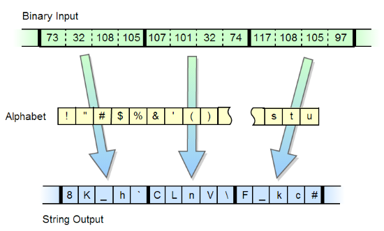
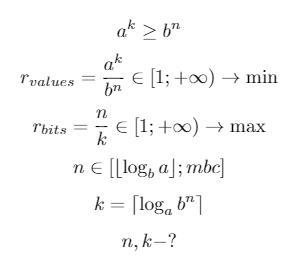
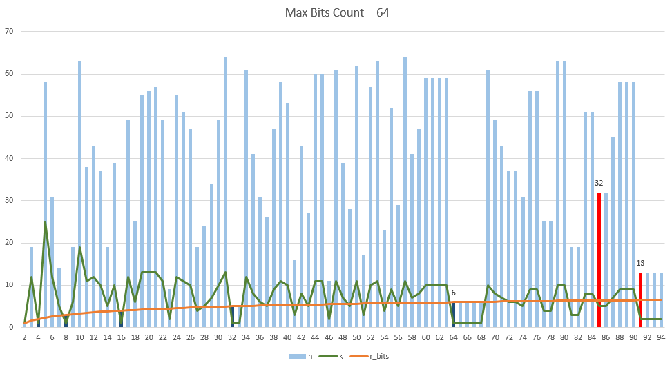

# Кодирование бинарных данных в строку с алфавитом произвольной длины (BaseN)



Всем хорошо известен алгоритм преобразования массива байт в строку base64.
Существует большое количество разновидностей данного алгоритма с
различными алфавитами, с хвостовыми символами и без. Есть модификации
алгоритма, в котором длина алфавита равна другим степеням двойки,
например 32, 16. Однако существуют и более интересные модификации, в
которых длина алфавита не кратна степени двойки, такими являются
алгоритмы [base85](http://ru.wikipedia.org/wiki/ASCII85),
[base91](http://sourceforge.net/projects/base91/). Однако мне не
попадался алгоритм, в котором алфавит мог бы быть произвольным, в том
числе длины, большей чем 256. Задача показалась мне интересной, и я
решил ее реализовать. Сразу выкладываю ссылку на
[**исходники**](https://github.com/KvanTTT/BaseNcoding) и [**демо на
js**](http://kvanttt.github.io/BaseNcoding/). Хотя разработанный
алгоритм имеет скорее теоретическое значение, я посчитал нужным описать
детали его реализации. Практически его можно использовать в случаях, когда
актуальна длина строки, а не ее размер в байтах (например, в квайнах).

## Произвольный алфавит

Чтобы понять как можно синтезировать такой алгоритм, я решил разобраться
в частном случае, а именно алгоритме base85. Идея у этого алгоритма
следующая: входной поток данных разделяется на блоки по 4 байта, затем
каждый их них рассматривается как 32-битное число со старшим байтом в
начале. Последовательным делением каждого блока на 85 получается 5 цифр в
85-ричной системе счисления. Далее каждая цифра кодируется печатным
символом из алфавита размером 85 символов и выводится в выходной
поток с сохранением порядка, от старшего разряда к младшему. Но почему
был выбран размер 4 байта, т.е. 32 бита? При таком размере
достигается оптимальное сжатие, т.е. задействуется минимальное
количество бит (2\^32 = 4294967296) при максимальном количестве символов
(85\^5 = 4437053125). Однако данную методику можно обобщить и на
любой другой алфавит. В конечном итоге была составлена математическая
система для поиска количества бит, при котором сжатие будет
максимальным:



В этой системе:

* `a` - размер алфавита `A`.
* `k` - количество кодируемых символов.
* `b` - основание системы счисления.
* `n` - количество бит в системе счисления `b` для представления `k` символов алфавита `A`.
* `r` - коэффициент сжатия (чем больше - тем лучше).
* `mbc` - максимальный размер блока в битах.
* `⌊x⌋` - наибольшее целое, меньшее x (floor).
* `⌈x⌉` - наименьшее целое, большее x (ceiling).

С помощью данной методики были найдены оптимальные комбинации бит и
закодированных в них символов, которые изображены на рисунке ниже.
Максимальный размер блока - 64 бита (такое число было выбрано из-за того, что
при большем количестве необходимо использовать большие числа). Как видим,
коэффициент сжатия не всегда увеличивается при увеличении количества
символов (это видно в области от 60 и от 91). Красными столбиками
изображены известные кодировки (85 и 91).

Из диаграммы можно сделать вывод, что такое количество символов для этих
кодировок было выбрано из-за того, что при этом используется минимальное количество
бит при хорошем коэффициенте сжатия. Стоит отметить, что при увеличении
максимального размера блока, диаграмма может и измениться (например, для
кодировки base85 при 64 битах размер блока будет равен 32 битам, а
количество символов - 5 при избыточности 1.25. Если же максимальный
размер блока увеличить до 256 бит, то размер блока будет равен 141 биту
при 22 символах и избыточности 1.2482).



## Этапы кодирования

Итак, поэтапно процесс кодирования выглядит следующим образом:

1.  Расчет оптимального размера блока (количество бит `n`) и
    количества соответствующих ему символов (`k`).
2.  Представление исходной строки в виде последовательности байтов
    (используется UTF8).
3.  Разбиение исходной последовательности байтов на группы по `n` бит.
4.  Преобразование каждой группы бит в число с системой счисления с
    основанием `a`.
5.  Просчет хвостовых бит.

Первый этап был рассмотрен выше. Для второго этапа
использовался метод для конвертации строки в массив байт (в C\# это
`Encoding.UTF8.GetBytes()`, а для JS он был написан
вручную `strToUtf8Bytes` и `bytesToUtf8Str`). Следующие три
этапа рассмотрены подробней. Обратное преобразование
последовательности символов в массив байт выглядит аналогичным образом.

### Кодирование блока бит

```csharp
private void EncodeBlock(byte[] src, char[] dst, int ind)
{
    int charInd = ind * BlockCharsCount;
    int bitInd = ind * BlockBitsCount;
    BigInteger bits = GetBitsN(src, bitInd, BlockBitsCount);
    BitsToChars(dst, charInd, (int)BlockCharsCount, bits);
}

private void DecodeBlock(string src, byte[] dst, int ind)
{
    int charInd = ind * BlockCharsCount;
    int bitInd = ind * BlockBitsCount;
    BigInteger bits = CharsToBits(src, charInd, (int)BlockCharsCount);
    AddBitsN(dst, bits, bitInd, BlockBitsCount);
}
```

`GetBitsN` возвращает число бит `BlockBitsCount` и начинающееся
с бита под номером `bitInd`. `AddBitsN` присоединяет число `bits`
длины `BlockBitsCount` бит к массиву байт `dst` на позиции `bitInd`.

### Конвертация блока бит в систему счисления с произвольным основанием и обратно

`Alphabet` - произвольный алфавит. Для обратного преобразования
используется заранее просчитанный обратный алфавит `InvAlphabet`.
Стоит отметить, что, например, для base64 используется прямой порядок
бит, а для base85 - обратный (`ReverseOrder`), `_powN` - степени
длины алфавита.

```csharp
private void BitsToChars(char[] chars, int ind, int count, BigInteger block)
{
    for (int i = 0; i < count; i++)
    {
        chars[ind + (!ReverseOrder ? i : count - 1 - i)] = Alphabet[(int)(block % CharsCount)];
        block /= CharsCount;
    }
}

private BigInteger CharsToBits(string data, int ind, int count)
{
    BigInteger result = 0;
    for (int i = 0; i < count; i++)
        result += InvAlphabet[data[ind + (!ReverseOrder ? i : count - 1 - i)]] * _powN[BlockCharsCount - 1 - i];
    return result;
}
```

### Обработка хвостовых бит

На решение данной проблемы было потрачено больше всего времени. Однако в
итоге получилось создать код для расчета основных и хвостовых бит и
символов без использования вещественных чисел, что позволило легко
распараллелить алгоритм.

* `mainBitsLength` - основное количество бит.
* `tailBitsLength` - хвостовое количество бит.
* `mainCharsCount` - основное количество символов.
* `tailCharsCount` - хвостовое количество символов.
* `globalBitsLength` - общее количество бит (`mainBitsLength + tailBitsLength`).
* `globalCharsCount` - общее количество символов (`mainCharsCount + tailCharsCount`).

#### Расчет основного и хвостового количества бит и символов при кодировании.

```csharp
int mainBitsLength = (data.Length * 8 / BlockBitsCount) * BlockBitsCount;
int tailBitsLength = data.Length * 8 - mainBitsLength;
int globalBitsLength = mainBitsLength + tailBitsLength;
int mainCharsCount = mainBitsLength * BlockCharsCount / BlockBitsCount;
int tailCharsCount = (tailBitsLength * BlockCharsCount + BlockBitsCount - 1) / BlockBitsCount;
int globalCharsCount = mainCharsCount + tailCharsCount;
int iterationCount = mainCharsCount / BlockCharsCount;
```

#### Расчет основного и хвостового количества бит и символов при декодировании.

```csharp
int globalBitsLength = ((data.Length - 1) * BlockBitsCount / BlockCharsCount + 8) / 8 * 8;
int mainBitsLength = globalBitsLength / BlockBitsCount * BlockBitsCount;
int tailBitsLength = globalBitsLength - mainBitsLength;
int mainCharsCount = mainBitsLength * BlockCharsCount / BlockBitsCount;
int tailCharsCount = (tailBitsLength * BlockCharsCount + BlockBitsCount - 1) / BlockBitsCount;
BigInteger tailBits = CharsToBits(data, mainCharsCount, tailCharsCount);
if (tailBits >> tailBitsLength != 0)
{
    globalBitsLength += 8;
    mainBitsLength = globalBitsLength / BlockBitsCount * BlockBitsCount;
    tailBitsLength = globalBitsLength - mainBitsLength;
    mainCharsCount = mainBitsLength * BlockCharsCount / BlockBitsCount;
    tailCharsCount = (tailBitsLength * BlockCharsCount + BlockBitsCount - 1) / BlockBitsCount;
}
int iterationCount = mainCharsCount / BlockCharsCount;
```

## JavaScript реализация

Я решил портировать данный алгоритм и на JavaScript. Для работы
с большими числами использовалась библиотека
[jsbn](https://github.com/andyperlitch/jsbn). Для интерфейса
использовался bootstrap. Результат доступен тут:
http://kvanttt.github.io/BaseNcoding/

## Заключение

Данный алгоритм написан так, что его легко портировать на другие языки и
распараллелить (это есть в C\# версии), в том числе и на GPU. Кстати,
про модифицирование алгоритма base64 под GPU с использованием C\# хорошо
написано здесь: [Base64 Encoding on a
GPU](http://www.codeproject.com/Articles/276993/Base-Encoding-on-a-GPU).

Корректность разработанного алгоритма была проверена на алгоритмах
base32, base64, base85 (последовательности получившихся символов
получались одинаковыми за исключением хвостов).
