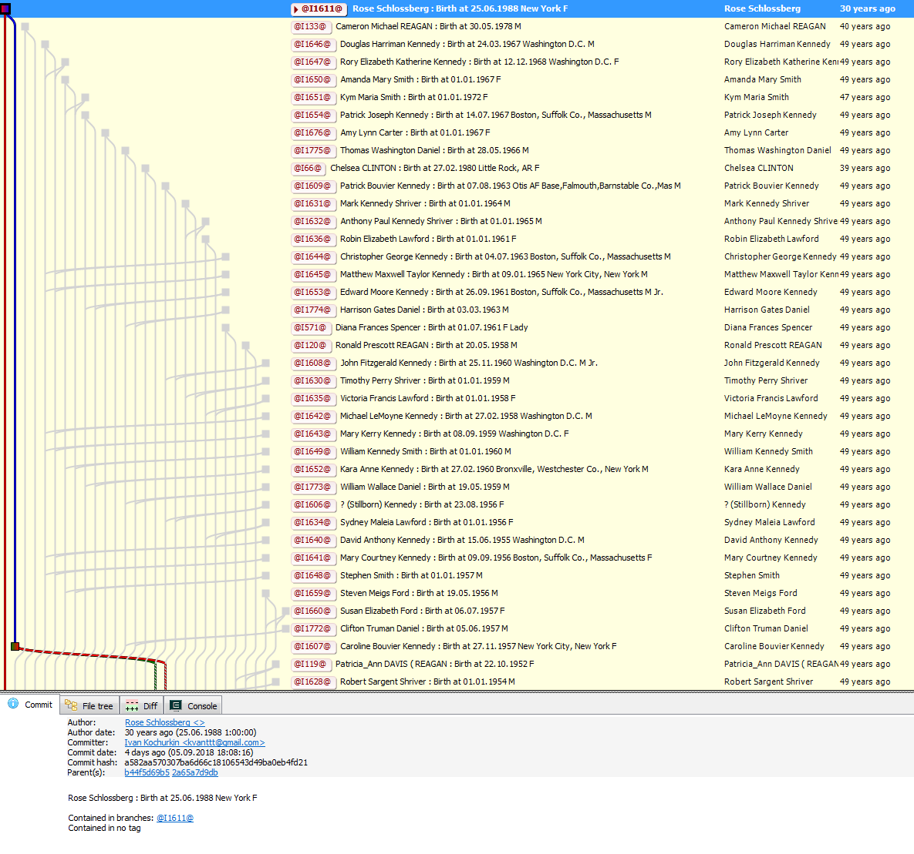

# Family tree inside Git

Happy programmer's day! I wish you more bright commits, merged pull requests,
less unexpected merges, and that your life branches remain relevant as long as
possible. As a conceptual gift, I propose the implementation of a family tree by
means of the Git version control system. Well... sounds like a plan!


For those who have immediately understood everything, I give links to the source
code: [GenealogyTreeInGit](https://github.com/KvanTTT/GenealogyTreeInGit.git)
and family trees: [mine](https://github.com/KvanTTT/Kochurkins.git) and [US
presidents'](https://github.com/KvanTTT/Presidents.git).

In addition, I implemented a simple [**social
graph**](https://en.wikipedia.org/wiki/Social_graph). It displays not only the
degree of kinship, but also the status of relations between descendants, events
such as wedding, divorce, childbirth, as well as contributions to the relations.

<cut text="More about implementation, details, and pictures">

## Git

<table> <tr> <td width=100></td> <td>Let me remind you that
<b><a href="https://en.wikipedia.org/wiki/Git">Git</a></b> is one of the most
popular version control systems. It is powerful: you can commit changes, create
(checkout) and merge branches, compare different versions of files (diff),
identify authors of specific strings (blame), and do many other things. </td>
</tr> </table>

Fortunately or unfortunately, Git is similar to the winner who rewrites history:
it allows you to change dates, messages, and authors of commits. But this allows
you to add family members, as if they are the authors of events made on a
specific date.

I started small: I wrote several commands and voila, a fragment of the tree is
ready. Fine. Now we are going to do this with the whole army of relatives. I
will be happy to write 200 lines of confusing code for them, and 10K lines for
presidents!

<!-- TODO добавить картинку -->

Have you already added me to the list of idiots? Strike off. Of course, I
automated the process and wrote an application for converting genealogical data
to a sequence of Git commands. There are several formats for such data, I chose
**GEDCOM**.

## Gedcom

<table> <tr> <td width=100></td> <td><b><a
href="https://en.wikipedia.org/wiki/GEDCOM">GEDCOM</a></b> is a specification
for exchanging genealogical data. This format is pretty old, but plain text and
simple. The specification is well <a
href="https://webtreeprint.com/tp_famous_gedcoms.php">described</a> on the
Internet. It is supported by almost all genealogical programs, so there are <a
href="https://webtreeprint.com/tp_famous_gedcoms.php">many examples</a> for it:
US presidents, the royal dynasty, Shakespeare.</td> </tr> </table>

I implemented all this mess in [.NET
Core](https://www.microsoft.com/net/learn/get-started-with-dotnet-tutorial) - it
is convenient and cross-platform. For parsing and processing GEDCOM, there are
several C# libraries, for
example,[GeneGenie.Gedcom](https://github.com/TheGeneGenieProject/GeneGenie.Gedcom),
[gedcomx-csharp](https://github.com/FamilySearch/gedcomx-csharp). I decided to
write my own library based on
[GedcomParser](https://github.com/jaklithn/GedcomParser), because it has a
[fatal flaw](https://en.wikipedia.org/wiki/Not_invented_here)... Actually, no: I
just wanted to understand the format myself and get rid of all dependencies,
which would allow, if necessary, to easily port the project to other languages.

## Command generation

It is time to process the extracted data in a convenient format and generate Git
commands for it. I decided to sort all the events in chronological order, and
then create branches, merge and commit them in ascending order of dates.
Unfortunately, not all events have dates, so it was not easy to sort all the
events correctly. 2^2^3 is coming, and I realized that this approach was not
entirely correct, since depth-first search would be much easier. Maybe I will
correct it later.

### Initialization

At this stage we just initialize the repository:

```
mkdir Family
cd Family
git init
```

### Events

In this part of the script we process and commit all events. To do this, the
following commands were used:

* `git checkout --orphan branch_name`
* `git merge @I1@ --allow-unrelated-histories --no-commit`
* `git commit -m "msg" --date "" --author "name <email>" --allow-empty`

The first command, `checkout`, creates a branch for each person. The `--orphan`
flag allows you to create orphan branches, i.e. branches without parents. The
orphan branch is created once - the next time you switch braches using the
`checkout` command this parameter is omitted. In the end, almost all commits
have parents, except the most distant ancestors, as the earlier ones are
unknown.

The second command, `merge`, unites the parents and creates the child. We write
"Birth" with the corresponding year in the commit message. We also specify the
flags `--allow-unrelated-histories` and `--no-commit` to enable merging orphan
branches and to commit changes later. Some children are adopted, so we write
"Adopted" for them. Funny, but Git allows group marriages, i.e. it is possible
to merge more than two branches at a time. And the branches do not have gender,
so you can call them "parent 1" and "parent 2".

Finally, the third command, `commit`, creates a new commit with the message
`-m`, the date `--date` and the author `--author`. As I already mentioned, Git
allows you to change the message, the author and the date of the commit.
Moreover, Git allows you to create commits without files with the flag
`--allow-empty`, and without messages with the flag `--allow-empty-message`. The
author also needs to specify an email, but Git accepts an empty one - you just
need to write `<>`. Unfortunately, Git does not respect the elderly: the lower
bound of the date of the commit is January 1, 1970 (the "start" of Unix Time) -
the earlier date will be incorrectly displayed. However, you can simply mention
the real date in the description. Nevertheless, Git accepts dates in the
future - look at my son Git. By the way, it is also possible to create single
parents.

#### Social graph

In the social graph, other events besides birth are also stored: baptism, change
of residence, graduation, marriage, divorce, death, funeral. After death ~~the
branch goes to digital heaven~~ the appearance of subsequent events, except
funerals, is impossible in the branch. On the server, you can make this branch
[protected](https://help.github.com/en/articles/about-protected-branches) (do
not worry: it is possible to "resurrect" it in the future, if necessary).

The event "Wedding" has two ancestors - spouses. "Divorce" has one ancestor -
the previous "Wedding". Family and parenting is work, so we can say that after
the wedding a new descendant also appears - "relationship" which ends after a
divorce. It resumes after the next wedding. In addition, several people may
participate in a relationship (merging several branches).

### Finalization

The cherry on the cake: we make a backup repository and upload all participants
to GitHub, GitLab, or any other server that supports Git. We can push the
branches one by one, but using the [magic
command](https://stackoverflow.com/a/10479068/1046374) we will push them all,
which is much faster and simpler:

```
git remote add origin https://gitlab.com/KvanTTT/Family.git
git push origin --all -u
```

To generate a common family tree, you need to pass the flag
`--only-birth-events` when starting the generator. In this case, one commit per
person (birth) will be created. Otherwise, a ~~social network~~ social graph
will be generated.

## Examples

As a small example, which will at least work everywhere, I created my family
tree, and a large example is the tree of US presidents (2145 people). They are
available in the [Kochurkins](https://github.com/KvanTTT/Kochurkins.git) and
[Presidents](https://github.com/KvanTTT/Presidents.git) repositories,
respectively. To create my own tree, I used the service
[geni.com](https://geni.com), from which I exported the tree to GEDCOM. A
generated script for creating a genealogical repository is available on
[Gist](https://gist.github.com/KvanTTT/4a713955a54a062313d43ebb5a96824a).

[](https://github.com/KvanTTT/Presidents.git)

On GitHub (and GitLab as well), you can navigate through ancestors and
descendants. This is similar to genealogical wiki systems
[Familypedia](http://familypedia.wikia.com) or
[WeRelate](https://www.werelate.org). However, GitHub/GitLab is more advanced:
the trees are easily downloaded from it (with the help of the `--clone`
command). And most importantly, you can open the entire graph at once. (In
existing genealogical programs, for some reason, there are difficulties with
opening even small graphs.) And you can do this using different tools (web
service, [Git Extesions](https://gitextensions.github.io/),
[Sourcetree](https://www.sourcetreeapp.com/),
[GitKraken](https://www.gitkraken.com/) and others). In addition, these services
can be used for free, unlike most of genealogical services.

It is noteworthy that on GitHub/GitLab even some sort of analytics is available:
you can find out who has the most ~~followed Instagram account~~ eventful life.
Or the most public: the `Insights` tab displays a list of people in order of
decreasing number of commits.

[](https://github.com/KvanTTT/Presidents/pulse)

Unfortunately, GitHub and GitLab do not display large trees correctly, but they
are stored properly - you can open the repository and check. Here is my tree in
the GitLab web interface:

[](https://gitlab.com/KvanTTT/Kochurkins/network/@I1@)

## Problems

It is not very clear how to complement history from the roots. For now you have
to generate it from the beginning from the GEDCOM file. Probably this can be
done with the help of rebase - you can try and tell in the comments. It would
also be better to rewrite the code to make it "commit-oriented", not
"event-oriented", because it is more Git-like: in fact, the branch is a sequence
of commits, not a separate entity. I also thought about implementing
[tags](https://git-scm.com/book/en/v2/Git-Basics-Tagging) and
[submodules](https://git-scm.com/book/en/v2/Git-Tools-Submodules), but for now I
don’t know how to do it better.

## Conclusion

If you extend the idea of family trees further to web services for developers,
then using [issues](https://help.github.com/articles/about-issues/) you can
create global tasks and distribute them according to
[milestones](https://help.github.com/articles/about-milestones/): childhood,
youth, adulthood, elderhood.

Besides family trees, you can use Git to encode genealogical trees of
programming languages (this is even more geeky), syntax trees, and any tree
structures. Git can also be useful for housewives to build relationships between
the characters of Brazilian soap operas :)

Practical benefit: this warm-up helps to better understand the structure of Git,
its commands, and the GEDCOM format for describing genealogical data.

*The sources of the article are [available on
GitHub](https://github.com/KvanTTT/Articles/tree/master/Genealogy-Tree-In-Git) -
please send Pull Request if you find any mistake or want to add something. For
converting to habr.com format, I used the library
[MarkConv](https://github.com/KvanTTT/MarkConv).*