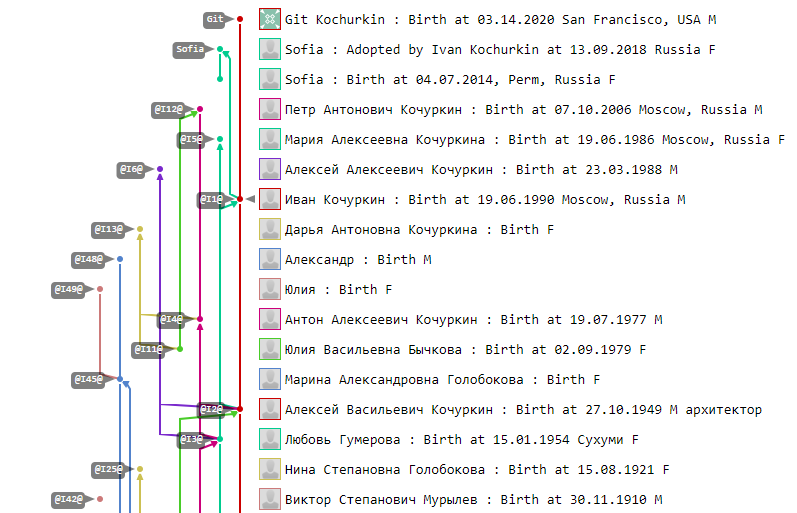

# Генеалогическое древо внутри Git

Поздравляю всех с днем программиста! Желаю больше ярких "коммитов",
принятых "пулл-реквестов", меньше незапланированных "мержей" и чтобы ваши ветви
жизни оставались актуальными как можно дольше. В качестве идейного подарка
предлагаю реализацию генеалогического древа средствами системы контроля версий Git.
Ну что же... звучит как план!


Для тех, кто сразу все понял, выкладываю исходники генератора: [GenealogyTreeInGit](https://github.com/KvanTTT/GenealogyTreeInGit.git)
и сами генеалогические древа - [мое](https://github.com/KvanTTT/Kochurkins.git)
и [президентов США](https://github.com/KvanTTT/Presidents.git).

Кроме того, я реализовал простой [**социальный граф**](https://ru.wikipedia.org/wiki/%D0%A1%D0%BE%D1%86%D0%B8%D0%B0%D0%BB%D1%8C%D0%BD%D1%8B%D0%B9_%D0%B3%D1%80%D0%B0%D1%84).
Он отображает не только степень родства, но и статус отношений между потомками,
отображает такие события как свадьба, развод, рождение ребенка, а также вклады в
отношения тех или иных сторон.

<cut text="Читать дальше о реализации, подробностях, а также смотреть картинки">

## Git

<table>
  <tr>
    <td width=100></td>
    <td>Напомню, что <b>Git</b> - одна из самых популярных систем контроля версий.
      Она мощная: в ней можно фиксировать изменения (commit), создавать и сливать
      ветви (checkout и merge), сравнивать разные версии файлов (diff), вычислять
      авторов конкретных строк (blame), а также делать многие другие вещи.
    </td>
  </tr>
</table>

К счастью или к сожалению, Git в чем-то похож на государство-победителя: он
позволяет менять историю, а именно менять даты, сообщения и авторов коммитов.
Но это наоборот содействует в том, что позволяет добавлять членов семьи,
как будто они авторы событий, сделанных в конкретную дату.

Начал я с простого: написал несколько команд и вуаля - фрагмент древа готов.
Отлично. Теперь надо это проделать со всей армией родственников. Я с радостью
напишу для них 200 строчек команд, в которых можно запутаться,
а для президентов - все 10К!

<!-- TODO добавить картинку -->

Добавили меня в список идиотов? Вычеркивайте. Конечно же, я автоматизировал
процесс и написал приложение для конвертации генеалогических данных в
последовательность команд гита. Существуют несколько форматов таких данных, я
выбрал **GEDCOM**.

## Gedcom

<table>
  <tr>
    <td width=100></td>
    <td><b>GEDCOM</b> - формат описания генеалогических древ. Довольно старый,
        но текстовый и в целом простой. Спецификация формата неплохо
        <a href="https://webtreeprint.com/tp_famous_gedcoms.php">описана</a>
        в интернете. Поддерживается чуть
        ли не всеми генеалогическими программами, поэтому примеров для него существует
        <a href="https://webtreeprint.com/tp_famous_gedcoms.php">множество</a>:
        древо президентов США, королевской династии, Шекспира.</td>
  </tr>
</table>

Я реализовал все это безобразие на [.NET Core](https://www.microsoft.com/net/learn/get-started-with-dotnet-tutorial) -
он удобный и кроссплатформенный. Для парсинга и обработки GEDCOM есть несколько
библиотек под C#, например [GeneGenie.Gedcom](https://github.com/TheGeneGenieProject/GeneGenie.Gedcom),
[gedcomx-csharp](https://github.com/FamilySearch/gedcomx-csharp).
Я решил написать собственную на основе [GedcomParser](https://github.com/jaklithn/GedcomParser).
Ну потому что она обладает [фатальным недостатком](https://ru.wikipedia.org/wiki/%D0%A1%D0%B8%D0%BD%D0%B4%D1%80%D0%BE%D0%BC_%D0%BD%D0%B5%D0%BF%D1%80%D0%B8%D1%8F%D1%82%D0%B8%D1%8F_%D1%87%D1%83%D0%B6%D0%BE%D0%B9_%D1%80%D0%B0%D0%B7%D1%80%D0%B0%D0%B1%D0%BE%D1%82%D0%BA%D0%B8)...
На самом деле, нет: мне захотелось самому лучше разобраться в формате и избавиться
от всех зависимостей, что позволит при желании легко портировать проект на другие
языки.

## Генерация команд

Настал момент обхода извлеченных личностей в удобном нам формате и генерации
команд Git для них. Было решено отсортировать все события в хронологическом
порядке, а затем создавать ветки, мержить и коммитить их, продвигаясь в порядке
возрастания дат. К сожалению, не у всех событий есть даты, поэтому пришлось изрядно
повозиться чтобы отсортировать все события правильно. На носу 2^2^3, и я осознал
что такой подход не совсем правильный, так как при обходе в глубину с датами
возиться вообще не пришлось бы. Исправлюсь позже (но это не точно).

### Инициализация

Все что требуется на этом этапе - инициализировать репозиторий:

```
mkdir Family
cd Family
git init
```

### События

В этой части скрипта обходятся и коммитятся все события. Для этого использовались
такие команды:

* `git checkout --orphan branch_name`
* `git merge @I1@ --allow-unrelated-histories --no-commit`
* `git commit -m "msg" --date "" --author "name <email>" --allow-empty`

Первая, `checkout`, создает ветвь для каждой личности. Флаг `--orphan` позволяет
создавать ветки-сироты, т.е. ветки не имеющие родителей. Ветка-сирота создается
один раз - при последующем переключении `checkout` этот параметр опускается.
В конечном итоге практически все коммиты имеют родителей, за исключением самых
дальних предков, потому что для них более ранние неизвестны.

Вторая команда, `merge`, объединяет родителей и создает ребенка. Будем писать в
сообщении коммита Birth - рождение с соответствующим годом. Также указываем флаги
`--allow-unrelated-histories` и `--no-commit` для возможности мержить ветки-сироты
и для того, чтобы закоммитить изменения позже. Некоторые дети являются приемными,
поэтому для них будем писать Adopted. Забавно, но Git позволяет создавать шведские
семьи, т.е. мержить одновременно несколько веток. А еще ветки не имеют пола, что
придется по душе любителям "родитель 1" и "родитель 2".

Наконец, третья команда, `commit`, создает коммит с сообщением `-m`,
датой `--date` и автором `--author`. Как уже писал, Git позволяет подменять сообщение,
автора и дату коммита. Более того, Git позволяет создавать коммиты без файлов с помощью
флага `--allow-empty` и без сообщений с помощью `--allow-empty-message`. У автора также
необходимо указывать электронную почту, но Git принимает и пустую - нужно просто
передать `<>`. К сожалению, Git не уважает стариков: дата коммита почему-то снизу
ограничена 1 январем 1970 года - более ранняя дата будет неправильно отображаться.
Однако все не так страшно: можно просто записывать реальную дату в
описание. Тем не менее, Git верит в будущее и принимает даты в будущем - обратите
внимание на моего сына Git. Матерей- и отцов-одиночек, кстати, тоже можно
создавать.

#### Социальный граф

В социальном графе фиксируются и другие события помимо рождения: крещение,
изменение места жительства, получение образования, женитьба, развод, смерть, похороны.
После смерти ~~ветвь попадает в цифровой рай~~ в ветви невозможно появление
последующих событий, разве что кроме похорон. На сервере такую
ветвь вообще можно запечатать, т. е. сделать [protected branch](https://help.github.com/articles/about-protected-branches/)
(не волнуйтесь: в будущем "воскресить" можно будет при необходимости).

Событие "Свадьба" имеет двух предков - супругов. А "Развод" имеет одного предка -
предыдущее событие "Свадьба". Над семейной жизнью надо работать как и над детьми,
поэтому можно сказать что после свадьбы появляется еще и новый потомок - "отношения",
которые заканчиваются после развода. Ну и возобновляются опять после следующих
циклов свадьба-развод. Кроме того, в отношениях могут участвовать несколько человек
(слияние нескольких веток).

### Финализация

Добавим вишенку к торту: сделаем бекап репозитория и выгрузим всех людей на GitHub,
GitLab, либо любой другой сервер, поддерживающий Git. Можно пушить все ветки
одну за другой, но мы с помощью [волшебной команды](https://stackoverflow.com/a/10479068/1046374)
запушим их все, что намного быстрее и проще:

```
git remote add origin https://gitlab.com/KvanTTT/Family.git
git push origin --all -u
```

Для генерации обычного генеалогического древа нужно передавать флаг
`--only-birth-events` при запуске генератора. В этом случае будет создаваться
по одному коммиту на человека (рождение). В противном случае будет
генерироваться ~~социальная сеть~~ социальный граф.

## Примеры

В качестве небольшого примера, который по крайней мере везде откроется, я создал
свое генеалогическое древо, а в качестве большого примера - древо президентов
США (2145 человек). Они доступны в репозиториях
[Kochurkins](https://github.com/KvanTTT/Kochurkins.git) и
[Presidents](https://github.com/KvanTTT/Presidents.git) соответственно. Для создания
своего я использовал сервис [geni.com](https://geni.com), откуда экспортировал
древо в GEDCOM. Сгенерированный скрипт создания генеалогического репозитория
доступен в [Gist](https://gist.github.com/KvanTTT/4a713955a54a062313d43ebb5a96824a).

[](https://github.com/KvanTTT/Presidents.git)

На GitHub, да и на GitLab можно перемещаться по предкам и потомкам. Это похоже
на генеалогические вики-системы [Familypedia](http://familypedia.wikia.com)
или [WeRelate](https://www.werelate.org). Правда гит(х|л)абы в чем-то
более продвинуты: из них древа легко выкачиваются (с помощью команды `--clone`).
А главное, можно открыть сразу весь граф. (В существующих генеалогических программах
почему-то возникали сложности с открытием в полном объеме даже небольших графов.)
Причем делать это можно с помощью разных инструментов (веб-сервис, [Git Extesions](https://gitextensions.github.io/),
[Sourcetree](https://www.sourcetreeapp.com/),
[GitKraken](https://www.gitkraken.com/)
и других). Кроме того, эти сервисы можно использовать бесплатно, в отличие от
большинства генеалогических.

Примечательно, в гит*абах доступно даже какое-то подобие аналитики: можно узнать
у кого самая ~~инстаграмная жизнь~~ насыщенная событиями жизнь. Ну или самая открытая:
на вкладке `Insights` отображается список людей в порядке уменьшения коммитов.

[](https://github.com/KvanTTT/Presidents/pulse)

К сожалению, большие древа GitHub и GitLab отображают некорректно, однако хранят
их правильно - можно затянуть репозиторий и убедиться в этом. Вот как выглядит
мое дерево в веб-интерфейсе гитлаба:

[](https://gitlab.com/KvanTTT/Kochurkins/network/@I1@)

## Проблемы

Не очень ясно, как дополнять историю с корней. Пока что
приходится генерировать ее полностью из GEDCOM-файла. Не исключаю что это
можно сделать с помощью хитрого rebase - можете поэкспериментировать и
рассказать в комментариях.
Также было бы неплохо переписать код чтобы он работал "коммит-ориентированно",
а не "событийно ориентированно", т.к.
это естественней относительно гита: на самом деле, ветви в нем являются последовательностью
коммитов, а не отдельными сущностями. Еще я думал, как можно привязать
[теги](https://git-scm.com/book/ru/v1/%D0%9E%D1%81%D0%BD%D0%BE%D0%B2%D1%8B-Git-%D0%A0%D0%B0%D0%B1%D0%BE%D1%82%D0%B0-%D1%81-%D0%BC%D0%B5%D1%82%D0%BA%D0%B0%D0%BC%D0%B8) и
[подмодули](https://git-scm.com/book/ru/v1/%D0%98%D0%BD%D1%81%D1%82%D1%80%D1%83%D0%BC%D0%B5%D0%BD%D1%82%D1%8B-Git-%D0%9F%D0%BE%D0%B4%D0%BC%D0%BE%D0%B4%D1%83%D0%BB%D0%B8),
но пока что знаю как это лучше сделать.

## Заключение

Если расширить идею генеалогических древ дальше, на веб-сервисы для разработчиков,
то с помощью [issues](https://help.github.com/articles/about-issues/)
можно заводить разные глобальные задачи и распределять их по разным [вехам (milestone)](https://help.github.com/articles/about-milestones/):
детство, юность, взрослая жизнь, старость.

Помимо генеалогических древ, можно ~~превращать другие буханки хлеба в троллейбусы~~
кодировать в гите генеалогические древа языков программирования
(это еще больше "по-кодерски"), синтаксические деревья и вообще любые древовидные
структуры. Гит можно освоить и домохозяйкам, чтобы выстраивать взаимосвязи между
героями бразильских сериалов :)

Практическая польза: эта разминка помогает лучше понять устройство гита, его
команды, а также формат описания генеалогических деревьев GEDCOM.

*Исходники самой статьи [доступны на GitHub](https://github.com/KvanTTT/Articles/tree/master/Genealogy-Tree-In-Git) -
присылайте pull request туда, если найдете ошибки или захотите дополнить контент.
Для конвертации в формат habr.com используется библиотека [MarkConv](https://github.com/KvanTTT/MarkConv).*