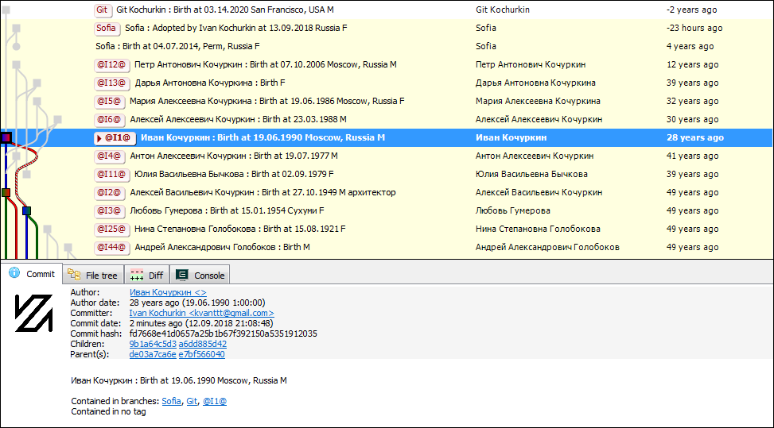
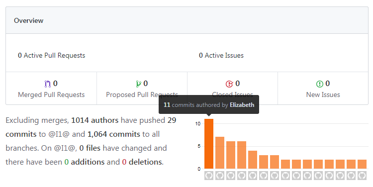

# Генеалогическое дерево внутри Git

Поздравляю всех программистов с их профессиональным днем, желаю меньше багов и
⩾ классных идей! А в качестве идейного подарка предлагаю
реализацию одной безумной задачи: создание генеалогического дерева средствами
системы контроля версий Git. Ну что же, звучит как план!



Для тех сразу все понял выкладываю исходники генератора: [GenealogyTreeInGit](https://github.com/KvanTTT/GenealogyTreeInGit.git)
и сами генеалогические деревья: [мое](https://github.com/KvanTTT/Kochurkins.git)
и [президентов США](https://github.com/KvanTTT/Presidents.git).

<cut text="Читать дальше о подробностях, примерах и смотреть картинки">

## Git

<table>
  <tr>
    <td width=100></td>
    <td>Напомню, что <b>Git</b> - одна из самых популярных систем контроля версий.
      Она мощная: в ней можно фиксировать изменения (commit), создавать и сливать
      ветви (checkout и merge), сравнивать разные версии файлов (diff), вычислять
      авторов конкретных строк (blame), а также делать многие другие вещи.
    </td>
  </tr>
</table>

К счастью или к сожалению, Git в чем-то похож на государство-победителя: он
позволяет менять историю, а именно менять даты, сообщения и авторов коммитов.
Но это наоборот содействует, поскольку позволяет коммитить членов семьи,
как будто они авторы событий, сделанных в конкретную дату.

Начал я с простого: написал несколько команд и вуала: фрагмент дерева готов.
Отлично, теперь надо это проделать со всем армией родственников. Я с радостью
напишу для них 200 строчек команд, в которых можно запутаться,
а для президентов - все 10К.

<!-- TODO добавить картинку -->

Надеюсь вы поняли, что это шутка, а я как программист конечно же автоматизирую процесс:
а именно, напишу приложение для конвертации генеалогических данных в
последовательность команд гита. Существуют несколько форматов таких данных,
но я выбрал **Gedcom**.

## Gedcom

<table>
  <tr>
    <td width=100></td>
    <td><b>Gedcom</b> - формат описания генеалогических деревьев. Довольно старый, но
        текстовый и в целом простой. Поддерживается чуть ли не всеми
        генеалогическими программами, поэтому примеров для него существует множество:
        дерево президентов США, королевской семьи, Шекспиров.</td>
  </tr>
</table>

Спецификация формата неплохо [описана](https://ru.wikipedia.org/wiki/GEDCOM) в
интернете, так что дополнительно его описывать я не буду.

Реализоввал все это безобразие на [.NET Core](https://www.microsoft.com/net/learn/get-started-with-dotnet-tutorial) -
он удобный и кроссплатформенный. Для парсинга и обработки gedcom есть несколько
библиотек под C#: [GeneGenie.Gedcom](https://github.com/TheGeneGenieProject/GeneGenie.Gedcom),
[gedcomx-csharp](https://github.com/FamilySearch/gedcomx-csharp) и другие.
Я решил написать собственную на основе [GedcomParser](https://github.com/jaklithn/GedcomParser),
ну потому что она обладает [фатальным недостатком](https://ru.wikipedia.org/wiki/%D0%A1%D0%B8%D0%BD%D0%B4%D1%80%D0%BE%D0%BC_%D0%BD%D0%B5%D0%BF%D1%80%D0%B8%D1%8F%D1%82%D0%B8%D1%8F_%D1%87%D1%83%D0%B6%D0%BE%D0%B9_%D1%80%D0%B0%D0%B7%D1%80%D0%B0%D0%B1%D0%BE%D1%82%D0%BA%D0%B8).
На самом деле нет: мне захотелось самому лучше разобраться в формате и избавиться
от всех зависимостей, что позволит при желании легко портировать проект на другие
языки.

## Генерация команд

Настал момент обхода извлеченных личностей в удобном нам формате и генерации
команд Git для них. Было решено отсортировать все события в хронологическом
порядке и создавать ветки, мержить и коммитить их, продвигаясь в порядке возрастания
дат. К сожалению, не у всех событий есть даты, поэтому пришлось изрядно повозиться
чтобы отсортировать все события правильно. Позже я понял что такой подход не
совсем правильный, так как при обходе в глубину с датами возиться бы вообще не
пришлось. Но слишком поздно: 2^2^3-й день на носу.

### Инициализация

Все что требуется на этом этапе - инициализировать репозиторий:

```
mkdir Family
cd Family
git init
```

### События

В этой части скрипта обходятся и коммитятся все события. Для этого использовались
такие команды:

* `git checkout --orphan branch_name`
* `git merge @I1@ --allow-unrelated-histories --no-commit`
* `git commit -m "msg" --date "" --author "name <email>" --allow-empty`

Первая, `checkout`, создает ветвь для каждой личности. Флаг `--orphan` позволяет
создавать ветки-сироты, т.е. ветки не имеющие родителей. Ветка-сирота создается
один раз - при последующем переключении `checkout` этот параметр опускается.
В конечном итоге практически все коммиты имеют родителей, за исключением самых
дальних предков, потому что для них более ранние неизвестны (во всяком случае пока).

Вторая команда, `merge`, объединяет родителей и создает ребенка. Будем писать в
сообщении коммита Birth - рождение с соответствующим годом. Также указываем флаги
`--allow-unrelated-histories` и `--no-commit` возможности мержить ветки-сироты и
для того, чтобы закоммитить изменения позже. Некоторые дети являются приемными,
поэтому для них будем писать Adopted. Забавно, но Git позволяет создавать шведские
семьи, т.е. мержить одновременно несколько веток. А еще, кстати, ветки не имеют пола.

Наконец, третья команда, `commit`, создает коммит с сообщением `-m`,
датой `--date` и автором `--author`. Как уже писал, Git позволяет подменять сообщение,
автора и дату коммита. Более того, Git позволяет создавать коммиты без файлов с помощью
флага `--allow-empty` и без сообщений с помощью `--allow-empty-message`. У автора также
необходимо указывать электронную почту, но Git принимает и пустую - нужно просто
передать `<>`. К сожалению, Git не уважает стариков: дата коммита почему-то снизу
ограничена 1 январем 1970 года - более ранняя дата будет неправильно отображаться.
Однако все не так страшно: можно просто записывать реальную дату в
описание. Тем не менее, Git верит в будущее и принимает даты в будущем - обратите
внимание на моего сына Git. Матерей- и отцов-одиночек, кстати, тоже можно
создавать.

Помимо событий "рождение", фиксировать можно и другие события: крещение,
изменение места жительства, получение образования, женитьбу, развод, смерть,
похороны и другие. После смерти ~~ветвь попадает в цифровой рай~~ в ветви невозможно
появление последующих событий, кроме разве что похорон. На сервере такую ветвь вообще
можно запечатать, т.е. сделать [protected branch](https://help.github.com/articles/about-protected-branches/)
(не волнуйтесь: в будущем "воскресить" можно будет при необходимости).

События, в которых участвует более одного человека и не рождения, не особо вписываются
в нашу концепцию. Однако их также можно сохранять и делать нескольких авторов вместо
одного. Например, событие "Свадьба" имеет двух предков, супругов. А "Развод" имеет
одного предка, предыдущее событие "Свадьба".
Над семейной жизнью надо работать как и над детьми, поэтому
можно сказать что после свадьбы появляется еще и новый потомок "отношения",
которые заканчиваются после развода. Ну и возобновляются опять после следующих
циклов свадьба-развод.

### Финализация

Добавим вишенку к торту: сделаем бекап репозитория и выгрузим всех людей на GitHub,
GitLab, либо любой другой сервер, поддерживающий Git. Можно пушить все ветки
одна за другой, но с помощью взмаха волшебной команды запушим их все, что намного
быстрее и проще:

```
git remote add origin https://gitlab.com/KvanTTT/Family.git
git push origin --all -u
```

Деревья можно генерировать с разной степенью детализированности:
чтобы не захламлять историю можно генерировать по одному коммиту на человека.
Для этого надо передать флаг `--only-birth-events` при запуске генератора.

## Примеры

В качестве небольшого примера, который по крайней мере везде откроется, я создал
свое генеалогическое дерево, а в качестве большого - дерево президентов США (2145 человек).
Они доступны в репозиториях
[Kochurkins](https://github.com/KvanTTT/Kochurkins.git) и
[Presidents](https://github.com/KvanTTT/Presidents.git) соответственно. Для создания
своего я использовал сервис [geni.com](https://geni.com), откуда экспортировал
дерево в gedcom.


На GitHub, да и на GitLab можно перемещаться по предкам и потомкам - это похоже
на генеалогическую вики-систему [Familypedia](http://familypedia.wikia.com)
или [WeRelate.org](https://www.werelate.org). Правда гит(х|л)абы в чем-то даже
более круты: из них деревья легко выкачиваются (с помощью команды `--clone`).
А главное, можно открыть сразу весь граф, причем делать это можно с помощью
разных инструментов (веб-сервис, [GitExtesions](https://gitextensions.github.io/),
[Sourcetree](https://www.sourcetreeapp.com/),
[GitKraken](https://www.gitkraken.com/)
и других). В существующих генеалогических программах почему-то с открытием
небольших графов возникали сложности.

Примечательно, в гит*абах доступно даже какое-то подобие аналитики: можно узнать
у кого самая ~~инстаграмная жизнь~~ насыщенная событиями жизнь. Ну или самая открытая:
на вкладке `Insights` отображается топ личностей в порядке уменьшения коммитов.

[](https://github.com/KvanTTT/Presidents/pulse)

К сожалению, большие деревья хабы отображают некорректно, однако хранят их
правильно - можно затянуть репозиторий и убедиться в этом. Вот как выглядит
мое дерево в веб-интерфейсе гитлаба:

[](https://gitlab.com/KvanTTT/Kochurkins/network/@I1@)

## Заключение

Пока что не очень ясно как можно дополнять историю с рутов - пока что
приходится генерировать ее полностью из gedcom файла. Не исключаю что это
как-то можно сделать с помощью хитрого рибэйза - можете поэкспериментировать и
рассказать в комментариях.
Также было бы неплохо переписать код чтобы он работал "коммито-ориентированно",
а не "событийно-ориентированно", т.к.
это естественней с точки гита - на самом деле ветви в нем являются последовательностью
коммитов, а не отдельными сущностями. Еще я думал как можно привязать
[теги](https://git-scm.com/book/ru/v1/%D0%9E%D1%81%D0%BD%D0%BE%D0%B2%D1%8B-Git-%D0%A0%D0%B0%D0%B1%D0%BE%D1%82%D0%B0-%D1%81-%D0%BC%D0%B5%D1%82%D0%BA%D0%B0%D0%BC%D0%B8)
к нашей концепции, но решил что ветвей достаточно.

Если расширить идею генеалогических деревьев дальше, на веб-сервисы для разработчиков,
то с помощью [issues](https://help.github.com/articles/about-issues/)
можно заводить разные глобальные таски: планировать отпуск, детей, причем
распределять их по разным [вехам (milestone)](https://help.github.com/articles/about-milestones/):
детство, отрочество, взрослая жизнь, старость.

Помимо генеалогических деревьев, можно ~~превращать другие буханки хлеба в троллейбусы~~
кодировать в гите генеалогические деревья языков программирования
(что еще более по-кодерски), деревья разбора и вообще любые древовидные структуры.
Гит можно освоить и домохозяйкам, чтобы выстраивать взаимосвязи между героями
бразильских сериалов :)

Практическая польза от всего этого тоже есть: такая разминка помогает лучше
понять устройство гита, его команды, а также формат описания генеалогических
деревьев gedcom.

Еще раз поздравляю с днем программиста, желаю больше ярких коммитов, больше
принятых пулл-риквестов, за которых не стыдно, меньше незапланированных мержей
и чтобы ваши ветки оставались актуальными как можно дольше!

*Исходники самой статьи [доступны на GitHub](https://github.com/KvanTTT/Articles/tree/master/Genealogy-Tree-In-Git) -
присылайте Pull Request туда если найдете ошибки.
Для конвертации в формат habr.com использовалась библиотека [MarkConv](https://github.com/KvanTTT/MarkConv).*