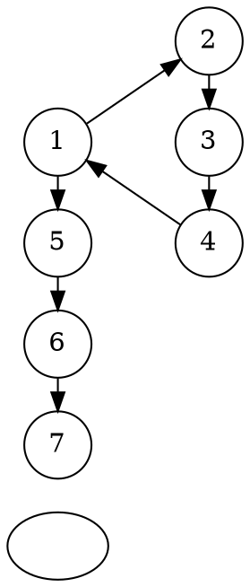
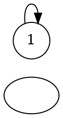
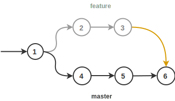
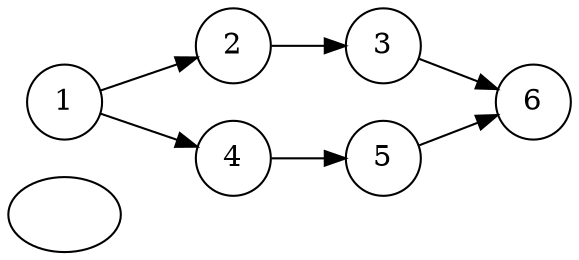
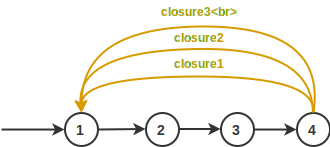
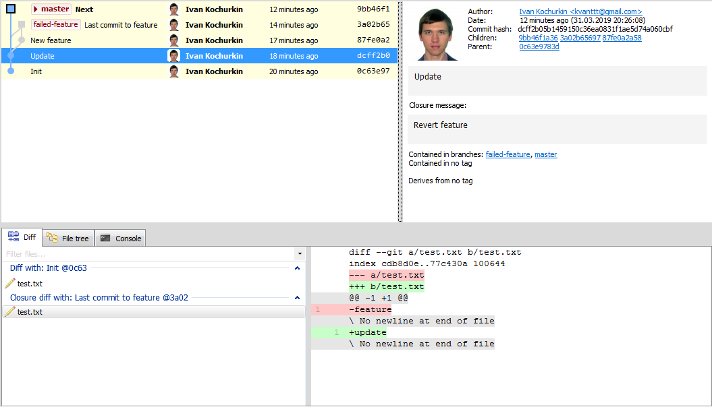

<linkmap src=HeaderImageLink dst=https://habr.com/en/post/445680 />
<include src=Links.ignore.md />

# New feature in Git 3: closures

Git is a popular version control system. In Git, an atomic change of one or
several files is called a commit, and several consecutive commits are combined
into a branch. Branches are used to implement new ideas (features).


It happens that an idea is a dead end and the developer has turned the wrong
way, so he needs to roll back to the original version. He should forget about
the new branch, switch to the main **dev** or **master** branch and continue
working. In this case, the "scion" will hang forever, as well as the desire to
remove it. But how to remove a part of the history? This branch shows the
efforts of the hard-working programmer, even if in vain. So it will be easier to
report to the boss, because an unsuccessful result is also a result!

I hasten to rejoice that Git developers are going to introduce a new command to
close such "homeless" branches in the third version. The current version is
[2.21.0](https://git-scm.com/downloads).

How to use this command, what benefits does it give and what do IT companies
think? The article answers these and other questions.

<cut/>

## Description

Now it is possible to close an unsuccessful branch over one of the previous
commits. Closure arcs are painted in yellow in the pictures below.


<!--


-->

The commit `4` is the last one for the unsuccessful feature. It was closed over
the commit `1`, and then we return to the master and go the other way (the
commit `5`).

You can also close a commit over itself, thus creating
[loops](https://en.wikipedia.org/wiki/Loop_(graph_theory)):


<!--


-->

You can close the branch over any commit - Git is smart, it calculates the
differences and merges everything correctly:



<!--


-->

## How to use?

The `merge` command does not include the functionality of closures, since for
the first case the branch will be
[fast-forwarded](https://stackoverflow.com/q/9069061/1046374), and for the
second case nothing will be done (`git already up to date`).

In order not to change the old behavior the developers decided to introduce a
closure command:

```
git closure -s $source_commit -d $dest_commit -m $message
```

The first argument `-s $source_commit` sets the hash of the commit from which
you want to stretch the loop, and the second (optional) `-d $dest_commit` sets
the commit into which the loop will be closed. If it is absent, the closure
occurs in the current check-out branch. The `-m $message` argument sets a
closure message, like `failed feature, revert to origin`. However, the
`--allow-empty-message` option is also available, which allows commits without
messages. By default, Git allows only one closure for a pair of commits. To
bypass this limitation, the `--allow-multiple-closures` option is available.



After the command is executed, Git calculates the changes, and in the final
commit a double diff will be shown: from the base and closing branches. In the
general case, it is an n-dimensional diff, that is, there can be as many
closures as you wish. closure-commit is similar to merge-commit with the only
difference that it contains several messages, not one.

Unfortunately, existing Git GUIs do not have good support for closures.
[GitExtensions](https://github.com/gitextensions/gitextensions) preview version
displays merge curves instead of elegant arcs. Take a look at the new fields such
as `Closure message` and `Closure diff`:



It is worth noting that the `closure` command always changes history (as now Git
is a full-fledged time machine!), so now it is possible to push branches only
with the `--force` option, or the safe `--force-with-lease` option.

Rebase is also available for looped branches, although the logic for
recalculating commits is complicated.

Also the `auto` option allows automatic closures of all the old branches. In
this case, the closing commit is the one starting the branch. With Git IDE
plugins, closures can be run periodically. In
GitExtensions there is a similar plugin **Delete obsolete branches**.

## What IT companies think

Large IT companies: Google, Facebook, Apple, DeepMind, Positive Technologies,
and especially Microsoft, are eagerly awaiting closures, because now it will be
possible to formalize the life cycle of branches, including unmerged ones.

One of Microsoft's top managers, Michael Richter, [wrote](https://blogs.microsoft.com/git-closure):

> The new feature of Git, of course, will reduce the chaos in the world of open
source development (and not only). There are a lot of "hanging" branches in our
repositories. For example, in [vscode](https://github.com/Microsoft/vscode) we
have more than 200 of them, and in
[TypeScript](https://github.com/Microsoft/TypeScript) more than 300! And this
problem is not only ours. Closures not only improve organization, but also make
it possible to track programmer's reasoning, sometimes completely
incomprehensible even to colleagues :) Closures reminded me of the movie "Back
to the Future", where the characters traveled to the past and the future. I like
this movie, I watched it several times. And I think I will love Git even more
because if this feature :)

## Note

If previously the graph of commits was a [directed acyclic
graph](https://en.wikipedia.org/wiki/Directed_acyclic_graph) (DAG), then
closures extend it to a general [directed
graph](https://en.wikipedia.org/wiki/Directed_graph). Using Git, you can
describe regular expressions in which the states are commits, and the alphabet
is the set of all messages. But this is the topic for the hub "Abnormal
programming", and therefore goes beyond the scope of this article. However, if
this sounds interesting to you, check out the
[article](https://habr.com/post/351158/) on how to store family trees inside
Git.