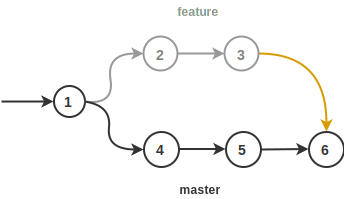
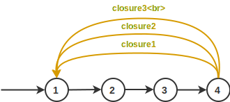

# Новое в Git 3: замыкания

Git - популярная система контроля версий.
В ней атомарное изменение одного или нескольких файлов называется коммитом, а несколько
последовательно идущих коммитов объединяются в ветку.
Ветки используются для того, чтобы реализовывать новые идеи (фичи).


Случается, что идея оказывается тупиковой, разработчик сворачивает не туда,
и возникает необходимость отката к изначальной версии, для этого нужно забыть о новой ветви и переключиться
на главную **dev** или **master**, и затем продолжить работу как ни в чем не бывало.
В этом случае "отросток" повиснет навсегда, как и желание его удалить.
Но как удалить, если это часть истории? Этот отросток показывает усилия
трудяги-программиста, пусть и тщетные. Так легче отчитываться перед начальством,
ведь неудачный результат - тоже результат!

Спешу обрадовать: разработчики Git в 3 версии введут новую команду для
замыкания таких беспризорных ветвей. Напомню, что текущая актуальная версия -
[2.21.0](https://git-scm.com/downloads).

Как использовать эту команду, что она дает и что думают IT компании?
Статья отвечает на эти и другие вопросы.

<cut/>

## Описание

Теперь можно замкнуть неудачную ветку с одним из предыдущих коммитов.
Желтым цветом на рисунках ниже раскрашены дуги замыкания.


<!--

-->

Здесь коммит `4` - последний у неудачной фичи. Его замкнули
с `1`, а затем вернулись в мастер и пошли по другому пути, с коммита `5`.

Также можно замыкать коммит в самого себя, таким образом создавая
[петли](https://ru.wikipedia.org/wiki/%D0%9F%D0%B5%D1%82%D0%BB%D1%8F_(%D1%82%D0%B5%D0%BE%D1%80%D0%B8%D1%8F_%D0%B3%D1%80%D0%B0%D1%84%D0%BE%D0%B2)):


<!--

-->

Можно замыкаться в любой коммит - умный Git сам подсчитает разницу и правильно
все объединит:



<!--

-->

## Как пользоваться?

В команду `merge` функциональность замыканий не вмержить, так как для первого
случая ветвь будет [фаст-фордиться](https://stackoverflow.com/q/9069061/1046374),
а для второго не будет ничего делать (`git already up to date`).

Чтобы не менять старое поведение, разработчики решили ввести команду для замыкания:

```
git closure -s $source_commit -d $dest_commit -m $message
```

Первым аргументом `-s $source_commit` задается хеш коммита, из которого нужно
протянуть "петлю", а вторым, опциональным `-d $dest_commit`, задается коммит,
в который петлю нужно замкнуть.
Если он отсутствует, то замыкание происходит в текущую check-out ветвь. Параметром
`-m $message` задается сообщение замыкания, типа `failed feature, revert to origin`.
Впрочем, доступен и параметр `--allow-empty-message`, разрешающий коммиты без
текста сообщения. По умолчанию Git разрешает ровно одно замыкание для пары коммитов.
Для обхода этого ограничения доступна опция `--allow-multiple-closures`.



После исполнения команды гит сам вычислит изменения, и в конечном коммите станет
виден двойной diff: из базовой и замыкающей ветвей. В общем случае это n-мерный diff,
то есть выполнять замыкание можно сколько угодно раз.
closure-commit похож на merge-commit с той разницей, что в нем
хранится несколько сообщений, а не одно.

К сожалению, существующие GUI для работы с Git пока что до конца не поддерживают
замыкания. Превью-версия [GitExtensions](https://github.com/gitextensions/gitextensions)
строит кривые как у слияния вместо красивой дуги. Обратите внимание на новые
поля `Closure message` и `Closure diff`:


Стоит отметить, что команда `closure` всегда изменяет историю (еще бы, теперь
Git - полноценная машина времени!), поэтому пушить ветки теперь можно только
с опцией `--force`, либо с помощью безопасной `--force-with-lease`.

Рибейзы для ветвей с петлями также доступны, правда, логика пересчета коммитов в
них сложна.

Также опция `auto` позволяет автоматически замыкать все старые ветви.
В этом случае замыкающий коммит тот, от которого пошло разветвление.
С помощью плагинов к Git IDE замыкания можно запускать периодически.
В GitExtensions аналогичный плагин **Delete obsolete branches** удаляет устаревшие
ветви.

## Мнение IT компаний

Крупные IT компании: Google, Facebook, Apple, DeepMind, Positive Technologies,
а особенно Microsoft, с нетерпением ожидают замыканий, ведь теперь можно будет
формализировать жизненный цикл ветвей, в том числе несмерженных.

Один из топ-менеджеров Microsoft, Михаэль Рихтер, [пишет](https://blogs.microsoft.com/git-closure):

> Новая возможность гита, безусловно, уменьшит хаос в мире Open Source разработки
и не только. В наших репозиториях очень много "висящих" ветвей.
Например, в [vscode](https://github.com/Microsoft/vscode) их более 200,
а в [TypeScript](https://github.com/Microsoft/TypeScript) их вообще более 300!
И это проблема не только Microsoft. Замыкания не только улучшают организацию,
но и позволяют отслеживать рассуждения программиста, порой совсем непонятные
даже коллегам :) Замыкания напомнили мне фильм
"Back to the Future" - там герои путешествовали в прошлое и будущее. Я люблю этот фильм,
несколько раз его пересматривал. И думаю, что полюблю гит из-за этого еще больше :)

## На заметку

Если раньше граф коммитов представлял из себя [направленный
ациклический граф](https://ru.wikipedia.org/wiki/%D0%9D%D0%B0%D0%BF%D1%80%D0%B0%D0%B2%D0%BB%D0%B5%D0%BD%D0%BD%D1%8B%D0%B9_%D0%B0%D1%86%D0%B8%D0%BA%D0%BB%D0%B8%D1%87%D0%B5%D1%81%D0%BA%D0%B8%D0%B9_%D0%B3%D1%80%D0%B0%D1%84) (DAG), то замыкания
расширяют его до обобщенного [ориентированного графа](https://ru.wikipedia.org/wiki/%D0%9E%D1%80%D0%B8%D0%B5%D0%BD%D1%82%D0%B8%D1%80%D0%BE%D0%B2%D0%B0%D0%BD%D0%BD%D1%8B%D0%B9_%D0%B3%D1%80%D0%B0%D1%84). С помощью Git можно будет описывать регулярные выражения, в которых
состояниями будут коммиты, а алфавитом - множество всех сообщений.
Но это попахивает хабом "ненормальное программирование", а потому выходит
за рамки статьи. Однако если вам такое интересно, то ознакомьтесь со
[статьей](https://habr.com/post/351158/), описывающей, как можно
хранить генеалогические деревья внутри Git.
