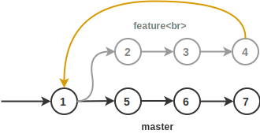
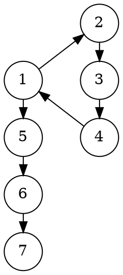
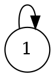
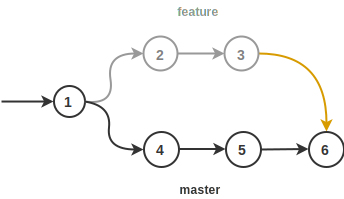
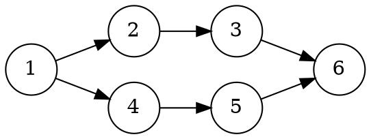
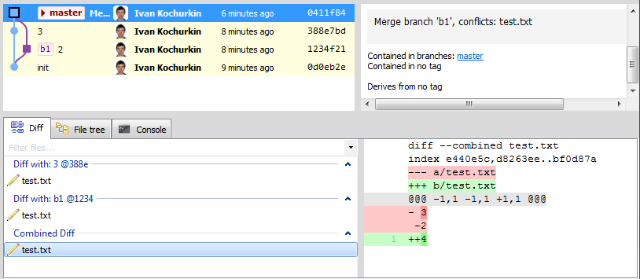

# В Git 3 появятся замыкания

Как известно, Git является самой популярной системой контроля версий.
В ней атомарное изменение нескольких файлов называется коммитом, а несколько
последовательно идущих коммитов объединяются в ветку.
Ветки используются для реализации новых идей (фичей).


Случается, что идея оказывается тупиковой, разработчик сворачивает не туда,
и возникает необходимость отката к изначальной версии, от которой фича стартовала.
Конечно же это не проблема - нужно просто забыть про новую ветвь и переключиться
на главную **dev** или **master**, а затем продолжить работу как ни в чем не бывало.
В этом случае "отросток" повиснет навсегда как и желание его удалить.
Но как его удалить если это часть истории и избавляться от нее тоже не хотелось бы?
К тому же этот отросток показывает усилия трудяги-программиста, пусть и тщетные.
Ему будет легче отчитываться перед начальством, ведь как известно,
неудачный результат - тоже результат!

Спешу обрадовать: разработчики Git в 3 версии введут новую команду для
замыкания таких беспризорных ветвей. Напомню, что текущая актуальная версия -
[2.21.0](https://git-scm.com/downloads).

Как использовать эту команду, что она дает и что думают крупные IT компании?
Статья отвечает на эти и другие вопросы.

<cut/>

## Описание

Теперь можно замкнуть неудачную ветку с одним из предыдущих коммитов.
Желтым цветом раскрашена дуга замыкания.



<!--

-->

Здесь последним коммитом неудачной фичи был коммит `4`, который замкнули
с `1`, а затем вернулись в мастер и пошли по другому пути, с коммита `5`.

Также можно замыкаться в то же самое состояние, таким образом создавая
[петли](https://ru.wikipedia.org/wiki/%D0%9F%D0%B5%D1%82%D0%BB%D1%8F_(%D1%82%D0%B5%D0%BE%D1%80%D0%B8%D1%8F_%D0%B3%D1%80%D0%B0%D1%84%D0%BE%D0%B2)):


<!--

-->

В целом же можно замыкаться вообще в любой коммит, умный Git сам подсчитает
разницу и правильно все объединит:



<!--

-->

## Как пользоваться?

В команду `merge` функциональность замыканий не вмержить, так как для первого
случая ветвь просто будет [фаст-фордиться](https://stackoverflow.com/q/9069061/1046374),
а для второго вообще не будет делать ничего (`git already up to date`).

Чтобы не менять старое поведение, разработчики решили ввести команду для замыкания:

```
git closure -s $source_commit -d $dest_commit -m $message
```

Первым аргументом `-s $source_commit` в ней задается хеш коммита, из которого нужно
протянуть "петлю", а вторым, опциональным `-d $dest_commit`, задается коммит,
в который нужно петлю замкнуть.
Если он отсутствует, то замыкание происходит в текущую check-out ветвь. Параметром
`-m $message` задается сообщение замыкания, типа `failed feature, revert to origin`.
Впрочем, доступен и параметр `--allow-empty-message`, который позволяет создавать
замыкающий коммит без сообщения. По умолчанию Git разрешает ровно одно замыкание
из одного коммита в другой. Для нескольких замыканий нужно воспользоваться
опцией `--allow-multiple-closures`.

После исполнения команды, гит сам вычислит изменения и в конечном коммите станет
виден двойной diff: из базовой и замыкающей ветвей. В общем случае это n-мерный diff,
т.к. выполнять замыкание можно сколько угодно раз с помощью вышеупомянутой опции.
В целом closure-commit похож на merge-commit с той лишь разницей, что в нем
хранится несколько сообщений, а не одно.



Стоит отметить, что команда `closure` всегда изменяет историю (еще бы, теперь
Git - полноценная машина времени!), поэтому пушить ветки теперь можно только
с опцией `--force`, либо с помощью более безопасной `--force-with-lease`.

Рибейзы для ветвей с петлями также доступны, правда логика пересчета коммитов в
них весьма сложна.

Также опция `auto` позволяет автоматически замыкать все старые ветви.
В этом случае замыкающим коммитом является тот, от которого пошло разветвление.
С помощью плагинов к существующим Git IDE
процесс замыкания можно автоматизировать и периодически его запускать.
Например, в [GitExtensions](https://github.com/gitextensions/gitextensions)
существует аналогичный плагин для удаления устаревших ветвей
**Delete obsolote branches**.

## Мнение IT компаний

Крупные IT компании, Google, Facebook, Apple, DeepMind, Positive Technologies,
а особенно Microsoft, с нетерпением ожидают замыканий, ведь теперь можно будет
формализировать жизненный цикл всех ветвей, в том числе несмережнных.

Один из топ-менеджеров Microsoft, Михаэль Рихтер, пишет:

> Новая возможность гита, безусловно, уменьшает хаос в мире Open Source разработки
и не только. В наших репозиториях очень много "висящих" ветвей.
Например, в [vscode](https://github.com/Microsoft/vscode) их более 200,
а в [TypeScript](https://github.com/Microsoft/TypeScript) их вообще более 300!
И это проблема не только Microsoft. Замыкания не только улучшают организацию,
но и позволяют отслеживать рассуждения программиста, порой совсем непонятные
даже коллегам :) Знаете, замыкания напомнили мне фильм
"Back in Future" - там герои путешествовали в прошлое и в будущее. Я люблю этот фильм,
несколько раз его пересматривал. И думаю, что полюблю гит из-за этого еще больше :)

## На заметку

Если раньше граф коммитов представлял из себя [направленный
ациклический граф](https://ru.wikipedia.org/wiki/%D0%9D%D0%B0%D0%BF%D1%80%D0%B0%D0%B2%D0%BB%D0%B5%D0%BD%D0%BD%D1%8B%D0%B9_%D0%B0%D1%86%D0%B8%D0%BA%D0%BB%D0%B8%D1%87%D0%B5%D1%81%D0%BA%D0%B8%D0%B9_%D0%B3%D1%80%D0%B0%D1%84) (DAG), то замыкания
расширяют его до обобщенного [ориентированного графа](https://ru.wikipedia.org/wiki/%D0%9E%D1%80%D0%B8%D0%B5%D0%BD%D1%82%D0%B8%D1%80%D0%BE%D0%B2%D0%B0%D0%BD%D0%BD%D1%8B%D0%B9_%D0%B3%D1%80%D0%B0%D1%84). С помощью Git можно будет описывать регулярные выражения, в которых
состояниями будут сами коммиты, а алфавитом - множество всех сообщений.
Это уже попахивает хабом "ненормальное программирование", а поэтому выходит
за рамки данной статьи. Однако если вам такое интересно, то ознакомьтесь с моей
прошлой [статьей](https://habr.com/post/351158/), в которой описано как можно
хранить генеалогические деревья внутри Git.