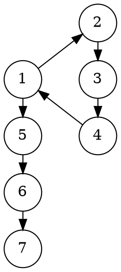
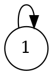
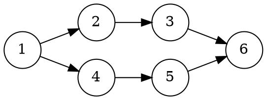

# В Git 3 появятся замыкания


Как известно, самой популярной системой контроля версий является Git.
В ней атомарное изменение нескольких файлов называется коммитом, а несколько
последовательно идущих коммитов объединяются в ветку.
Ветки используются для реализации новых идей (фичей).

Случается, что идея оказывается тупиковой, разработчик сворачивает не туда,
и возникает необходимость отката к изначальной версии, от которой фича стартовала.
Конечно же это не проблема - нужно просто забыть про новую ветвь и переключиться
на главную **dev** или **master**, а затем продолжить работу как ни в чем не бывало.
В этом случае "отросток" повиснет навсегда как и желание его удалить.
Но как его удалить если это часть истории и избавляться от нее тоже не хотелось бы?
К тому же этот отросток отображает усилия трудяги-программиста, хотя и тщетные.
Ему будет легче отчитываться перед начальством, ведь как известно,
неудачный результат - тоже результат!

Спешу обрадовать: разработчики Git в 3 версии решили ввести новую команду для
замыкания беспризорных ветвей. Напомню, что текущей актуальная версия -
[2.21.0](https://git-scm.com/downloads).

Как использовать эту команду, что она дает и что думают по поводу нее крупные
IT компании? Статья отвечает на эти и другие вопросы.

<cut/>

## Описание

Теперь можно замкнуть неудачную ветку с одним из предыдущих коммитов.
Желтым цветом раскрашена дуга замыкания.


<!--

-->

Здесь последним коммитом неудачной фичи был `4` коммит, который замкнули
с коммитом `1`, а затем вернулись в мастер и начали с коммита `5`.

Также можно замыкаться в то же самое состояние, таким образом создавая
[петли](https://ru.wikipedia.org/wiki/%D0%9F%D0%B5%D1%82%D0%BB%D1%8F_(%D1%82%D0%B5%D0%BE%D1%80%D0%B8%D1%8F_%D0%B3%D1%80%D0%B0%D1%84%D0%BE%D0%B2)):


<!--

-->

В целом же можно замыкаться вообще в любой коммит, Git сам подсчитает разницу
и правильно все объединит:


<!--

-->

## Как пользоваться?

В команду `merge` функциональность замыканий "не вмержить": для первого
случая ветвь просто будет [фаст-фордиться](https://stackoverflow.com/q/9069061/1046374),
а для второго вообще не будет никакого эффекта.

Чтобы не изменять старое поведение, разработчики решили ввести команду именно
для замыкания:

```
git closure -s $source_commit$ -d $dest_commit$
```

Первым аргументом в ней задается хеш коммита, из которого нужно протянуть "петлю",
а вторым, опциональным, задается коммит, в который нужно петлю замкнуть.
Если он отсутствует, то замыкание происходит в текущую ветвь.

После применения, гит сам вычислит изменения (а точнее скорее удаления),
и в конечном коммите станет виден тройной diff: из базовой ветки, замыкающей и
совмещенный (Combined). Такой же, как и для команды merge, только с нюансом.


Стоит отметить, что команда `closure` всегда изменяет историю (еще бы, теперь
Git - полноценная машина времени!), поэтому пушить ветки можно только
с опцией `--force`, либо `--force-with-lease`.

Рибейзы для ветвей с петлями также доступны, правда логика пересчета коммитов в
них весьма сложна.

Более  того, специальная опция `auto` позволяет автоматически замыкать все старые ветви.
При этом замыкающим коммитом является тот, от которого пошло разветвление (бранчевание).
С помощью плагинов к существующим Git IDE,
процесс замыкания можно автоматизировать и периодически его запускать.
Например, в [GitExtensions](https://github.com/gitextensions/gitextensions)
существует аналогичный плагин по удалению устаревших ветвей
**Delete obsolote branches**.

## Мнение IT компаний

Крупные IT компании, Facebook, Apple, Google, DeepMind, а особенно Microsoft, с
нетерпением ожидают функциональности замыканий, ведь теперь можно будет
формализировать несмерженные ветви.

Один из менеджеров Microsoft, Михаэль Рихтер, пишет:

> Новая возможность гита, безусловно, уменьшит хаос в мире Open Source разработки
и не только. В наших репозиториях очень много "висящих" ветвей.
Например, в [vscode](https://github.com/Microsoft/vscode) их более 200,
а в [TypeScript](https://github.com/Microsoft/TypeScript) их вообще более 300!
И это проблема не только Microsoft, но и других компаний. Замыкания не только
улучшают организацию, но и позволяют отслеживать рассуждения программиста.
Я люблю фильм "Back in Future", несколько раз его пересматривал. А тут подобная
функциональность в гите - очень круто :)

## На заметку

Также замыкания расширяют возможности самой системы коммитов и превращает ее в
конечный автомат. Теперь с помощью Git можно будет описывать регулярные выражения:
состояниями будут сами коммиты, а алфавитом - множество всех сообщений.
Но это уже больше относится к "ненормальному программированию", поэтому выходит
за рамки данной статьи. Однако если вам интересно, в моей прошлой
[статье](https://habr.com/post/351158/) описано, как можно
хранить генеалогические деревья внутри Git.