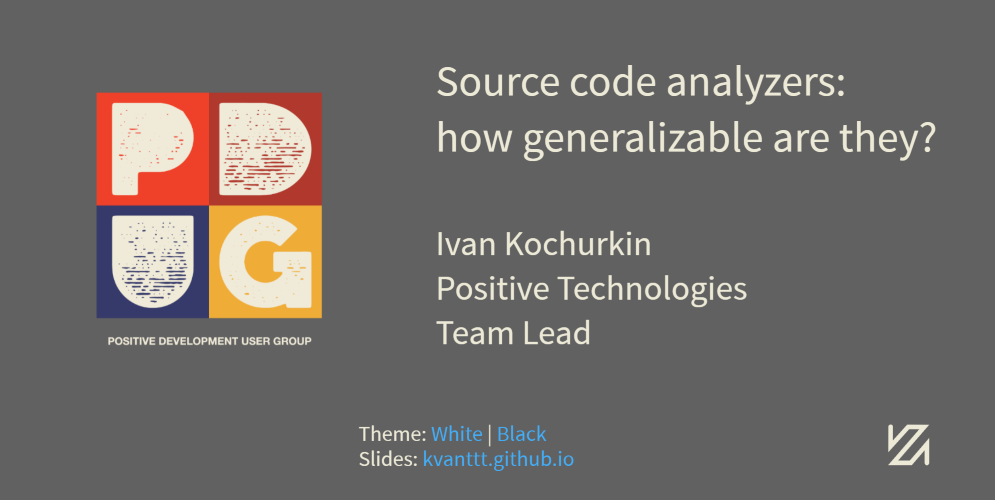
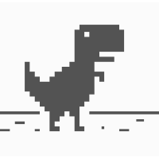
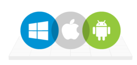
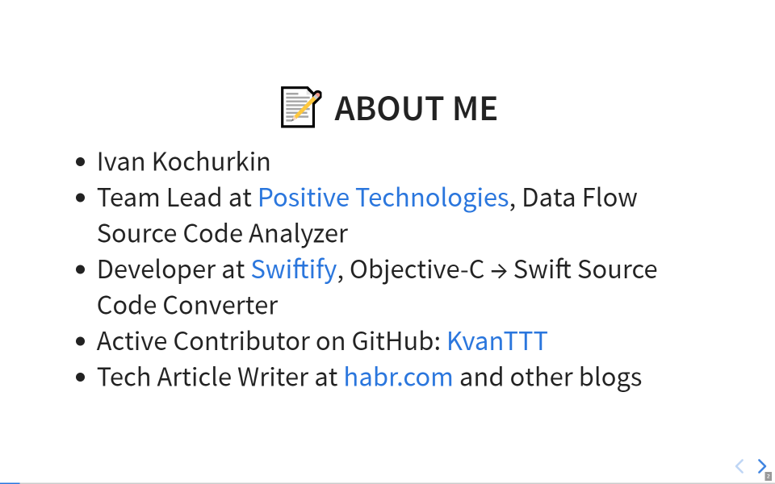
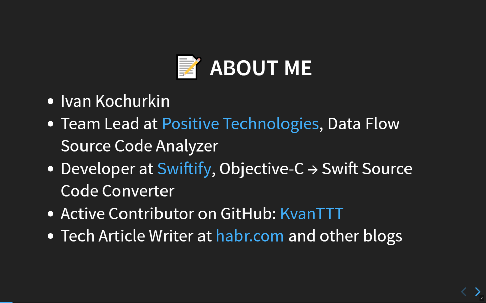
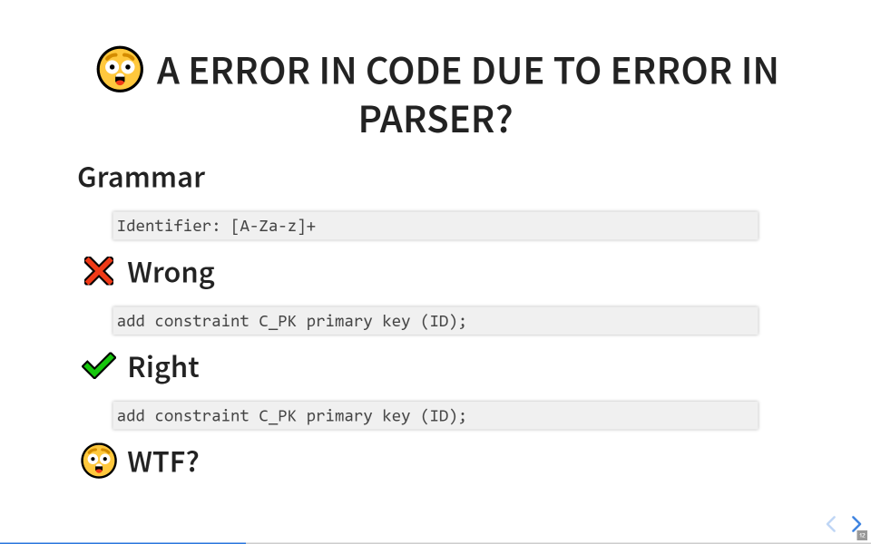
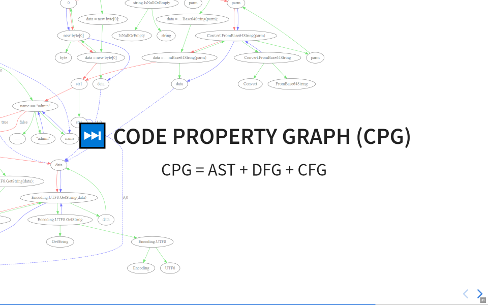
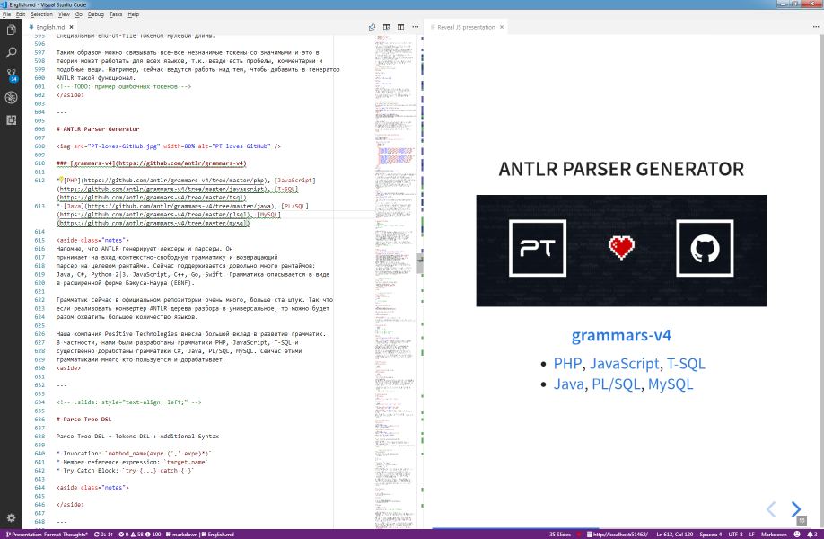
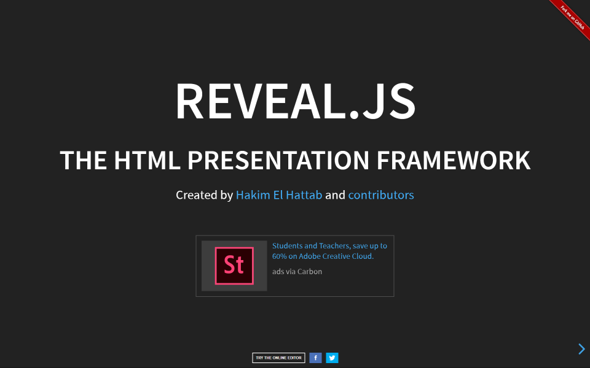
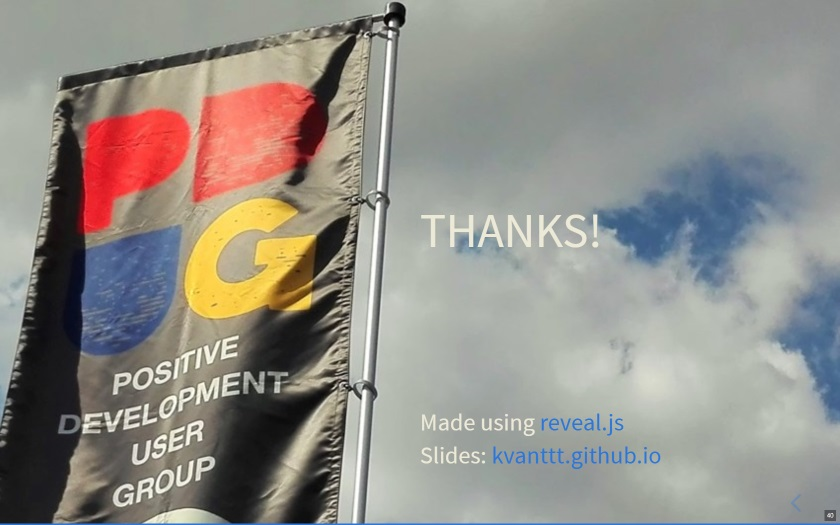

<linkmap src=HeaderImageLink dst=https://habr.com/en/post/445062 />
<include src=Links.ignore.md />

# Modern Presentations Format?

Nowadays, when VR helmets have become part of our reality and Tesla cars fly in
space, you can use all the power of browser engines to create truly interactive,
cross-platform and stylish presentations, rather than make a set of PPTX pages
or, even worse, a PDF document in "illustrative material for explanatory and
calculation report" style.



Since 2015, I have been trying to find the optimal presentation format for
myself (apart from graduation projects). And now I think I have almost
succeeded. It all started with PowerPoint, and ended with web frameworks based
on JavaScript.

There are several JavaScript engines which can be used to create cool
presentations: [Marp](https://yhatt.github.io/marp/),
[Reveal](https://revealjs.com/),
[landslide](https://github.com/adamzap/landslide),
[hacker-slides](https://github.com/jacksingleton/hacker-slides),
[slidify](http://slidify.org/) and others. In some engines, you can use
Markdown, some are embedded in an IDE, and some have their own editors. I have
tried the first two engines.

As a demonstration, [slide
examples](https://kvanttt.github.io/Presentations/2018-05-15-Source-code-analyzers-how-generalizable-are-they/English/index.html#/)
and [video](https://www.youtube.com/watch?v=SSaymBqOwWs) are available.

<cut/>

Both of the above-mentioned engines support Markdown plain text format. The
first one, **Marp**, allows you to create presentations in its own IDE, which is
very convenient, but the output is still a static PDF. The second one,
**Reveal**, is more interesting: it can be used to create entire presentation
websites—you can use the full power of JavaScript, HTML and CSS besides
Markdown. I will mostly speak about **Reveal** in this article.

You can see the evolution of my presentations in the repository
[https://github.com/KvanTTT/Presentations](https://github.com/KvanTTT/Presentations).

<!-- TOC -->

- [Small amount of text](#small-amount-of-text)
- [Using metaphors](#using-metaphors)
- [Minimalism and flat design](#minimalism-and-flat-design)
- [Online access](#online-access)
- [Offline work](#offline-work)
- [Cross-platform versions](#cross-platform-versions)
- [Slides in English](#slides-in-english)
- [Access by link](#access-by-link)
- [Readable link](#readable-link)
- [Dark and light themes](#dark-and-light-themes)
- [Integration with version control systems (Git)](#integration-with-version-control-systems-git)
- [Using plain text format (Markdown)](#using-plain-text-format-markdown)
- [Slide notes](#slide-notes)
- [😃 Using emoji](#😃-using-emoji)
- [Pictures and schemes in suitable formats (JPG, PNG, SVG)](#pictures-and-schemes-in-suitable-formats-jpg-png-svg)
    - [JPG](#jpg)
    - [PNG](#png)
    - [SVG](#svg)
- [Using convenient and simple IDEs](#using-convenient-and-simple-ides)
- [Easy to print presentation text](#easy-to-print-presentation-text)
- [Free to use](#free-to-use)
- [Additional features](#additional-features)
- [Presentation looks simple and cool](#presentation-looks-simple-and-cool)
- [Drawbacks](#drawbacks)
- [Conclusion](#conclusion)

<!-- /TOC -->

### Small amount of text

Your audience will not read the text of the presentation from the slides, so do
not put entire paragraphs on the slides. Talk with the audience. If you have
doubts whether to put a piece of text on a slide or not, then throw it out. If
necessary, write an article in which the details will be explained. It is better
to use more visual information.

### Using metaphors

Using metaphors is good. The audience should be engaged from the start of the
presentation and kept awake. This can be done with the help of funny pictures.
But know the limits: the abundance of jokes can be annoying and distracting.

[](https://kvanttt.github.io/Presentations/2018-05-15-Source-code-analyzers-how-generalizable-are-they/English/index.html#/7)

### Minimalism and flat design

One of the principles that I borrowed. It is in trend now, and I also like it.
Consequently, it is recommended to use a small number of basic colors (three to
five) when creating presentations.

### Online access

The presentation should be available from the browser. Thus, you will not be
afraid of losing a flash drive, crashing of your laptop and other adversities
during the presentation.

### Offline work

<table>
  <tr>
    <td width=120></td>
    <td>A sudden loss of Internet connection is not a big problem. However, you
        still require the browser. In this case, all pictures
        should be local. To run the presentation, just download the sources from
        a GitHub repository.
    </td>
  </tr>
</table>

### Cross-platform versions

<table>
  <tr>
    <td width=30%></td>
    <td>It works on <b>Windows</b>, <b>Mac</b>, <b>Linux</b>, <b>Android</b>,
        <b>iOS</b> Yes, you can flip through the slides even on the phone during
        the presentation!
    </td>
  </tr>
</table>

### Slides in English

<table>
  <tr>
    <td widht=120></td>
    <td>In a good presentation there is little text, and it is simple.
        Your talk in Russian (or any other not English language) with slides
        in English will be clear to the most part of audience who know elementary
        English. It is easy to translate audio, but quite hard to change video.
    </td>
  </tr>
</table>

### Access by link

<table>
  <tr>
    <td></td>
    <td>Listeners are able to open the presentation on their device during the talk.
        On the title slide you can put a short link
        <a href="https://kvanttt.github.io" >kvanttt.github.io</a> to the main site,
        where it is easy to find a full link to the presentation.</td>
  </tr>
</table>

### Readable link

From the link to the presentation
https://kvanttt.github.io/Presentations/2018-05-15-Source-code-analyzers-how-generalizable-are-they/English/index.html
the following is immediately clear:

* Author: **kvanttt**
* Date of publication: **2018-05-15**
* Format: **Presentations** (there can also be, for example,
  **Articles**, **Samples**)
* Language: **English**
* Title: **Source-code-analyzers-how-generalizable-are-they**
* You can also refer to any page of the presentation using the number sign `#/5`.

### Dark and light themes

For the best adaptation to lighting or mood. You can also create your own.

<table>
  <tr>
    <td>
      <a href="https://kvanttt.github.io/Presentations/2018-05-15-Source-code-analyzers-how-generalizable-are-they/English/index.html#/1"></a>
    </td>
    <td>
      <a
href="https://kvanttt.github.io/Presentations/2018-05-15-Source-code-analyzers-how-generalizable-are-they/English/index.html#/1"></a>
    </td>
  </tr>
</table>

You can also change the style of transitions between slides.

### Integration with version control systems (Git)

<table border=0>
  <tr>
    <td width=120><a href="https://en.wikipedia.org/wiki/Git"></a>
    </td>
    <td>Git is one of the most popular version control systems. Using Git, you
        can commit changes, create and merge branches, compare different versions
        of files (diff), identify authors of specific strings (blame),
        and do a lot of other things. Git is not very simple, but the basic
        capabilities can be mastered quickly.
    </td>
  </tr>
</table>

GitHub can be configured so that when you push to the `gh-pages` or `master`
branch, the site is immediately published on a static hosting in the domain
`github.io`—this is very convenient.

Here is the source folder:
https://github.com/KvanTTT/Presentations/tree/master/2018-05-15-Source-code-analyzers-how-generalizable-are-they

### Using plain text format (Markdown)

<table border=0>
  <tr>
    <td width=120>
      <a
href="https://en.wikipedia.org/wiki/Markdown" ></a>
    </td>
    <td>It is a simple text format—tags and other complex syntax are optional.
        It is something like Python for technical writers :) On the other
        hand, it is easy to compare different versions since this is a text format,
        and you can use standard programmer tools like <b>Pull Request | Merge Request</b>
        or just commits edits to the appropriate branch.
    </td>
  </tr>
</table>

[Markdown](https://en.wikipedia.org/wiki/Markdown) makes it easy to describe:

* different text styles (*italics*, **bold**, ~~strikethrough~~, [link](link),
  quote, `code snippet`),
* headings,
* lists, ordered and unordered,
* tables,
* spoilers,
* additional elements that may vary depending on the implementation. If
  necessary, you can use HTML tags as well.

<details>

<summary>Example of the slide sources</summary>

```markdown
<!-- .slide: style="text-align: left;" -->

# 🕵️ Text fingerprinting with zero-length characters

Be c​aref​ul wh​at yo​u copy

<span class="fragment">🕵️ [https://diffchecker.com](https://www.diffchecker.com/M2PvqSXw)</span>

<span class="fragment">
Be c•aref•ul wh•at yo•u copy•
</span>

<aside class="fragment" align="middle">Detail: [habr.com](https://habr.com/post/352950/) | [Medium](https://medium.com/@umpox/be-careful-what-you-copy-invisibly-inserting-usernames-into-text-with-zero-width-characters-18b4e6f17b66)
</span>

<br>

<aside class="notes">
There is another similar funny story with zero-width characters. F​or exam​ple,
I have ins​erted 5 such characters in​to thi​s string, c​an you tel​​l?
You can check it using the service <https://www.diffchecker.com>. These characters
can be used as unique text fingerprints to identify users. Using this method,
for example, you can play detective: encode the name of the user in a copied message
to understand who leaks some confidential information :)

You can find more information about such characters on Habr and Medium.
</aside>

---
```

</details>

### Slide notes

During the presentation, you can press **S** and look at the prepared notes and
the next slide. Also you can control the duration of your talk using the timer.
Notes can be displayed on the second monitor.

[](https://kvanttt.github.io/Presentations/2018-05-15-Source-code-analyzers-how-generalizable-are-they/English/index.html#/38)

### 😃 Using emoji

Emoji can be used to associate slides with visual images. Unfortunately, they
are still not supported on Habr, so you won't see the emoji in the title
above this paragraph.

[](https://kvanttt.github.io/Presentations/2018-05-15-Source-code-analyzers-how-generalizable-are-they/English/index.html#/11)

### Pictures and schemes in suitable formats (JPG, PNG, SVG)

#### JPG

Lossy compression format, suitable for photos and complex images with gradients
and rich palette. Bad for drawings and graphics with text and signs. Good for
background.

#### PNG

Lossless compression format, suitable for images with large homogeneous areas
and a limited palette of colors. No need to use it for photos, as the file size
will be much larger. Good for screenshots.

#### SVG

For some reason, many people forget about SVG, which has the following
advantages:

* scaling the image to any size without losing quality;
* integration with Git (text format);
* you can change colors, fonts and other elements in the file directly;
* small file size.

Supported by all modern browsers—and even Habr! Unfortunately, it can be
uploaded to Habr only
[indirectly](https://github.com/limonte/dear-habr/issues/104).

Note that most of the pictures in this article are in SVG format.

[](https://kvanttt.github.io/Presentations/2018-05-15-Source-code-analyzers-how-generalizable-are-they/English/index.html#/30)

<details>
<summary>This is a fragment of the source code for the background SVG
image of this slide</summary>

```xml
<?xml version="1.0" encoding="UTF-8" standalone="no"?>
<!DOCTYPE svg PUBLIC "-//W3C//DTD SVG 1.1//EN"
 "http://www.w3.org/Graphics/SVG/1.1/DTD/svg11.dtd">
<!-- Generated by graphviz version 2.38.0 (20140413.2041)
 -->
<!-- Title: cfg Pages: 1 -->
<svg width="478pt" height="601pt"
 viewBox="0.00 0.00 478.13 601.00" xmlns="http://www.w3.org/2000/svg" xmlns:xlink="http://www.w3.org/1999/xlink">
	<g id="graph0" class="graph" transform="scale(1 1) rotate(0) translate(4 597)">
		<title>cfg</title>
		<polygon fill="white" stroke="none" points="-4,4 -4,-597 474.131,-597 474.131,4 -4,4"/>
		<!-- 27 -->
		<g id="node1" class="node">
			<title>27</title>
			<ellipse fill="none" stroke="black" cx="310.039" cy="-575" rx="75.2868" ry="18"/>
			<text text-anchor="middle" x="310.039" y="-571.3" font-family="Times New Roman,serif" font-size="14.00">name == &quot;admin&quot;</text>
		</g>
		<!-- 33 -->
		<g id="node2" class="node">
			<title>33</title>
			<ellipse fill="none" stroke="black" cx="229.039" cy="-488" rx="81.4863" ry="18"/>
			<text text-anchor="middle" x="229.039" y="-484.3" font-family="Times New Roman,serif" font-size="14.00">key1 == &quot;validkey&quot;</text>
		</g>
```

</details>

### Using convenient and simple IDEs

For example, **Visual Studio Code** with plugins. The preview on the left, the
final version (render) on the right or in the browser. There is a spell checker
plugin, plugins for generating contents (TOC), formatting tables and others.

[](https://code.visualstudio.com/)

### Easy to print presentation text

<table>
  <tr>
    <td width=120>
    </td>
    <td>The text of slides and notes can be easily printed (for example, for training).
        It is <a href=https://raw.githubusercontent.com/KvanTTT/Presentations/master/2018-05-15-Source-code-analyzers-how-generalizable-are-they/English.md>
        a plain text</href> with a minimum of garbage.
    </td>
  </tr>
</table>

### Free to use

<table>
  <tr>
    <td width=120>
    </td>
    <td>All tools, formats and static hosting <b>.github.io</b> are free.
        And even this picture
    </td>
  </tr>
</table>

### Additional features

<table>
  <tr>
    <td width=120></td>
    <td>In the <b>reveal.js</b> engine, other features are also available
    </td>
  </tr>
</table>

* Vertical slides: you can scroll not only sideways, but also vertically.
* Ability to create a presentation without writing code using
  [slides.com](https://slides.com/).
* Ability to view many slides at once for easy navigation.
* Using different types of background tiling, using video as a background.
* Automatic slideshow.
* And some [other features](https://revealjs.com/).

You can also experiment with an interactive version.

[](https://revealjs.com/)

### Presentation looks simple and cool

<table>
  <tr>
    <td width=100>
    </td>
    <td>Yes, of course, there are minor flaws due to the imperfect engine and
        not enough capable hands of a non-frontend developer :) But, in my opinion,
        it looks good. If you do not agree, please leave a comment.
    </td>
  </tr>
</table>

### Drawbacks

Of course, everything has drawbacks, and this approach is no exception:

1. Clumsy export to **PDF**, you have to edit the output. However, is also
[available‌](https://speakerdeck.com/pdugslides/mozhno-li-obobshchit-analizator-iskhodnykh-kodov).
2. No export to **PPTX**.
3. Not very easy to master, especially for non-programmers and non-frontend
developers (ideally, you need to know **HTML** and **CSS**).
4. Not very easy to make edits. But you can adapt and automate it.
5. 😔 Emoji are not displayed the same everywhere
  (for example, you will not see the emoji in this sentence).
6. The engine is still crude.

### Conclusion

It seems to me that future presentations will be like this: interactive, in the
format of websites that are easy for editing for both programmers and designers.
Let's try to bring this future closer!

By the way, articles can also be written using Git and Markdown and hosted on
GitHub or GitLab. I will write about this later.

If you have any corrections or additions, please write your comments below. I
will consider them and possibly include in the article.

[](https://kvanttt.github.io/Presentations/2018-05-15-Source-code-analyzers-how-generalizable-are-they/English/index.html#/39)

*The sources of the article are
[available on GitHub](https://github.com/KvanTTT/Articles/tree/master/Modern-Presentations-Format)—
please
send Pull Request if you find any mistake. For converting to habr.com
format, I use the library [MarkConv](https://github.com/KvanTTT/MarkConv).*