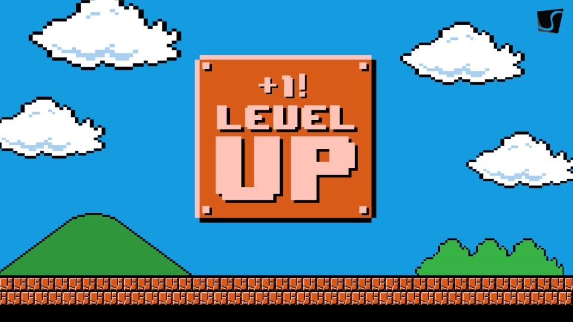
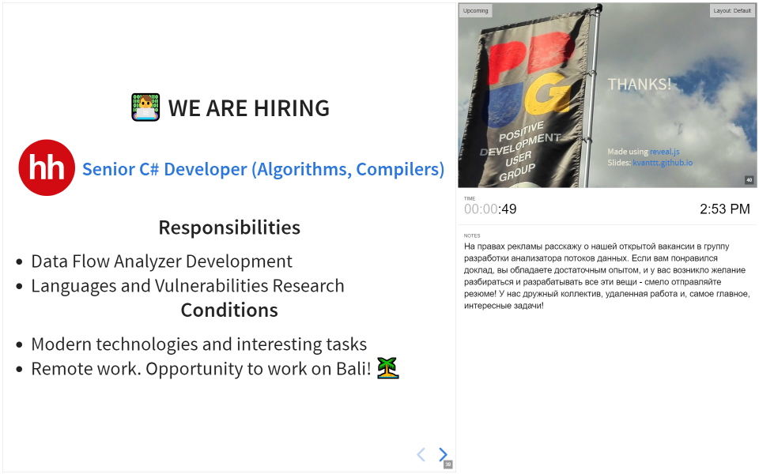

# Современный формат презентаций

Поздравляю дизайнеров с их профессиональным днем! В связи с этим праздником я в
лице нашей компании решил рассказать о наборе правил (гайдлайнов), которые описывают,
какими характеристиками должны обладать современные презентации с точки зрения
контента и оформления.

В настоящее время, когда во всю продвигаются шлемы виртуальной реальности,
теслы летают в космос, можно использовать всю мощность браузерных движков
для создания по настоящему интерактивных, кроссплатформенных и стильных презентаций,
а не делать набор страниц pptx или, чего хуже, pdf в формате
"иллюстративного материала к расчетно-пояснительной записке".


С 2015 года я пытаюсь найти для себя оптимальный формат презентаций
(не считая дипломных проектов). И сейчас, в 2018, думаю что это почти удалось.
Начиналось все с Power Point, а закончилось веб-фреймворками на базе JavaScript.

Сейчас существует несколько JavaScript движков, с помощью которых можно создавать
классные презентации, такие как [Marp](https://yhatt.github.io/marp/),
[Reveal](https://revealjs.com/), [landslide](https://github.com/adamzap/landslide),
[hacker-slides](https://github.com/jacksingleton/hacker-slides), [slidify](http://slidify.org/)
и другие. В каких-то можно использовать маркдаун, какие-то встраиваются в IDE,
а какие-то - можно создавать в собственных редакторах.
Мне пока что удалось попробовать первые два.

В качестве демонстрации материала, доступны [примеры слайдов](https://kvanttt.github.io/Presentations/2018-05-15-Source-code-analyzers-how-generalizable-are-they/English/index.html#/) и [видео](https://www.youtube.com/watch?v=SSaymBqOwWs). Разумеется,
мое мнение субъективно и не является истиной в последней инстанции.

<cut>

Оба вышеупопянутых движка поддерживают простой текстовый формат Markdown. Первый, **Marp**,
позволяет создавать презентации в собственной IDE, что очень удобно, однако на выходе
все равно получается статичная pdf. Второй, **Reveal** более интересный: с помощью
него можно создавать целые презентации-сайты, помимо Markdown можно использовать
всю мощь JavaScript, Html и CSS. В основном о нем и идет речь в данной статье.

В целом, эволюция моих форматов презентаций, доступны в репозитории
[https://github.com/KvanTTT/Presentations](https://github.com/KvanTTT/Presentations).

<!-- TOC -->

- [Небольшое количество текста](#небольшое-количество-текста)
- [Использование метафор](#использование-метафор)
- [Минимализм и плоский дизайн](#минимализм-и-плоский-дизайн)
- [Онлайн доступ](#онлайн-доступ)
- [Офлайн функционирование](#офлайн-функционирование)
- [Кроссплатформенность](#кроссплатформенность)
- [Английский язык слайдов](#английский-язык-слайдов)
- [Доступ по ссылке](#доступ-по-ссылке)
- [Читаемая ссылка](#читаемая-ссылка)
- [Темная и светлая темы](#темная-и-светлая-темы)
- [Интеграция с системами контроля версий (Git)](#интеграция-с-системами-контроля-версий-git)
- [Использование простого текстового формата (Markdown)](#использование-простого-текстового-формата-markdown)
- [Аннотации к слайдам](#аннотации-к-слайдам)
- [😃 Использование Emoji](#😃-использование-emoji)
- [Картинки и схемы в подходящем формате (JPG, PNG, SVG)](#картинки-и-схемы-в-подходящем-формате-jpg-png-svg)
    - [JPG](#jpg)
    - [PNG](#png)
    - [SVG](#svg)
- [Использование удобных и простых IDE](#использование-удобных-и-простых-ide)
- [Удобный для печати текст презентации](#удобный-для-печати-текст-презентации)
- [Бесплатность](#бесплатность)
- [Дополнительные возможности](#дополнительные-возможности)
- [Презентация смотрится просто и классно :)](#презентация-смотрится-просто-и-классно-)
- [Неудобства](#неудобства)
- [Другие ресурсы](#другие-ресурсы)
- [Заключение](#заключение)

<!-- /TOC -->

### Небольшое количество текста

Слушатель доклада не будет читать текст презентации, поэтому не надо помещать
целые абзацы в слайды, как будто это какая-то статья. Рассказывайте. Если есть
сомнения по поводу, нужно ли выкинуть лишний текст или нет, то лучше выбрать первое.
А при необходимости напишите статью, в которой будут разъяснены подробности.
Лучше используйте больше визуальной информации.

### Использование метафор

Метафоры - это хорошо. Аудиторию нужно завлечь с самого начала, пробудить.
Это можно сделать с помощью смешных картинок. Но нужно не забывать про чувство меры -
их обилие может вызывать раздражение и несерьезность.

[](https://kvanttt.github.io/Presentations/2018-05-15-Source-code-analyzers-how-generalizable-are-they/English/index.html#/7)

### Минимализм и плоский дизайн

Один из пунктов, которые я "списал". Сейчас это в тренде, ну и мне тоже
в принципе нравится. Как следствие этого пункта рекомендуется использовать небольшое
количество (3-5) базовых цветов при создании презентаций.

### Онлайн доступ

Презентация должна быть доступна в виде сайта, открывается в браузере.
Таким образом, не страшна потеря флешки, поломка компа и другие невзгоды во время
доклада.

### Офлайн функционирование

<table>
  <tr>
    <td width=120></td>
    <td>Не страшно, если внезапно пропадет доступ к интернету. Однако браузер
    все равно требуется. В этом случае все картинки должны быть также локальными.
    Для запуска достаточно закачать репозиторий с исходниками с гитхаба.</td>
  </tr>
</table>

### Кроссплатформенность

<table>
  <tr>
    <td width=30%></td>
    <td>Все это работает на <b>Win</b>, <b>Mac</b>, <b>Linux</b>, <b>Android</b>, <b>iOS</b>
    Да, реально, можно листать презентацию хоть на телефоне прямо во время демонстрации!</td>
  </tr>
</table>

### Английский язык слайдов

<table>
  <tr>
    <td widht=120></td>
    <td>В хорошей презентации мало текста, причем он простой. Презентация будет понятна
как русскоязычной аудитории, так и глобальной. Аудиодорожку можно легко перевести,
а изменить видео – нет.</td>
  </tr>
</table>

### Доступ по ссылке

<table>
  <tr>
    <td></td>
    <td>Любой желающий может открыть презентацию на своем устройстве прямо во
    время доклада. На титульном слайде можно поместить короткую ссылку
    <a href="https://kvanttt.github.io" >kvanttt.github.io</a> на основной сайт,
    через который легко перейти на презентацию по полноценной, длинной.</td>
  </tr>
</table>

### Читаемая ссылка

Из ссылки на презентацию https://kvanttt.github.io/Presentations/2018-05-15-Source-code-analyzers-how-generalizable-are-they/English/index.html
сразу понятно следующее:

* Кто автор: **kvanttt**
* Дата публикации с точностью до числа: **2018-05-15**
* Какой формат: **Presentations** (еще могуть быть, например, **Articles**, **Samples**)
* Язык: **English**
* Название: **Source-code-analyzers-how-generalizable-are-they**
* Также на любую страницу презентации можно сделать ссылку с помощью решетки `#/5`.

### Темная и светлая темы

Для лучшей адаптации к освещению, настроению. Также можно создать и свою.

<table>
  <tr>
    <td>
      <a href="https://kvanttt.github.io/Presentations/2018-05-15-Source-code-analyzers-how-generalizable-are-they/English/index.html#/1"></a>
    </td>
    <td>
      <a href="https://kvanttt.github.io/Presentations/2018-05-15-Source-code-analyzers-how-generalizable-are-they/English/index.html#/1"></a>
    </td>
  </tr>
</table>

Кроме тем, можно менять стиль переходов между слайдами.

### Интеграция с системами контроля версий (Git)

<table border=0>
  <tr>
    <td width=120><a href="https://ru.wikipedia.org/wiki/Git" ></a></td>
    <td>
      Git - одна из самых популярных систем контроля версий. С помощью гита можно
      фиксировать изменения (commit), создавать и сливать ветви (merge), сравнивать
      разные версии файлов (diff), вычислять авторов конкретных строк (blame),
      а также делать многие других вещей. Git не очень прост, но базовые возможности
      осваиваются быстро.
    </td>
  </tr>
</table>

GitHub можно настроить так, чтобы при пуше в ветку `gh-pages` или
в `master` сайт сразу публиковался на статичном хостинге в домене `github.io` -
это очень удобно.

Вот так выглядит папка с исходниками: https://github.com/KvanTTT/Presentations/tree/master/2018-05-15-Source-code-analyzers-how-generalizable-are-they

### Использование простого текстового формата (Markdown)

<table border=0>
  <tr>
    <td width=120><a href="https://ru.wikipedia.org/wiki/Markdown" ></a>
    </td>
    <td>
      Представляет собой простой текстовый формат - теги и другие сложный синтаксис
      не обязательно использовать.
      Можно даже сказать что это «Python» для технических писателей. С другой стороны,
      текстовая природа позволяет легко сравнивать разные версии, а для вычитки
      и редактирования текста можно использовать привычные инструменты программиста
      <b>Pull Request | Merge Request</b> или просто коммиты в соответствующую
      ветвь.
    </td>
  </tr>
</table>

[Markdown](https://ru.wikipedia.org/wiki/Markdown) позволяет просто описывать следующие
элементы:

* Разные стили текста (*курсив*, **жирный**, ~~зачеркнутый~~, [ссылка](ссылка), цитата, `вставка кода`)
* Заголовки
* Списки, ненумерованные и упорядоченные
* Таблицы
* Спойлеры
* А также дополнительные элементы, которые могут различаться в зависимости от реализации.
  При необходимости можно использовать и html теги.

<details>

<summary>Пример исходника слайда</summary>

```markdown
<!-- .slide: style="text-align: left;" -->

# 🕵️ Text fingerprinting with zero-length characters

Be c​aref​ul wh​at yo​u copy

<span class="fragment">🕵️ [https://diffchecker.com](https://www.diffchecker.com/M2PvqSXw)</span>

<span class="fragment">
Be c•aref•ul wh•at yo•u copy•
</span>

<aside class="fragment" align="middle">Detail: [habr.com](https://habr.com/post/352950/) | [Medium](https://medium.com/@umpox/be-careful-what-you-copy-invisibly-inserting-usernames-into-text-with-zero-width-characters-18b4e6f17b66)
</span>

<br>

<aside class="notes">
Есть и другая похожая забавная история с символами, но только уже нулевой длины.
Например, в эту строку я вставил 5 таких символов. Не верите? Можете сами
в этом убедиться с помощью сервиса <https://www.diffchecker.com>.
Эти символы можно использовать как уникальные "отпечатки" текста для
идентификации пользователей. С помощью этого способа, например, можно поиграть в
разведчика: в копируемое сообщение закодировать имя пользователя и понять,
кто сливает какую-то конфиденциальную инфу :)

Подробнее о разведовательной деятельности таким способом вы можете почитать на
хабре и медиуме.
</aside>

---
```

</details>

### Аннотации к слайдам

Во время презентации можно нажать на **S** и посмотреть на заготовленные тезисы, речь
и следующий слайд. Также доступен таймер по котором можно замерить продолжительность
выступления. Аннотации можно включать на второстепенном экране.

[](https://kvanttt.github.io/Presentations/2018-05-15-Source-code-analyzers-how-generalizable-are-they/English/index.html#/38)

### 😃 Использование Emoji

Можно использовать для ассоциации слайдов с визуальным образами. К сожалению,
на хабре они все еще не поддерживаются, поэтому в заголовке вы не увидите
смайлика :(

[](https://kvanttt.github.io/Presentations/2018-05-15-Source-code-analyzers-how-generalizable-are-they/English/index.html#/11)

### Картинки и схемы в подходящем формате (JPG, PNG, SVG)

#### JPG

Сжимает с потерями, подходит для фотографий и сложных изображений
с градиентами и насыщенной палитрой. Малопригоден для сжатия чертежей,
текстовой и знаковой графики. Хорошо подходит для фона.

#### PNG

Формат сжатия без потерь, подходит для изображений с большими
однородными областями и ограниченным набором используемых цветов.
Не нужно использовать для фотографий, т.к. файлы будут весить существенно больше.
Хорошо подходит для скринов.

#### SVG

И почему-то многие забывают о SVG, который обладает следующими преимуществами:

* Увеличение картинки без потери качества.
* Хорошо интегрируется с Git, т.к. текстовый формат.
* Можно изменить цвета, шрифта и другие элементы прямо в файле.
* Маленький размер.

Поддерживается всеми современными браузерами и даже хабром! К сожалению, на хабр
его можно загрузить только пока что [косвенно](https://github.com/limonte/dear-habr/issues/104).

Обратите внимание, что большинство картинок в данной статье в формате SVG.

[](https://kvanttt.github.io/Presentations/2018-05-15-Source-code-analyzers-how-generalizable-are-they/English/index.html#/30)

<details>
<summary>Вот так выглядит фрагмент исходника для фоновой SVG картинки этого слайда</summary>

```xml
<?xml version="1.0" encoding="UTF-8" standalone="no"?>
<!DOCTYPE svg PUBLIC "-//W3C//DTD SVG 1.1//EN"
 "http://www.w3.org/Graphics/SVG/1.1/DTD/svg11.dtd">
<!-- Generated by graphviz version 2.38.0 (20140413.2041)
 -->
<!-- Title: cfg Pages: 1 -->
<svg width="478pt" height="601pt"
 viewBox="0.00 0.00 478.13 601.00" xmlns="http://www.w3.org/2000/svg" xmlns:xlink="http://www.w3.org/1999/xlink">
	<g id="graph0" class="graph" transform="scale(1 1) rotate(0) translate(4 597)">
		<title>cfg</title>
		<polygon fill="white" stroke="none" points="-4,4 -4,-597 474.131,-597 474.131,4 -4,4"/>
		<!-- 27 -->
		<g id="node1" class="node">
			<title>27</title>
			<ellipse fill="none" stroke="black" cx="310.039" cy="-575" rx="75.2868" ry="18"/>
			<text text-anchor="middle" x="310.039" y="-571.3" font-family="Times New Roman,serif" font-size="14.00">name == &quot;admin&quot;</text>
		</g>
		<!-- 33 -->
		<g id="node2" class="node">
			<title>33</title>
			<ellipse fill="none" stroke="black" cx="229.039" cy="-488" rx="81.4863" ry="18"/>
			<text text-anchor="middle" x="229.039" y="-484.3" font-family="Times New Roman,serif" font-size="14.00">key1 == &quot;validkey&quot;</text>
		</g>
```

</details>

### Использование удобных и простых IDE

Например, **Visual Studio Code** с плагинами. Слева – превью, справа или в
браузере – готовый вариант, рендер. Есть плагин для проверки правописания,
генерации содержания, форматирования таблиц и другие.

[](https://code.visualstudio.com/)

### Удобный для печати текст презентации

<table>
  <tr>
    <td width=120></td>
    <td>Код самих слайдов и аннотаций можно легко распечатать (например, для прогона).
Это обычный <a href=https://raw.githubusercontent.com/KvanTTT/Presentations/master/2018-05-15-Source-code-analyzers-how-generalizable-are-they/English.md>текст</href> с небольшим количеством мусора.</td>
  </tr>
</table>

### Бесплатность

<table>
  <tr>
    <td width=120></td>
    <td>Все инструменты, форматы и статичный хостинг <b>.github.io</b> бесплатные.</td>
  </tr>
</table>

### Дополнительные возможности

<table>
  <tr>
    <td width=120></td>
    <td>В движке <b>reveal.js</b> доступны и другие возможности:</td>
  </tr>
</table>

* Вертикальные слайды - можно пролистывать не только вбок, но и вниз.
* Возможность создания презентации без написания кода с помощью [slides.com](https://slides.com/).
* Возможность обзора сразу многих слайдов для облечения навигации.
* Использование разных типов замощения фона, видео в качестве фона.
* Автоматическое слайд-шоу.
* И некоторые [другие](https://revealjs.com/)

Также можно поэкспериментировать с интерактивной версией.

[](https://revealjs.com/)

### Презентация смотрится просто и классно :)

<table>
  <tr>
    <td width=100></td>
    <td>Да, конечно, есть небольшие недоработки из-за несовершенного движка и недостаточно
прямых нефронтендных рук :) Но по-моему выглядит неплохо. Если не согласны,
то прошу высказать замечания в комментах.</td>
  </tr>
</table>

### Неудобства

Ну и конечно, у всего есть недостатки, в том числе и у изложенного подхода:

1. Кривой экспорт в **pdf**, приходится править. Тем не менее, тоже [доступен‌](https://speakerdeck.com/pdugslides/mozhno-li-obobshchit-analizator-iskhodnykh-kodov).
2. Нет экспорта в **pptx**.
3. Не очень легко освоить, особенно не программистам и не фронтэндщикам
   (в идеале нужно знать **HTML** и **CSS**).
4. Правки не очень легко вносить. Но можно приспособиться и автоматизировать.
5. 😔 Эмоджи не везде одинаково отображаются (например в этом пункте не увидите).
6. Движок пока что сыроват.

### Другие ресурсы

Есть и другие советы с примерами, которые мне понравились:

* [презентации, которые восхищают. пять трендов 2017 года](https://l-a-b-a.com/blog/show/55)
* [10 приемов по созданию красивых бизнес презентаций в 2018 году](https://artrange.ru/sozdanie-prezentatsiy-10-priemov-po-sozdaniyu-krasivyih-prezentatsiy/)

### Заключение

Мне кажется, что за подобными интерактивными презентациями в формате
сайтов, которые легко редактировать как программистам, так и дизайнерам, будущее.
Давайте пробовать приближать его быстрей!

Кстати, все статьи тоже можно писать с использованием Git и Markdown, хостить их
на GitHub или GitLab. Но об этом и других подробностях я напишу позже!

Если у вас есть замечания и другие заметки - отписывайтесь в комментариях.
Рассмотрю и, возможно, включу в статью.

[](https://kvanttt.github.io/Presentations/2018-05-15-Source-code-analyzers-how-generalizable-are-they/English/index.html#/39)

*Исходники самой статьи [доступны на GitHub](https://github.com/KvanTTT/Articles/tree/Modern-Presentation-Format/Modern-Presentations-Format).
Для конвертации в формат habr.com использовался [MarkConv](https://github.com/KvanTTT/MarkConv).*