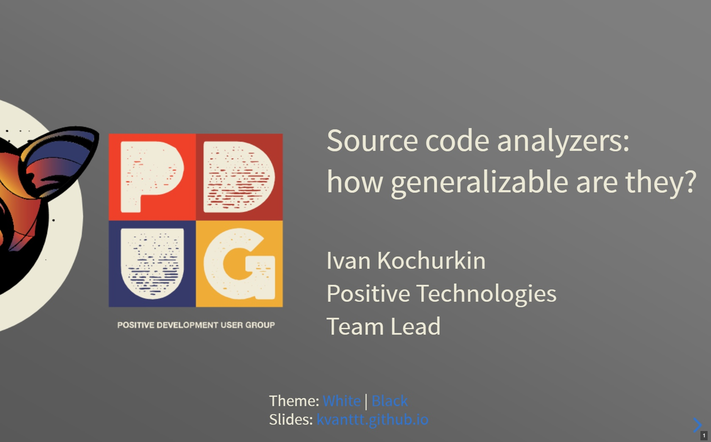
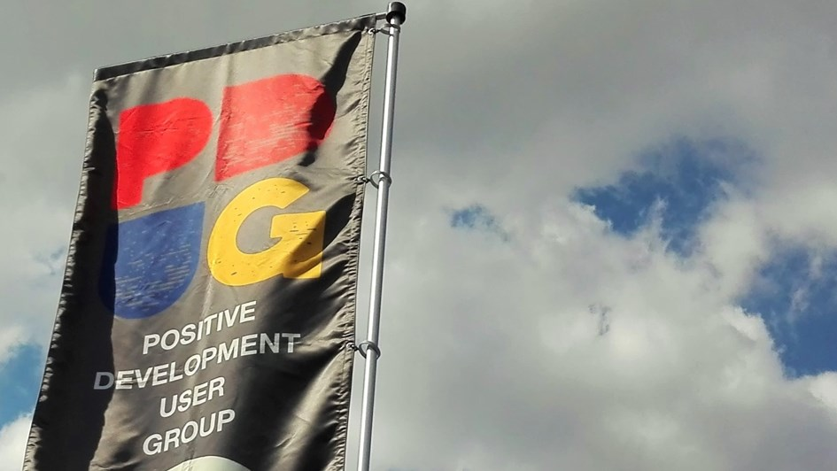

# Современный формат презентаций

<!-- TODO: Опубликовать 9 сентября, добавить инфу про день дизайнеров -->

Распространенными форматами презентаций являются **pdf**, а то и **pptx**.
Однако в настоящее время, когда продвигаются шлемы виртуальной реалности,
теслы летают в космос, можно использовать все возможности браузерных движков
для создания по настоящему интерактивных, кроссплатформенных и стильных презентаций,
а не делать набор страниц в формате "иллюстративный материал к расчетно-пояснительной записке".

Сейчас существует несколько JavaScript движков, с помощью которых можно создавать
классные презентации, такие как [Marp](https://yhatt.github.io/marp/),
[Reveal](https://revealjs.com/), [landslide](https://github.com/adamzap/landslide),
[hacker-slides](https://github.com/jacksingleton/hacker-slides), [slidify](http://slidify.org/)
и другие. У всех есть различные достоинства и недостатки, в каких-то можно
использовать маркдаун, какие-то встраиваются в IDE, а какие-то - можно создавать
в собственных редакторах.



Мне пока что удалось попробовать первые два, а именно, **Marp** и **Reveal**.
Оба движка поддерживают простой текстовый формат Markdown. Первый позволяет
создавать презентации в собственной IDE, что очень удобно, однако на выходе все
равно получается статичная pdf. Второй более интересный: с помощью него можно
создавать целые презентации-сайты, помимо Markdown можно использовать всю мощь
JavaScript, Html и CSS. В основном о нем и идет речь в этой статье.

В этой статье я описываю набор правил (гайдлайнов), которые описывают, какими
характеристиками должны обладать современные презентации. Разумеется мое мнение
субъективно и не является истиной в последней инстанции.

В качестве демонстрации материала, доступны [примеры слайдов](https://kvanttt.github.io/Presentations/Source-code-analyzers-how-generalizable-are-they/English/index.html#/) и [видео](https://www.youtube.com/watch?v=SSaymBqOwWs).

<cut>

<!-- TOC -->

- [1. Онлайн доступ](#1-онлайн-доступ)
- [2. Офлайн функционирование](#2-офлайн-функционирование)
- [3. Кроссплатформенность](#3-кроссплатформенность)
- [4. Английский язык слайдов](#4-английский-язык-слайдов)
- [5. Доступ по ссылке](#5-доступ-по-ссылке)
- [6. Читаемая ссылка](#6-читаемая-ссылка)
- [7. Темная и светлая темы](#7-темная-и-светлая-темы)
- [8. Интеграция с системами контроля версий (Git)](#8-интеграция-с-системами-контроля-версий-git)
- [9. Использование простого текстового формата (Markdown)](#9-использование-простого-текстового-формата-markdown)
- [10. Аннотации к слайдам](#10-аннотации-к-слайдам)
- [11. 😃 Использование Emoji](#11-😃-использование-emoji)
- [11. Картинки и схемы в подходящем формате (JPG, PNG, SVG)](#11-картинки-и-схемы-в-подходящем-формате-jpg-png-svg)
    - [JPG](#jpg)
    - [PNG](#png)
    - [SVG](#svg)
- [12. Использование удобных и простых IDE](#12-использование-удобных-и-простых-ide)
- [13. Удобный для печати текст презентации](#13-удобный-для-печати-текст-презентации)
- [14. Бесплатность](#14-бесплатность)
- [15. Дополнительные возможности](#15-дополнительные-возможности)
- [16. Презентация смотрится просто и классно :)](#16-презентация-смотрится-просто-и-классно-)
- [Неудобства](#неудобства)
- [Заключение](#заключение)

<!-- /TOC -->

### 1. Онлайн доступ

Не страшно потерять флешку, если сломается комп и т.д.

### 2. Офлайн функционирование

Не страшно, если внезапно пропадет доступ к интернету. Однако браузер все равно требуется.
В этом случае все картинки должны быть также локальными. Для запуска достаточно
закачать репозиторий с исходниками с гитхаба.

### 3. Кроссплатформенность

Работает на **Win**, **Mac**, **Linux**, **Android**, **iOS** Да, реально, можно
листать ее хоть на телефоне!

### 4. Английский язык слайдов

В хорошей презентации мало текста, причем он простой. Презентация будет понятна
как русскоязычной аудитории, так и глобальной. Аудиодорожку можно легко перевести,
а изменить видео – нет.

### 5. Доступ по ссылке

Любой желающий может открыть презентацию на своем устройстве прямо во время доклада.
На титульном слайде короткая ссылка [kvanttt.github.io](kvanttt.github.io) на
основной сайт, через который легко перейти на презентацию по полноценной, длинной.

### 6. Читаемая ссылка

Из ссылки на презентацию https://kvanttt.github.io/Presentations/Source-code-analyzers-how-generalizable-are-they/English/index.html можно понять следующее:

* Кто автор: **kvanttt**
* Какой формат: **Presentations** (еще бывают, например, статьи, примеры)
* Язык: **English**
* Название: **Source-code-analyzers-how-generalizable-are-they**
* Также на любую страницу презентации можно сделать ссылку с помощью решетки.

### 7. Темная и светлая темы

Для лучшей адаптации к освещению, настроению. Также можно создать и свою.

<table>
  <tr>
    <td>
      <a href="https://kvanttt.github.io/Presentations/Source-code-analyzers-how-generalizable-are-they/English/index.html#/1"></a>
    </td>
    <td>
      <a href="https://kvanttt.github.io/Presentations/Source-code-analyzers-how-generalizable-are-they/English/index.html#/1"></a>
    </td>
  </tr>
</table>

Кроме тем, можно менять стиль переходов между слайдами.

### 8. Интеграция с системами контроля версий (Git)

<table border=0>
  <tr>
    <td></td>
    <td>
      <ul>
        <li>Полная и удобная история изменений</li>
        <li>Возможность использования веток, коммитов, rebase, blame и других полезных возможностей Git.</li>
      </ul>
    </td>
  </tr>
</table>

Вот так выглядит папка с исходниками: https://github.com/KvanTTT/Presentations/tree/master/Source-code-analyzers-how-generalizable-are-they

<details>

<summary>Пример исходника слайда</summary>

```markdown
<!-- .slide: style="text-align: left;" -->

# 🕵️ Text fingerprinting with zero-length characters

Be c​aref​ul wh​at yo​u copy

<span class="fragment">🕵️ [https://diffchecker.com](https://www.diffchecker.com/M2PvqSXw)</span>

<span class="fragment">
Be c•aref•ul wh•at yo•u copy•
</span>

<aside class="fragment" align="middle">Detail: [habr.com](https://habr.com/post/352950/) | [Medium](https://medium.com/@umpox/be-careful-what-you-copy-invisibly-inserting-usernames-into-text-with-zero-width-characters-18b4e6f17b66)
</span>

<br>

<aside class="notes">
Есть и другая похожая забавная история с символами, но только уже нулевой длины.
Например, в эту строку я вставил 5 таких символов. Не верите? Можете сами
в этом убедиться с помощью сервиса <https://www.diffchecker.com>.
Эти символы можно использовать как уникальные "отпечатки" текста для
идентификации пользователей. С помощью этого способа, например, можно поиграть в
разведчика: в копируемое сообщение закодировать имя пользователя и понять,
кто сливает какую-то конфиденциальную инфу :)

Подробнее о разведовательной деятельности таким способом вы можете почитать на
хабре и медиуме.
</aside>

---
```

</details>

### 9. Использование простого текстового формата (Markdown)

<table border=0>
  <tr>
    <td>
    </td>
    <td>
      <ul>
        <li>Простой формат, «Python» для технических писателей</li>
        <li>Технические писатели также могут вычитывать текст с помощью механизма <b>Pull Request | Merge Request</b> или просто коммитить в соответствующую ветвь</li>
      </ul>
    </td>
  </tr>
</table>

[Markdown](https://ru.wikipedia.org/wiki/Markdown) позволяет просто описывать следующие
элементы:

* Разные стили текста (*курсив*, **жирный**, ~~зачеркнутый~~, [ссылка](ссылка), цитата, `вставка кода`)
* Заголовки
* Списки, ненумерованные и упорядоченные
* Таблицы
* Спойлеры
* А также дополнительные элементы, которые могут различаться в зависимости от реализации

### 10. Аннотации к слайдам

Во время презентации можно нажать на **S** и посмотреть на заготовленные тезисы, речь
и следующий слайд. Также доступен таймер по котором можно замерить продолжительность
выступления. Аннотации можно включать на второстепенном экране.

[](https://kvanttt.github.io/Presentations/Source-code-analyzers-how-generalizable-are-they/English/index.html#/38)

### 11. 😃 Использование Emoji

Можно использовать для ассоциации слайдов с визуальным образами.

<!-- TODO: добавить инфу про поддержку хабром -->

[](https://kvanttt.github.io/Presentations/Source-code-analyzers-how-generalizable-are-they/English/index.html#/11)

### 11. Картинки и схемы в подходящем формате (JPG, PNG, SVG)

#### JPG

Сжимает с потерями, подходит для фотографий и сложных изображений
с градиентами и насыщенной палитрой. Малопригоден для сжатия чертежей,
текстовой и знаковой графики.



#### PNG

Формат сжатия без потерь, подходит для изображений с большими
однородными областями и ограниченным набором используемых цветов.
Не нужно использовать для фотографий, т.к. файлы будут весить существенно больше.

#### SVG

И почему-то многие забывают о SVG, который обладает следующими преимуществами:

* Увеличение без потери качества.
* Хорошо интегрируется с Git, т.к. текстовый формат.
* Можно изменить цвета, шрифта и другие элементы прямо в файле.
* Маленький размер.

Поддерживается он всеми современными браузерами. <!-- TODO: дописать про поддержку хабром -->

[](https://kvanttt.github.io/Presentations/Source-code-analyzers-how-generalizable-are-they/English/index.html#/30)

<details>
<summary>А вот так выглядит фрагмент исходника для фоновой SVG картинки этого слайда</summary>

```xml
<?xml version="1.0" encoding="UTF-8" standalone="no"?>
<!DOCTYPE svg PUBLIC "-//W3C//DTD SVG 1.1//EN"
 "http://www.w3.org/Graphics/SVG/1.1/DTD/svg11.dtd">
<!-- Generated by graphviz version 2.38.0 (20140413.2041)
 -->
<!-- Title: cfg Pages: 1 -->
<svg width="478pt" height="601pt"
 viewBox="0.00 0.00 478.13 601.00" xmlns="http://www.w3.org/2000/svg" xmlns:xlink="http://www.w3.org/1999/xlink">
	<g id="graph0" class="graph" transform="scale(1 1) rotate(0) translate(4 597)">
		<title>cfg</title>
		<polygon fill="white" stroke="none" points="-4,4 -4,-597 474.131,-597 474.131,4 -4,4"/>
		<!-- 27 -->
		<g id="node1" class="node">
			<title>27</title>
			<ellipse fill="none" stroke="black" cx="310.039" cy="-575" rx="75.2868" ry="18"/>
			<text text-anchor="middle" x="310.039" y="-571.3" font-family="Times New Roman,serif" font-size="14.00">name == &quot;admin&quot;</text>
		</g>
		<!-- 33 -->
		<g id="node2" class="node">
			<title>33</title>
			<ellipse fill="none" stroke="black" cx="229.039" cy="-488" rx="81.4863" ry="18"/>
			<text text-anchor="middle" x="229.039" y="-484.3" font-family="Times New Roman,serif" font-size="14.00">key1 == &quot;validkey&quot;</text>
		</g>
```

</details>

### 12. Использование удобных и простых IDE

Например, **Visual Studio Code** с плагинами. Слева – превью, справа или в
браузере – готовый вариант, рендер. Есть плагин для проверки правописания,
генерации содержания, форматирования таблиц и другие.


### 13. Удобный для печати текст презентации

Код самих слайдов и аннотаций можно легко распечатать (например, для прогона).
Это обычный [текст](https://raw.githubusercontent.com/KvanTTT/Presentations/master/Source-code-analyzers-how-generalizable-are-they/English.md).

### 14. Бесплатность

Все инструменты, форматы и статичный хостинг бесплатное.

### 15. Дополнительные возможности

В движке **reveal.js** доступны и другие возможности:

* Вертикальные слайды - можно пролистывать не только вбок, но и вниз.
* Возможность создания презентации без кода с помощью [slides.com](https://slides.com/).
* Возможность обзора сразу многих слайдов для облечения навигации.
* Использование разных типов замощения фона, видео в качестве фона.
* Автоматическое слайд-шоу.
* И некоторые [другие возможности](https://revealjs.com/)

Также можно поэкспериментировать с интерактивной версией.

[](https://revealjs.com/)

### 16. Презентация смотрится просто и классно :)

Да, конечно, есть небольшие недоработки из-за несовершенного движка и недостаточно
прямых нефронтендных рук :) Однако в целом выглядит неплохо, если не согласны,
то прошу высказать замечания в комментах.

### Неудобства

Ну и конечно, у всего есть недостатки, в том числе и у изложенного подхода:

1. Кривой экспорт в **pdf**, приходится править. Тем не менее, тоже [доступен‌](https://speakerdeck.com/pdugslides/mozhno-li-obobshchit-analizator-iskhodnykh-kodov).
2. Нет экспорта в **pptx**.
3. Не очень легко освоить, особенно не программистам и не фронтэндщикам
   (в идеале нужно знать **HTML** и **CSS**).
4. Правки не очень легко вносить. Но можно приспособиться и автоматизировать.
5. 😔 Эмоджи не везде одинаково отображаются.
6. Движок пока что сыроват.

### Заключение

Тем не менее, мне кажется, что за подобными интерактивными презентациями в формате
сайтов, которые легко редактировать как программистам, так и дизайнерам, будущее.
Давайте попробуем приблизить его прямо сейчас!

Кстати, все статьи тоже можно писать с использованием Git и Markdown, хостить их
на GitHub или GitLab. Но об этом и других подробностях я напишу позже! Если вам,
конечно, интересно.

[](https://kvanttt.github.io/Presentations/Source-code-analyzers-how-generalizable-are-they/English/index.html#/39)

<!-- TODO: добавить инфу про MarkConv и ссылку на исходники статьи -->