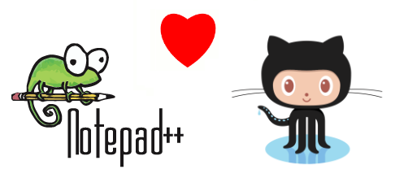
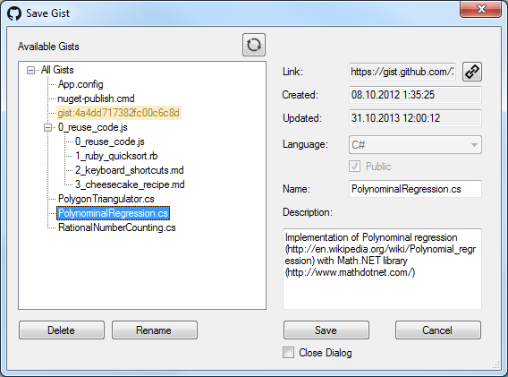

<linkmap src=HeaderImageLink dst=https://habr.com/en/post/442426 />
<include src=Links.ignore.md />

# Developing .NET plugin for working with Gist in Notepad++



Once I had to create a Gist - a code snippet, which I could share with my
colleagues. I am an active user of Notepad++, and I tried to find a plugin for
working with Gist in Notepad++. After I failed (there were plugins for Sublime
only), I decided to write my own. Furthermore, it could be a good experience in
developing plugins and working with GitHub API. So, here is the link to [the
source code](https://github.com/KvanTTT/NppGist) and the plugin build
[NppGist-x86-1.1.0.10](https://github.com/KvanTTT/NppGist/releases/download/1.2/NppGist-x86-1.1.0.10.zip),
[NppGist-x64-1.1.0.10](https://github.com/KvanTTT/NppGist/releases/download/1.2/NppGist-x64-1.1.0.10.zip).
To install it, you need to copy the corresponding *NppGist.dll* file into the
*plugins* folder inside your Notepad++ directory. Plugins can be written in
several languages: C++, Ada, Delphi, C#, but I chose C# because of its relevance
and my extensive experience in it. I used the following libraries and tools:

* [**NppPlugin.NET**](http://sourceforge.net/projects/sourcecookifier/files/other%20plugins/NppPlugin.NET.v0.5.zip/download) -
  Notepad++ plugin template for the .NET platform.
* [**NppNetInf**](https://github.com/KvanTTT/NppNetInf) - The new Notepad++ .NET
  Infrastructure for more easy and convenient plugin development.
* [**ServiceStack.Text**](https://github.com/ServiceStack/ServiceStack.Text) -
  a high performance library for JSON serialization and deserialization with a
  small size).
* **[hurl.it](http://www.hurl.it/)** - a convenient online tool for creating
  and testing GET, POST, DELETE and other queries.
* **NUnit** - a unit testing framework for the .NET platform.

<cut/>

## Plugin initialization

Interaction with Notepad ++ occurs via Win32 messages. But, fortunately, there
is the ready plugin template for .NET with many messages, classes and structures
([NppPlugin.NET.v0.5](http://sourceforge.net/projects/sourcecookifier/files/other%20plugins/NppPlugin.NET.v0.5.zip/download)).

To compile the plugin correctly in Visual Studio, it is necessary to set
**Platform target** value to **x86** or **x64**, instead of **Any CPU** which is
the default value, and also to use the .NET Framework version 4.0 or higher. The
plugin is initialized in the `CommandMenuInit` and `SetToolBarIcon` methods. The
first one is used to add items that are displayed in the plugin menu. This is
done as follows:

```CSharp
PluginBase.SetCommand(OpenCommandId, "Open Gist", OpenGistCommand,
    new ShortcutKey(false, false, false, Keys.None));
```

You can also define keyboard shortcuts for commands there (they were not used in
the developed plugin). The `OpenGistCommand` method is described by the
developer, it specifies the logic of opening window with Gist choosing. In the
`SetToolBarIcon` method, icons with plugin commands (Open, Save) are added to
the Notepad++ toolbar.

```CSharp
toolbarIcons tbIcons = new toolbarIcons();
tbIcons.hToolbarBmp = tbLoad.GetHbitmap();
IntPtr pTbIcons = Marshal.AllocHGlobal(Marshal.SizeOf(tbIcons));
Marshal.StructureToPtr(tbIcons, pTbIcons, false);
Win32.SendMessage(PluginBase.nppData._nppHandle, NppMsg.NPPM_ADDTOOLBARICON,
    PluginBase._funcItems.Items[OpenCommandId]._cmdID, pTbIcons);
Marshal.FreeHGlobal(pTbIcons);
```

## Saving and loading settings

For saving and loading plugin parameters, the following methods are used:

```CSharp
saveLocally = Convert.ToBoolean(Win32.GetPrivateProfileInt("Settings", "SaveLocally", 1, IniFileName));
//...
Win32.WritePrivateProfileString("Settings", "SaveLocally",
    (Convert.ToInt32(saveLocally)).ToString(), Main.IniFileName);
```

## Executing commands

Notepad++ uses the Scintilla component, which is used in other text editors as
well. You can communicate with both components through messages. All possible
codes for messages are specified in the *NppPluginNETHelper.cs* file. Notepad++
messages have the `NPPM` prefix and they are used for working with files, menus,
tabs, languages, etc. Scintilla messages are used directly for working with text
(inserting, deleting, highlighting, setting visual styles, folding, scrolling,
etc.).

## Intercepting events

To intercept events in Notepad++, the `beNotified` method in the
*UnmanagedExports.cs* file is used. These events have the `NPPN` prefix for
Notepad++ (opening, closing files, switching tabs) and the `SCN` prefix for
Scintilla (changing text). In this plugin, intercepting events is not used. The
full list and detailed description of commands can be found in [Messages And
Notifications](http://docs.notepad-plus-plus.org/index.php/Messages_And_Notifications)
for Notepad++ and in [ScintillaDoc](http://www.scintilla.org/ScintillaDoc.html)
for Scintilla.

## Obtaining correct UTF8-encoded text

In the .NET plugin, for some reason, you cannot get text in UTF8 format,
although this encoding is the most common. To solve this problem, the following
property was implemented to convert the text, including Russian, correctly. This
property is used when uploading the Gist to GitHub.

```CSharp
public string lpstrTextUtf8
{
    get
    {
        _readNativeStruct();
        int len = 0;
        while (Marshal.ReadByte(_sciTextRange.lpstrText, len) != 0)
            ++len;
        if (len == 0)
            return string.Empty;
        byte[] buffer = new byte[len];
        Marshal.Copy(_sciTextRange.lpstrText, buffer, 0, buffer.Length);
        return Encoding.UTF8.GetString(buffer);
    }
}
```

## Embedding assemblies

Notepad++ loads plugins from all DLL files from the *plugins* folder. If the
plugin cannot be loaded from the DLL, the following message is displayed: *The
plugin is not compatible with current version of Notepad++*. Thus, if you copy
the plugin with its dependencies (*ServiceStack.Text.dll* in our case) to this
folder, an error message for each dependency will be displayed, which, of
course, is not acceptable. There are two ways to solve this problem:

* Place all dependencies in a separate subfolder.
* Combine the plugin and its dependencies into one assembly.

I used the second method, because it is more convenient to distribute and copy
one file. For this, third-party assemblies were marked as **Embedded Resource**
and dynamically connected to the plugin during the initialization as follows:

```CSharp
static Main()
{
    AppDomain.CurrentDomain.AssemblyResolve += ResolveEventHandler;
}

private static Assembly ResolveEventHandler(object sender, ResolveEventArgs args)
{
    string resource = string.Format("{0}.{1}.dll", PluginName, args.Name.Remove(args.Name.IndexOf(',')));
    Assembly currentAssembly = Assembly.GetExecutingAssembly();
    using (Stream stream = currentAssembly.GetManifestResourceStream(resource))
    {
        var bytes = new byte[(int)stream.Length];
        stream.Read(bytes, 0, (int)stream.Length);
        return Assembly.Load(bytes);
    }
}
```

More information about dynamic loading of assemblies can be found in the article
[Load DLL From Embedded
Resource](http://www.codeproject.com/Articles/528178/Load-DLL-From-Embedded-Resource)
at CodeProject.

In order for this method to work, all dependencies must be placed in the root
folder of the project. Therefore, you should use the pre-build event to move
assemblies to the project folder, as NuGet downloads them by default into other
folders.

You can also use a third-party program
[ILMerge](https://github.com/Microsoft/ILMerge) to combine several assemblies
into one. But it would be run in the post-build event.

## GitHub API

For GitHub authorization, AccessToken is used, which you can get on [developer
settings page on GitHub](https://github.com/settings/tokens/new). It is used in
all queries as **access\_token** parameter. The full list of the GitHub Gist API
methods used can be found [under this
link](https://developer.github.com/v3/gists/). Anonymous Gists are not supported
in the developed plugin.

## NppNetInf submodule

When the project was defrosted in 2017, compilation of x64 version of the plugin
failed: load and save icons could not be added to the toolbar. To solve this
problem, I wondered if there were other x64 .NET plugins and if they were
working correctly. After some searching, I found a template
[NotepadPlusPlusPluginPack.Net](https://github.com/kbilsted/NotepadPlusPlusPluginPack.Net)
and a plugin for Markdown rendering
[MarkdownViewerPlusPlus](https://github.com/nea/MarkdownViewerPlusPlus) based on
it, which added icons for both x86 and x64 platforms correctly.

However, this template was bulky and depended on Visual C++. And I asked myself:
is it possible to remove the dependence on Visual C++ and make an easy and
simple infrastructure connection?

Fortunately, this question was successfully resolved, and this infrastructure
was developed: [NppNetInf](https://github.com/KvanTTT/NppNetInf). To connect it,
you need to perform a few simple steps:

1. Create a repository with the .NET project **MyAwesomePlugin**.
2. Add a submodule <https://github.com/KvanTTT/NppNetInf.git> to the repository.
3. Add a target to the *MyAwesomePlugin.csproj* file as follows: `<Import Project="$(SolutionDir)NppNetInf\src\DllExport\NppPlugin.DllExport.targets" />`.
   This target will be executed after each build. It changes the final assembly in
a special way so that Notepad++ "understands" it.
4. Create the *NppNetInf* subdirectory inside the `MyAwesomePlugin` project and
   add all `*.cs` files *as references* from the uploaded `NppNetInf` submodule
   (Win32.cs, Scintilla.cs, PluginMain.cs, etc.).
5. Add the `Main` class and inherit it from `PluginMain`. Then, redefine the
   necessary abstract methods and properties in this class (`PluginName`,
   `CommandMenuInit`). Optionally, you can redefine other methods
   (`OnNotification(ScNotification notification)`, `PluginCleanUp()`,
   `SetToolBarIcon`).
6. Select the platform (x86 or x64), build the project and move the compiled
   assembly to the appropriate directory of the Notepad++ plugins. Usually it is
   *C:\Program Files (x86)\Notepad++\plugins* for the x86 platform and *C:\Program
   Files\Notepad++\plugins* for the x64.
7. Start Notepad++ and enjoy working with your awesome plugin!

To remove the dependence on Visual C++, it was enough to simply delete the
`LibToolPath` and `LibToolDllPath` attributes in the
*NppPlugin.DllExport.targets* file (I don't know why they were even added by
developers).

`NppNetInf` at startup tries to find the `Main` plugin class that implements
`PluginMain` with the use of reflection:

```CSharp
Type pluginMain = Assembly.GetExecutingAssembly().GetTypes()
    .FirstOrDefault(type => type.IsSubclassOf(typeof(PluginMain)));
_main = (PluginMain)Activator.CreateInstance(pluginMain);
```

Unfortunately, the full modularity has not yet been implemented (connecting via
NuGet package, not submodule). However, even with the current implementation it
is not necessary to add infrastructure project to the plugin solution.

## Conclusion

The Gist save window looks like this:



When initializing the plugin, you need to enter your access token.

Also, the project implemented continuous integration of AppVeyor for x86 and x64
platforms. The results of the build, tests and final assemblies are available
[under this
link](https://ci.appveyor.com/project/KvanTTT/nppgist/branch/master).

I hope that after reading this article it will be easier to write plugins for
Notepad++. Use the plugin and help to improve it!