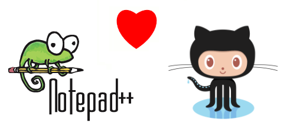
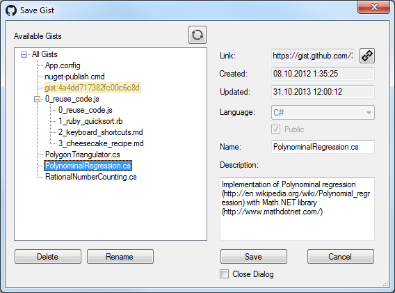

# Разработка плагина для работы с Gist в Notepad++



Однажды мне потребовалось создать gist, а еще я активно пользуюсь Notepad++.
После того, как найти плагин для работы с gist в Notepad++ мне не удалось
(есть только под Sublime), я решил написать свой. Ну и к тому же
это было хорошим опытом в написании плагинов и работе с github api.
Сразу выкладываю ссылку на исходники: [NppGist
sources](https://github.com/KvanTTT/NppGist) и сам плагин:
[NppGist](https://github.com/KvanTTT/NppGist/releases/download/1.1/NppGist.dll)
(для его подключения просто перенесите файл в папку plugins в папке
Notepad++). Под Notepad++ плагины можно писать на нескольких языках:
C++, Ada, Delphi, .NET, но я остановился на последнем из-за скорости
разработки и из-за того, что я лучше его знаю. Для разработки было
использовано следующее:

1. [**NppPlugin.NET**](http://sourceforge.net/projects/sourcecookifier/files/other%20plugins/NppPlugin.NET.v0.5.zip/download) -
   шаблон Notepad++ плагина для .NET платформы.
2. [**ServiceStack.Text**](https://github.com/ServiceStack/ServiceStack.Text) -
   сериализация и десериализация JSON высокая производительность и небольшой размер).
3. **[hurl.it](http://www.hurl.it/)** - удобный онлайн-инструмент для
   составления и тестирования GET, POST, DELETE и других запросов.
4. **NUnit** - юнит-тестирование.

Тем, кому интересно знать, как писать плагины под Notepad++, добро
пожаловать под кат.

## Инициализация плагина

Взаимодействие с Notepad++ происходит посредством Win32 сообщений. Но, к
счастью, под .NET уже написан готовый шаблон плагина со всеми
сообщениями, классами и структурами
([NppPlugin.NET.v0.5](http://sourceforge.net/projects/sourcecookifier/files/other%20plugins/NppPlugin.NET.v0.5.zip/download)).
Стоит отметить, что **Platform taget** нужно установить в **x86**,
вместо **Any CPU** по умолчанию, а также использовать .NET 4.0, а то
плагин работать не будет. Инициализация плагина происходит в методах
**CommandMenuInit** и **SetToolBarIcon**. В первом добавляются пункты,
которые будут видны в меню плагина следующим образом:

```CSharp
PluginBase.SetCommand(OpenCommandId, "Open Gist", OpenGistCommand, new ShortcutKey(false, false, false, Keys.None));
```

Там же можно и назначить комбинации клавиш для определенных команд (в
разработанном плагине они не используются). Метод же *OpenGistCommand*
уже описывается разработчиком, и в нем можно делать уже все, что угодно.
Для данной команды - открытие окна. В методе *SetToolBarIcon* можно
добавить иконки с командами плагина в панель инструментов Notepad++.

```CSharp
toolbarIcons tbIcons = new toolbarIcons();
tbIcons.hToolbarBmp = tbLoad.GetHbitmap();
IntPtr pTbIcons = Marshal.AllocHGlobal(Marshal.SizeOf(tbIcons));
Marshal.StructureToPtr(tbIcons, pTbIcons, false);
Win32.SendMessage(PluginBase.nppData._nppHandle, NppMsg.NPPM_ADDTOOLBARICON, PluginBase._funcItems.Items[OpenCommandId]._cmdID, pTbIcons);
Marshal.FreeHGlobal(pTbIcons);
```

## Сохранение и загрузка настроек

Для сохранения и загрузки параметров плагина, используются следующие методы.
Строки также можно сохранять.

```CSharp
saveLocally = Convert.ToBoolean(Win32.GetPrivateProfileInt("Settings", "saveLocally", 1, IniFileName));
//...
Win32.WritePrivateProfileString("Settings", "SaveLocally", (Convert.ToInt32(saveLocally)).ToString(), Main.IniFileName);
```

## Выполнение команд в Notepad++

На самом деле Notepad++ использует компонент Scintilla, который
используется и в других редакторах текста. Таким образом, сообщения для
взаимодействия делятся на Notepad++ и Scintilla. Все возможные коды для
сообщений перечислены в файле *NppPluginNETHelper.cs*. Notepad++
сообщения имеют префикс **NPPM** и служат для команд, связанные с
работой с файлами, меню, табами, языками и т.д. Scintilla сообщения, в
свою очередь, связаны непосредственно с редактором текста (вставка,
удаление, выделение, визуальные стили, фолдинг, скроллинг и т.д.).

## Перехват событий Notepad++

Для перехвата сообщениях о событиях в Notepad++, используется метод
**beNotified** в файле *UnmanagedExports.cs*. Данные сообщения имеют
префикс **NPPN** для Notepad++ событий (открытие, закрытие файла,
переключение вкладок) и **SCN** для Scintilla событий (изменение
текста). Правда в данном плагине это не используется. Полный список и
подробное описание команд по Notepad++ находится здесь: [Messages And
Notifications](http://docs.notepad-plus-plus.org/index.php/Messages_And_Notifications).
А по Scintilla здесь:
[ScintillaDoc](http://www.scintilla.org/ScintillaDoc.html).

## Корректное получение UTF8 текста из Notepad++

В .NET оболочке плагина почему-то нельзя получить текст в UTF8 формате,
хотя эта кодировка является самой распространенной. Поэтому было
дописано следующее свойство, которое позволило корректно считывать в том
числе и русский текст, который используется при сохранении гиста.

```CSharp
public string lpstrTextUtf8
{
    get
    {
        _readNativeStruct();
        int len = 0;
        while (Marshal.ReadByte(_sciTextRange.lpstrText, len) != 0)
            ++len;
        if (len == 0)
            return string.Empty;
        byte[] buffer = new byte[len];
        Marshal.Copy(_sciTextRange.lpstrText, buffer, 0, buffer.Length);
        return Encoding.UTF8.GetString(buffer);
    }
}
```

## Встраивание сборок

Notepad++ загружает плагины из всех .dll файлов, находящихся в папке
plugins. Причем, если плагин из dll загрузить не удалось, выводится
сообщение с таким содержанием: *The plugin is not compatible with
current version of Notepad++*. Таким образом, если в эту папку вместе с
сами плагином копировать его зависимости (в данном случае JSON), то это
будет не очень правильно. Можно было конечно использовать для них папку,
но я воспользовался более изящным решением, а именно, объединение всех
зависимостей с самой сборкой плагина. Да и к тому же один файл удобней
распространять и копировать. Итак, чтобы плагин занимал только одну dll,
сторонние сборки помечались как **Embedded Resource**, а потом
динамически подключались следующим образом:

```CSharp
static Main()
{
    AppDomain.CurrentDomain.AssemblyResolve += ResolveEventHandler;
}

private static Assembly ResolveEventHandler(object sender, ResolveEventArgs args)
{
    string resource = string.Format("{0}.{1}.dll", PluginName, args.Name.Remove(args.Name.IndexOf(',')));
    Assembly currentAssembly = Assembly.GetExecutingAssembly();
    using (Stream stream = currentAssembly.GetManifestResourceStream(resource))
    {
        var bytes = new byte[(int)stream.Length];
        stream.Read(bytes, 0, (int)stream.Length);
        return Assembly.Load(bytes);
    }
}
```

Подробнее о том, как это делается, можно почитать в статье на
CodeProject: [Load DLL From Embedded
Resource](http://www.codeproject.com/Articles/528178/Load-DLL-From-Embedded-Resource).
Можно было, конечно, воспользоваться сторонней программой для
объединения сборок в одну,
[ILMerge](https://github.com/Microsoft/ILMerge)
например, но ее нужно было бы применять после каждого билда. Стоит
отметить, что, так как `ServiceStack.Text` является NuGet сборкой и
подгружается во время первого билда после клонирования репозитория, то
для ее копирования в корневую папку проекта NppGist, использовалось
Prebuild событие.

## GitHub Api

В реализации взаимодействия с GitHub Api ничего интересного нет, разве
что стоит упомянуть, что для авторизации используется AccessToken,
который можно получить [на
сайте](https://github.com/settings/tokens/new), который потом передается
во все запросах в виде параметра **access\_token**. Анонимные гисты в
разработанном плагине не поддерживаются. Полный список используемых API
методов перечислен здесь: [github gists
api](https://developer.github.com/v3/gists/).

## Заключение

Выглядит окно сохранения гиста так (окно открытия аналогичное):



Но в начале нужно ввести ваш access token. Надеюсь, что после моей
статьи, всем желающим станет проще писать плагины под Notepad++. При
желании присоединяйтесь к разработке и используйте плагин.
