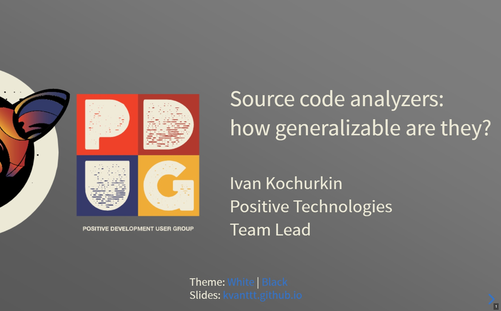
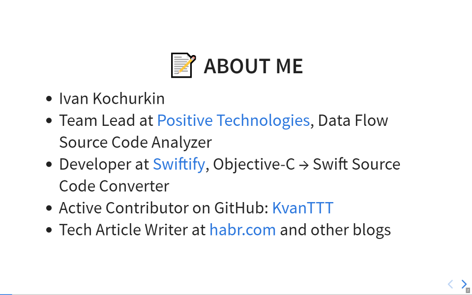
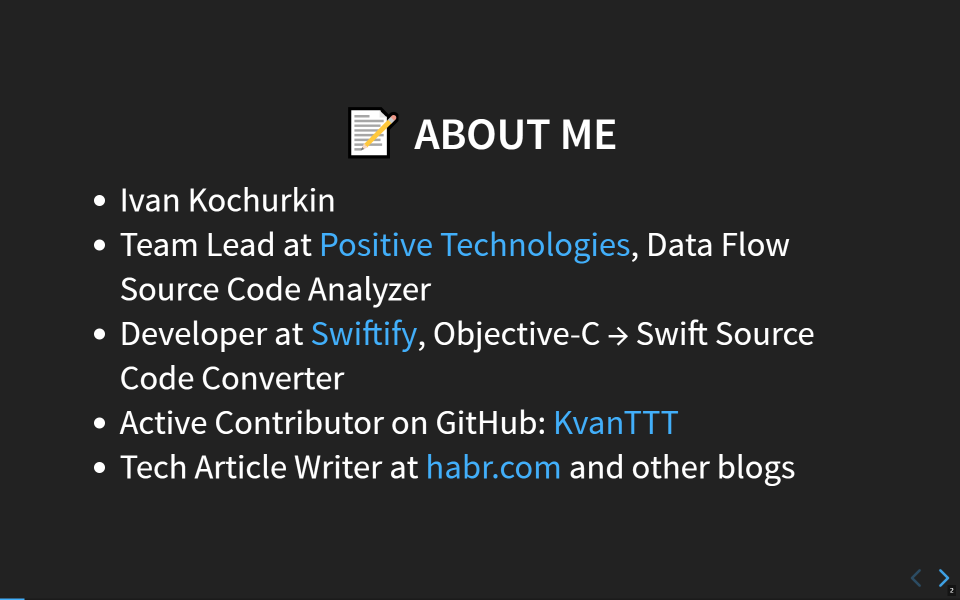
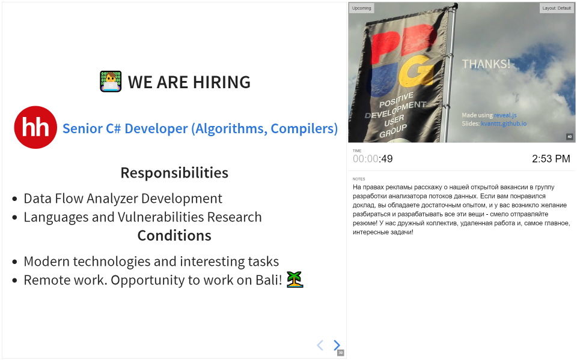
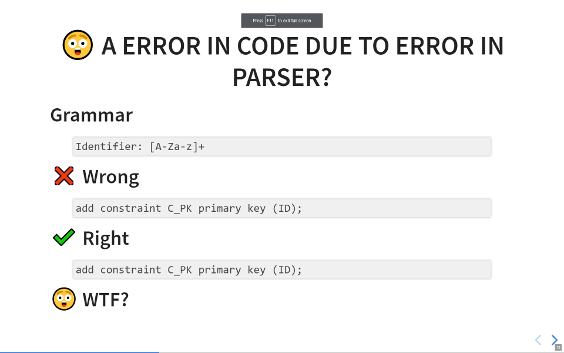
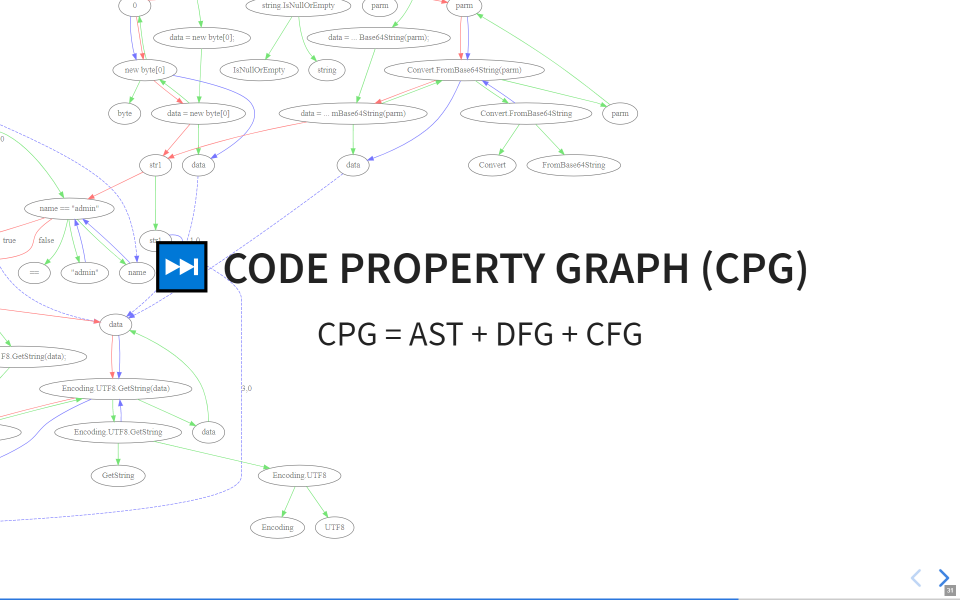
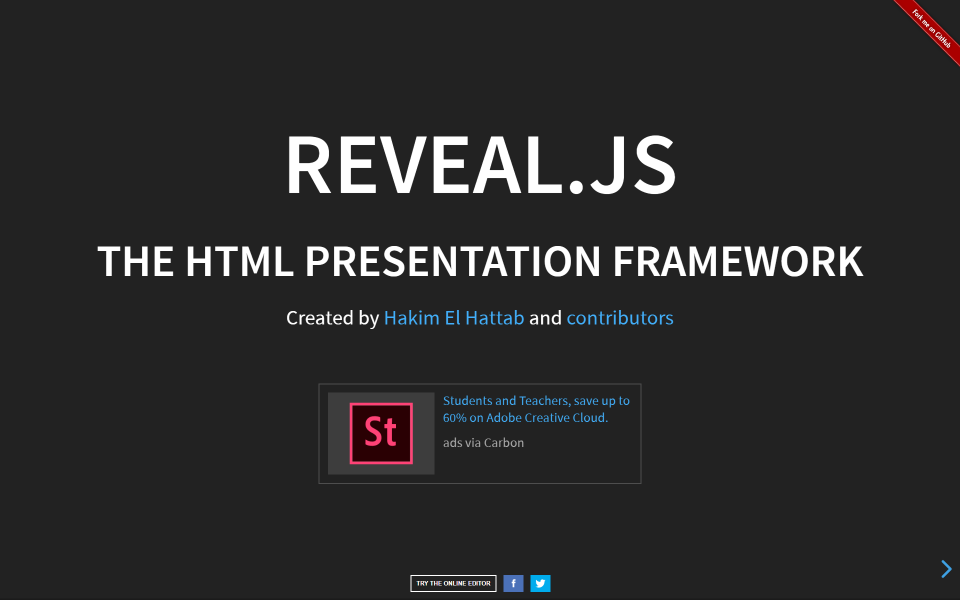

# Современный формат презентаций

В настоящее время распространенными форматами презентаций являются **pdf**, а
то и **pptx**. Однако первый вообще не интерактивный, а второй привязан к
Windows, к тому же для его создания требуется проприетарное ПО.

Существует много разных JavaScript движков для рендеринга презентаций,
с помощью которых можно создавать интерактивные презентациии, причем хостить их
сразу на сайте. Мне пока что удалось попробовать [Marp](https://yhatt.github.io/marp/)
и [Reveal](https://revealjs.com/).



Предлагаю новый формат презентаций с собственными гайдлайнами и видением.
Сразу выкладываю примеры [слайдов](https://kvanttt.github.io/Presentations/Source-code-analyzers-how-generalizable-are-they/English/index.html#/) и [видео](https://www.youtube.com/watch?v=SSaymBqOwWs).

<cut>

1. **Работа в онлайн** – не старшно если потеряте флешку, сломается комп и т.д.
2. **Работа локально** – требуется браузер. Если доступ к инету внезапно пропадет.
   Но в этом случае все картинки должны быть тоже локальными.
3. Кроссплатформенность (**Win**, **Mac**, **Linux**, **Android**, **iOS**).
   Да, реально, можно листать ее хоть на телефоне!
4. Язык слайдов: **английский**. В хорошей презентации мало текста, причем он простой.
   Презентация будет понятна как русскоязычной аудитории, так и глобальной.
   Аудиодорожку можно легко перевести, а изменить видео – нет.
5. Доступ **по ссылке** – любой желающий может открыть презентацию на своем устройстве
   прямо во время доклада. На титульном слайде короткая ссылка kvanttt.github.io
   на основной сайт, через который легко перейти на презентацию по полноценной, длинной.
6. Из ссылки на презентацию https://kvanttt.github.io/Presentations/Source-code-analyzers-how-generalizable-are-they/English/index.html можно понять следующее:
    * Кто автор: **kvanttt**
    * Какой формат: **Presentations**
    * Язык: **English**
    * Название доклада: **Source-code-analyzers-how-generalizable-are-they**
    * Также на любую страницу презентации можно сделать ссылку
7. Темная и светлая темы для лучшей адаптации к освещению, настроению.
   Также можно создать и свою тему.

<table>
  <tr>
    <td>
      
    </td>
    <td>
      
    </td>
  </tr>
</table>

8. Возможность использования систему контроля версий **Git** и текстовый формат
   [**Markdown**](https://ru.wikipedia.org/wiki/Markdown):
    * Простой формат, «Python» для технических писателей.
    * Полная и удобная история изменений.
    * Ветки, аменды, мержи, рибейзы, версионирование, blame и другие полезные
      полезные фичи Гита.
    * Технические писатели также могут вычитывать текст с помощью механизма
      **Pull Request | Merge Request** или просто коммитить в соответствующую ветвь.
    * Вот так выглядит папка с исходниками: https://github.com/KvanTTT/Presentations/tree/master/Source-code-analyzers-how-generalizable-are-they

<details>

<summary>Пример исходника слайда</summary>

```markdown
<!-- .slide: style="text-align: left;" -->

# 🕵️ Text fingerprinting with zero-length characters

Be c​aref​ul wh​at yo​u copy

<span class="fragment">🕵️ [https://diffchecker.com](https://www.diffchecker.com/M2PvqSXw)</span>

<span class="fragment">
Be c•aref•ul wh•at yo•u copy•
</span>

<aside class="fragment" align="middle">Detail: [habr.com](https://habr.com/post/352950/) | [Medium](https://medium.com/@umpox/be-careful-what-you-copy-invisibly-inserting-usernames-into-text-with-zero-width-characters-18b4e6f17b66)
</span>

<br>

<aside class="notes">
Есть и другая похожая забавная история с символами, но только уже нулевой длины.
Например, в эту строку я вставил 5 таких символов. Не верите? Можете сами
в этом убедиться с помощью сервиса <https://www.diffchecker.com>.
Эти символы можно использовать как уникальные "отпечатки" текста для
идентификации пользователей. С помощью этого способа, например, можно поиграть в
разведчика: в копируемое сообщение закодировать имя пользователя и понять,
кто сливает какую-то конфиденциальную инфу :)

Подробнее о разведовательной деятельности таким способом вы можете почитать на
хабре и медиуме.
</aside>

---
```

</details>

9. Аннотации к слайдам: во время презентации можно нажать на **S** и посмотреть на
   заготовленные тезисы или речь. Также доступен таймер по котором можно замерить
   продолжительность выступления. Аннотации можно включать на второстепенном экране.



10. 😃 Эмоджи для ассоциирования слайдов с визуальным образами.



11. Картинки (схемы) в формате **SVG**:
    * Увеличение без потери качества.
    * Хорошо интегрируется с Git, т.к. текстовый формат.
    * Можно изменить цвета, шрифта и другие элементы прямо в файле.
    * Маленький размер.



12. Возможность использования **Visual Studio Code** с плагинами. Слева – превью,
    справа или в браузере – готовый вариант, рендер. Есть плагин для проверки
    правописания, генерации содержания, форматирования таблиц и другие.
13. При необходимости код самих слайдов и аннотаций можно распечатать (например,
    для прогона). Это обычный [текст](https://raw.githubusercontent.com/KvanTTT/Presentations/master/Source-code-analyzers-how-generalizable-are-they/English.md).
14. Все инструменты, форматы и статичный хостинг бесплатное.
15. В движке **reveal.js** доступны и другие возможности, например можно
    поэкспериментировать с интерактивной версией. Подробнее – [по ссылке](https://revealjs.com/).



16. Презентация смотрится просто и классно :)

## Неудобства

1. Кривой экспорт в **pdf**, приходится править. Тем не менее, тоже [доступен‌](https://speakerdeck.com/pdugslides/mozhno-li-obobshchit-analizator-iskhodnykh-kodov).
2. Нет экспорта в pptx.
3. Не очень легко освоить, особенно не программистам и не фронтэндщикам
   (в идеале нужно знать **HTML** и **CSS**).
4. Правки не очень легко вносить. Но можно приспособиться и автоматизировать.
5. 😔 Эмоджи не везде одинаково отображаются.
6. Движок пока что сыроват.

В общем за подобным будущее. Давайте реализовывать его прямо сейчас!

Статьи тоже можно писать с использованием Git и Markdown, но об этом и других
подробностях я собираюсь написать в другой статье.