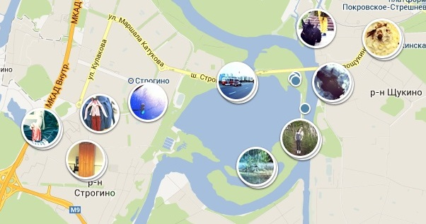
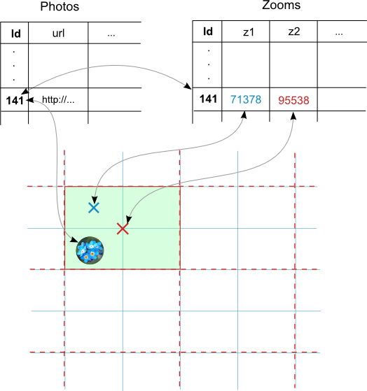
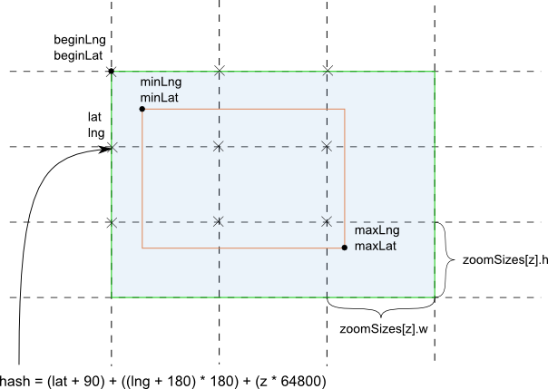

# Implementation of selecting, caching and displaying photos on the map

*Disclaimer. The original article was written in August 2013. Therefore now (in
2017) some information may not be relevant.*

In this article, I decided to describe how the functionality of selecting and
displaying photos on a specific place on the map was implemented in our photo
service *gfranq.com*. The photo service does not work now.



Since we had a lot of photos in our service and sending requests to database
every time the viewport changes was too resource-intensive, it was logical to
divide the map into several areas that contain information about the retrieved
data. For obvious reasons, these areas have rectangular shape (although
hexagonal grid was considered too). As the areas become more spherical at large
scales, elements of spherical geometry and tools for it were also considered.

In this article, the following issues were raised:

* Storing and retrieving photos from the database and caching them on the server
  (SQL, C#, ASP.NET).
* Downloading necessary photos on the client side and saving them to the client
  cache (JavaScript).
* Recalculation of photos that must be hidden or shown when the viewport
  changes.
* Elements of spherical geometry.

## Contents

* [Server part](#server-part)
  * [Built-in geotypes](#built-in-geotypes)
  * [Normal selection](#normal-selection)
  * [Using additional hash table](#using-additional-hash-table)
  * [Caching photos for multi-threaded access](#caching-photos-for-multi-threaded-access)
* [Client side](#client-side)
  * [Initializing the map](#initializing-the-map)
    * [Determining the geolocation using HTML5](#determining-the-geolocation-using-HTML5)
    * [Determining the geolocation using information from the server](#determining-the-geolocation-using-information-from-the-server)
  * [Calculating partially visible rectangular areas](#calculating-partially-visible-rectangular-areas)
    * [Calculating the size of caching areas](#calculating-the-size-of-caching-areas)
    * [Using delay when redrawing](#using-delay-when-redrawing)
    * [Calculating coordinates and hashes of partially visible areas](#calculating-coordinates-and-hashes-of-partially-visible-areas)
  * [Redrawing the displayed photos](#redrawing-the-displayed-photos)
    * [Distance on the map](#distance-on-the-map)
* [Conclusion](#conclusion)

## Server part

The following methods of selecting and storing geoinformation in the database
were designed:

* SQL Server built-in geography data type.
* Normal selection with restrictions.
* Using additional tables.

Further, these methods will be described in details.

### Built-in geotypes

As is known, SQL Server 2008 supports geography and geometry data types, which
allow to specify geographical (on the sphere) and geometrical (on the plane)
information, such as points, lines, polygons
[etc.](http://msdn.microsoft.com/en-us/library/bb933790.aspx). In order to
retrieve all photos enclosed by a rectangle with coordinates (`lngMin` `latMin`)
and (`latMax` `lngMax`), you can use the following query:

```SQL
DECLARE @h geography;
DECLARE @p geography;
SET @rect =
geography::STGeomFromText('POLYGON((lngMin latMin, lngMax latMin, lngMax latMax, lngMin latMax, lngMin latMin))', 4326);
SELECT TOP @cound id, image75Path, geoTag.Lat as Lat, geoTag.Long as Lng, popularity, width, height
FROM Photo WITH (INDEX(IX_Photo_geoTag))
WHERE @rect.STContains(geoTag) = 1
ORDER BY popularity DESC
```

Note that the polygon is oriented counterclockwise and the spatial index
`IX_Photo_geoTag` defined by the coordinates is used (besides, spatial indexes
are built using [B-trees](https://en.wikipedia.org/wiki/B-tree)).

However, it turned out that in Microsoft SQL Server 2008, spatial indexes do not
work if the column with geotypes can accept `NULL` values, and a composite index
cannot contain a column with geography data type, and this question was
[discussed on Stackoverflow](http://stackoverflow.com/q/15004850/1046374).
That's why the performance of such queries (without indexes) becomes very low.

The following approaches can solve this problem:

* Since `NULL` values cannot be used, the default values for this column are
  coordinates (0, 0) which point to a location in the Atlantic Ocean near Africa (the
  starting point for measuring latitude and longitude). However, in this place as
  well as nearby the real points can be located, and the photos not from the map
  should be ignored. If you change zero point (0, 0) to far north point (0, 90),
  then everything will be much better, because latitude 90 points to the edge of
  the map, and you should ignore this value when building the grid (i.e. build up
  to latitude 89).
* Using SQL Server 2012 or higher and changing the compatibility level of the
  database to 110 or higher by executing `ALTER DATABASE database_name SET
  COMPATIBILITY_LEVEL = 110`. In this version of SQL Server, the bug with `NULL`
  values of geotypes was fixed and the support of polygons of different
  orientations (counterclockwise and clockwise) was added.

Despite the wide possibilities of geotypes (they allow you to make not only a
simple selection as shown above, but also to use distances and different
polygons), we did not use them in our project.

### Normal selection

To select photos from the area bounded by coordinates (`lngMin` `latMin`) and
(`latMax` `lngMax`), use the following query:

```SQL
SELECT TOP @Count id, url, ...
FROM Photo
WHERE latitude > @latMin AND longitude > @lngMin AND latitude < @latMax AND longitude < @lngMax
ORDER BY popularity DESC
```

Note that in this case you can create any indexes for `latitude` and `longitude`
fields (in contrast to the first method), because an ordinary float data type is used.
However, there are 4 comparison operations in this selection.

### Using additional hash table

The most optimal solution to the problem of selecting photos from certain areas
is to create additional table `Zooms` which stores strings containing hashes of
areas for each zoom, as shown below.



The following SQL query can be used (`zn` - current zoom level):

```SQL
DECLARE @hash float;
SET @hash = (@latMin + 90) + (@lngMin + 180) * 180 + (@latMax + 90) * 64800 + (@lngMax + 180) * 11664000;
SELECT TOP @Count id, url, ...
FROM Photo WHERE id = (SELECT id FROM Zooms WHERE zn = @hash)
```

The disadvantage of this approach is that the additional table occupies
additional memory space.

Despite the advantages of the latter method, we used the second method ([Normal
selection](#normal-selection)) on the server, as it showed good performance.

### Caching photos for multi-threaded access

After extracting the information from the database in one way or another, photos
are placed in the server cache using synchronizing object to support
multithreading as follows:

```CSharp
private static object SyncObject = new object();
...
List<Photo> photos = (List<Photo>)CachedAreas[hash];
if (photos == null)
{
    // Use lock to avoid extracting from and adding to the cache more than once.
    lock (SyncObject)
    {
        photos = (List<Photo>)CachedAreas[hash];
        if (photos == null)
        {
            photos = PhotoList.GetAllFromRect(latMin, lngMin, latMax, lngMax, count);
            // Adding information about photos to the cache with a storage time of 2 minutes with a high storage priority.
            CachedAreas.Add(hash, photos, null, DateTime.Now.AddSeconds(120), Cache.NoSlidingExpiration, CacheItemPriority.High, null);
        }
    }
}
// Further usage of CachedAreas[hash]
```

This section described server functionality for retrieving photos from the
database and saving them to the cache. The next section will describe what
happens on the client side in the browser.

## Client side

To visualize the map and photos on it, the Google Maps API was used. First, the
user map must be moved to a certain place, corresponding to the geolocation of
the photos.

### Initializing the map

There are two ways to determine the geolocation when initializing the map: to
use the capabilities of HTML5 or to use pre-calculated coordinates for regions.

#### Determining the geolocation using HTML5

```JavaScript
function detectRegion() {
    if (navigator.geolocation) {
        navigator.geolocation.getCurrentPosition(success);
    } else {
        map.setZoom(defaultZoom);
        map.setCenter(defaultPoint);
    }
}

function success(position) {
    ...
    map.setZoom(defaultZoom);
    map.setCenter(new google.maps.LatLng(position.coords.latitude, position.coords.longitude));
}
```

The disadvantage of this approach is that not all browsers support this
functionality of HTML5 and the user may not allow access to geoinformation on
his device.

#### Determining the geolocation using information from the server

The map is initialized in the section of the source code below, where `bounds`
is the coordinates of the region (populated area, region or country) returned by
the server. The approximate zoom level is calculated in the function
`getZoomFromBounds` (taken from
[stackoverflow](http://stackoverflow.com/a/6055653/1046374)).

```JavaScript
var northEast = bounds.getNorthEast();
var southWest = bounds.getSouthWest();
var myOptions = {
    zoom: getZoomFromBounds(northEast, southWest),
    center: new google.maps.LatLng((northEast.lat() + southWest.lat()) / 2, (northEast.lng() + southWest.lng()) / 2),
    mapTypeId: google.maps.MapTypeId.ROADMAP,
    minZoom: 3,
    maxZoom: 19
}
map = new google.maps.Map(document.getElementById("map_canvas"), myOptions);
```

```JavaScript
function getZoomFromBounds(ne, sw) {
    var GLOBE_WIDTH = 256; // a constant in Google's map projection
    var west = sw.lng();
    var east = ne.lng();
    var angle = east - west;
    if (angle < 0) {
      angle += 360;
    }
    return Math.round(Math.log($('#map_canvas').width() * 360 / angle / GLOBE_WIDTH) / Math.LN2);
}
```

On the server, the regions are calculated depending on the user's IP address. To
aggregate all coordinates of boundaries for each region, [google geocoding
api](https://developers.google.com/maps/documentation/geocoding/?hl=en) was
used, although it is not legitimate to use such information offline; in
addition, there is a limit of 2500 requests per day. For each city, region and
country from our database, a query was generated that returned the required
boundaries of `viewport` and `bounds`. They differ only for large areas that
cannot fit completely into the viewport. If the server returned an error, then
other queries were used in which the native language of that region or English
was used, the part {Populated area} was removed, etc.
`http://maps.googleapis.com/maps/api/geocode/xml?address={Country},{Region},{Populated
area}&sensor=false`

For example, for the following query:
<http://maps.googleapis.com/maps/api/geocode/xml?address=Россия,Ивановская%20область,Иваново&sensor=false>

<details>
<summary>The following coordinates will be returned (fragment)</summary>

```html
...
<location>
    <lat>56.9951313</lat>
    <lng>40.9796047</lng>
</location>
<location_type>APPROXIMATE</location_type>
<viewport>
    <southwest>
        <lat>56.9420231</lat>
        <lng>40.8765941</lng>
    </southwest>
    <northeast>
        <lat>57.0703221</lat>
        <lng>41.0876169</lng>
    </northeast>
</viewport>
<bounds>
<southwest>
    <lat>56.9420231</lat>
    <lng>40.8765941</lng>
</southwest>
<northeast>
    <lat>57.0703221</lat>
    <lng>41.0876169</lng>
</northeast>
</bounds>
...
```

</details>

### Calculating partially visible rectangular areas

#### Calculating the size of caching areas

So, as mentioned earlier, all photos on both client and server side are cached
by rectangular areas, the starting point of which is an arbitrary point (in our
case the point with coordinates (0, 0)), and the size is calculated depending on
the current zoom level as follows:

```JavaScript
// The initial window at which initMapSizeLat and initMapSizeLng were calculated
var initDefaultDimX = 1000, var initDefaultDimY = 800;
// The current default viewport which depends on the size of the areas.
var currentDefaultDimX = 1080, var currentDefaultDimY = 500;
var initMapSizeLat = 0.0003019; var initMapSizeLng = 0.00067055;
// The coefficient of size reduction (increase).
var initRatio = 0.75;

// To calculate the size of the smallest caching area, the map was zoomed in to the maximum zoom level
// I.e. initMapSizeLat and initMapSizeLng were calculated empirically.
var initZoomSize = new google.maps.Size(
initMapSizeLat / initDefaultDimX * currentDefaultDimX * initRatio,
initMapSizeLng / initDefaultDimY * currentDefaultDimY * initRatio);

// All subsequent sizes of areas can be calculated based only on the smallest area (by multiplying each size by 2, because with increasing the zoom level by 1, the linear dimensions increase by 2 times, and the quadratic dimensions increase by 4 times).
function initZoomSizes() {
    zoomSizes = [];
    var coef = 1;
    for (var i = 21; i >= 0; i--) {
        zoomSizes[i] = new google.maps.Size(initZoomSize.width * coef, initZoomSize.height * coef);
        coef *= 2;
    }
}
```

Thus, at each zoom level, the size of the rectangular area is `0.75^2=0.5625` from
the size of the current viewport, if it has width of 1080px and height of 500px.

#### Using delay when redrawing

Since the redrawing of all the photos on the map is not a fast operation (as
will be shown later), we decided to do it with some delay after the user input:

```JavaScript
google.maps.event.addListener(map, 'bounds_changed', function () {
    if (boundsChangedInverval != undefined)
        clearInterval(boundsChangedInverval);

    var zoom = map.getZoom();
    boundsChangedInverval = setTimeout(function () {
        boundsChanged();
    }, prevZoom === zoom ? moveUpdateDelay : zoomUpdateDelay);

    prevZoom = zoom;
});
```

#### Calculating coordinates and hashes of partially visible areas

Calculation of coordinates and hashes of all the rectangles that overlap the
visible window with coordinates (`latMin`, `lngMin`) and dimensions calculated
using the algorithm described earlier is done as follows:



```JavaScript
var s = zoomSizes[zoom];
var beginLat = Math.floor((latMin - initPoint.x) / s.width) * s.width + initPoint.x;
var beginLng = Math.floor((lngMin - initPoint.y) / s.height) * s.height + initPoint.y;
var lat = beginLat;
var lng = beginLng;

if (lngMax <= beginLng)
    beginLng = beginLng - 360;

while (lat <= maxlat) {
    lng = beginLng;
    while (lng <= maxLng) {
        // lat and normalizeLng(lng) coordinates are the coordinates of the overlapping rectangles.
        // Longitude normalization is used because the right boundary can be greater than 180 or the left boundary can be less than -180.
        loadIfNeeded(lat, normalizeLng(lng));
        lng += s.height;
    }
    lat += s.width;
}

function  normalizeLng(lng)
{
    var rtn = lng % 360;
        if (rtn <= 0)
            rtn += 360;
        if (rtn > 180)
            rtn -= 360;
        return rtn;
}
```

After that, for each area, the following function is called, which sends the
request to the server, if necessary. The formula of hash calculation returns a
unique value for each area, because the starting point and dimensions are fixed.

```JavaScript
function loadIfNeeded(lat, lng) {
    var hash = calculateHash(lat, lng, zoom);
    if (!(hash in items)) {
        // Send a query to the database and put this cell in the client cache.
    } else {
        // Do nothing.
    }
}

function calculateHash(lat, lng, zoom) {
    // lat: [-90..90]
    // lng: [-180..180]
    return (lat + 90) + ((lng + 180) * 180) + (zoom * 64800);
}
```

### Redrawing the displayed photos

After all the photos are downloaded or extracted from the cache, some of them
need to be redrawn. With a large number of photos, or markers, in one place,
some of them should be hidden, but then it becomes unclear how many photos are
located in this place. To solve this problem, we decided to support two types of
markers: markers displaying photos and markers showing that there are photos in
this place. In addition, if all markers are hidden when the boundaries are
changed, and then they are redisplayed, then the user may notice flickering. To
solve these problems, the following algorithm was developed:

1. Extracting all visible photos from the client cache to the array `visMarks`.
   Calculation of these areas with photos was described above.
2. Sorting the received markers by popularity.
3. Finding overlapping markers using `markerSize`, `SmallMarkerSize`,
   `minPhotoDistRatio` and `pixelDistance`.
4. Creating arrays of large markers with `maxBigVisPhotosCount` and small
   markers with `maxSmlVisPhotosCount`.
5. Defining old markers that should be hidden and adding them to
   `smlMarksToHide` and `bigMarksToHide` using `refreshMarkerArrays`.
6. Updating the visibility and zoom index `zIndex` for new markers that should
   be displayed using `updateMarkersVis`.
7. Adding photos, which became visible at the current time, to the feed using
   `addPhotoToRibbon`.

<details>
<summary>Algorithm for recalculation of visible markers</summary>

```JavaScript
function redraw() {
    isRedrawing = true;

    var visMarker;
    var visMarks = [];
    var visBigMarks2;
    var visSmlMarks2;
    var bigMarksToHide = [];
    var smlMarksToHide = [];

    var photo;
    var i, j;

    var bounds = map.getBounds();
    var northEast = bounds.getNorthEast();
    var southWest = bounds.getSouthWest();
    var latMin = southWest.lat();
    var lngMin = southWest.lng();
    var latMax = northEast.lat();
    var lngMax = northEast.lng();
    var ratio = (latMax - latMin) / $("#map_canvas").height();

    var zoom = map.getZoom();
    visMarks = [];
    var k = 0;

    var s = zoomSizes[zoom];
    var beginLat = Math.floor((latMin - initPoint.x) / s.width) * s.width + initPoint.x;
    var beginLng = Math.floor((lngMin - initPoint.y) / s.height) * s.height + initPoint.y;
    var lat = beginLat;
    var lng = beginLng;

    i = 0;
    if (lngMax <= beginLng)
        beginLng = beginLng - 360;

    // Extracting all visible markers.
    while (lat <= latMax) {
        lng = beginLng;
        while (lng <= lngMax) {
            var hash = calcHash(lat, normLng(lng), zoom);
            if (!(hash in curItems)) {
            }
            else {
                var item = curItems[hash];
                for (photo in item.photos) {
                    if (bounds.contains(item.photos[photo].latLng)) {
                        visMarks[i] = item.photos[photo];
                        visMarks[i].overlapCount = 0;
                        i++;
                    }
                }
            }
            k++;
            lng += s.height;
        }
        lat += s.width;
    }

    // Sorting markers by popularity.
    visMarks.sort(function (a, b) {
        if (b.priority !== a.priority) {
            return b.priority - a.priority;
        } else if (b.popularity !== a.popularity) {
            return b.popularity - a.popularity;
        } else {
            return b.id - a.id;
        }
    });

    // Finding overlapping markers and markers that exceed a certain specified number.
    var curInd;
    var contains;
    var contains2;
    var dist;
    visBigMarks2 = [];
    visSmlMarks2 = [];
    for (i = 0; i < visMarks.length; i++) {
        contains = false;
        contains2 = false;
        visMarker = visMarks[i];

        for (j = 0; j < visBigMarks2.length; j++) {
            dist = pixelDistance(visMarker.latLng, visBigMarks2[j].latLng, zoom);
            if (dist <= markerSize * minPhotoDistRatio) {
                contains = true;
                if (contains && contains2)
                    break;
            }
            if (dist <= (markerSize + smallMarkerSize) / 2) {
                contains2 = true;
                if (contains && contains2)
                    break;
            }
        }

        if (!contains) {
            if (visBigMarks2.length < maxBigVisPhotosCount) {
                smlMarksToHide[smlMarksToHide.length] = visMarker;
                visBigMarks2[visBigMarks2.length] = visMarker;
            }
        } else {
            bigMarksToHide[bigMarksToHide.length] = visMarker;
            if (!contains2 && visSmlMarks2.length < maxSmlVisPhotosCount) {
                visSmlMarks2[visSmlMarks2.length] = visMarker;
            } else {
                visBigMarks2[j].overlapCount++;
            }
        }
    }

    // Adding markers that should be hidden to smlMarksToHide and bigMarksToHide.
    refreshMarkerArrays(visibleSmallMarkers, visSmlMarks2, smlMarksToHide);
    refreshMarkerArrays(visibleBigMarkers, visBigMarks2, bigMarksToHide);

    // Hiding invisible markers and displaying visible markers when zIndex changes.
    var curZInd = maxBigVisPhotosCount + 1;
    curZInd = updateMarkersVis(visBigMarks2, bigMarksToHide, true, curZInd);
    curZInd = 0;
    curZInd = updateMarkersVis(visSmlMarks2, smlMarksToHide, false, curZInd);

    visibleBigMarkers = visBigMarks2;
    visibleSmallMarkers = visSmlMarks2;

    // Adding visible photos to the feed.
    trPhotosOnMap.innerHTML = '';
    for (var marker in visBigMarks2) {
        addPhotoToRibbon(visBigMarks2[marker]);
    }

    isRedrawing = false;
}

function refreshMarkerArrays(oldArr, newArr, toHide) {
    for (var j = 0; j < oldArr.length; j++) {
        contains = false;
        var visMarker = oldArr[j];
        for (i = 0; i < newArr.length; i++) {
            if (newArr[i].id === visMarker.id) {
                contains = true;
                break;
            }
        }
        if (!contains) {
            toHide[toHide.length] = visMarker;
        }
    }
}

function updateMarkersVis(showArr, hideArr, big, curZInd) {
    var marker;
    var bounds = map.getBounds();

    for (var i = 0; i < showArr.length; i++) {
        var photo = showArr[i];
        if (big) {
            marker = photo.bigMarker;
            $('#divOvlpCount' + photo.id).html(photo.overlapCount);
        } else {
            marker = photo.smlMarker;
        }
        marker.setZIndex(++curZInd);
        if (marker.getMap() === null) {
            marker.setMap(map);
        }
    }

    for (i = 0; i < hideArr.length; i++) {
        marker = big ? hideArr[i].bigMarker : hideArr[i].smlMarker;
        if (marker.getMap() !== null) {
            marker.setMap(null);
            marker.setZIndex(0);
            if (!bounds.contains(hideArr[i].latLng))
                hideArr[i].priority = 0;
        }
    }

    return curZInd;
}

function addPhotoToRibbon(marker) {
    var td = createColumn(marker);

    if (isLatLngValid(marker.latLng)) {
        trPhotosOnMap.appendChild(td);
    } else {
        trPhotosNotOnMap.appendChild(td);
        if (photoViewMode == 'user') {
            var img = $("#photo" + marker.id).children()[0];
            $('#photo' + marker.id).draggable({
                helper: 'clone',
                appendTo: $('#map_canvas'),
                stop: function (e) {
                    var mapBoundingRect = document.getElementById("map_canvas").getBoundingClientRect();
                    var point = new google.maps.Point(e.pageX - mapBoundingRect.left, e.pageY - mapBoundingRect.top);

                    var latLng = overlay.getProjection().fromContainerPixelToLatLng(point);
                    marker.latLng = latLng;
                    marker.priority = ++curPriority;
                    placeMarker(marker);
                },
                containment: 'parent',
                distance: 5
            });
        }
    }
}
```

</details>

#### Distance on the map

To calculate the distance between two points on the map in _pixels_ the
following function is used:

```JavaScript
var Offset = 268435456;
var Radius = 85445659.4471;

function pixelDistance(latLng1, latLng2, zoom) {
    var x1 = lonToX(latLng1.lng());
    var y1 = latToY(latLng1.lat());
    var x2 = lonToX(latLng2.lng());
    var y2 = latToY(latLng2.lat());
    return Math.sqrt((x1 - x2) * (x1 - x2) + (y1 - y2) * (y1 - y2)) >> (21 - zoom);
}

function lonToX(lng) {
    return Math.round(Offset + Radius * lng * Math.PI / 180);
}

function latToY(lat) {
    return Math.round(Offset - Radius * Math.log((1 + Math.sin(lat * Math.PI / 180)) / (1 - Math.sin(lat * Math.PI / 180))) / 2);
}
```

This function was also found on stackoverflow.

To make the markers look like circles with photos (like vkontakte), the plugin
[RichMarker](https://github.com/googlemaps/js-rich-marker) was used with the
addition of an arbitrary style to div element.

## Conclusion

It turned out that in order to display photos on the map quickly and correctly,
we needed to solve quite interesting and non-trivial problems related to caching
and spherical geometry. Despite the fact that not all described methods were
actually used in our project, time was not wasted, as the experience we get
might be useful in other projects, and it might also be useful for those who
have read and understood this article.