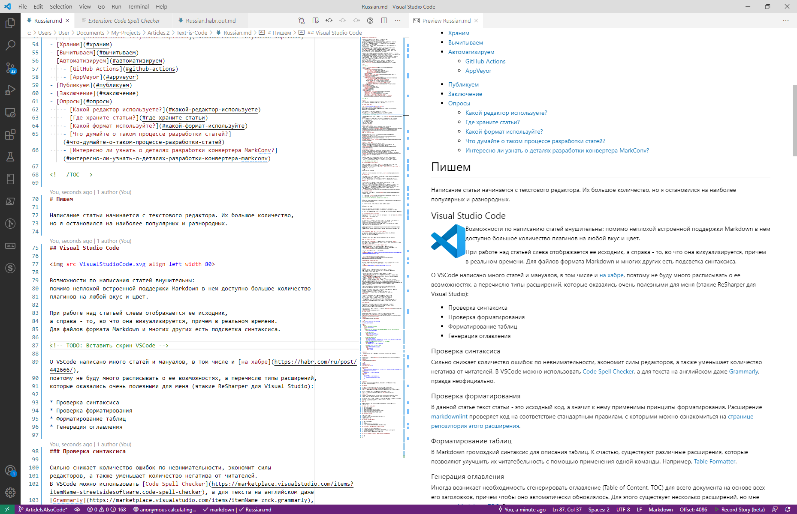
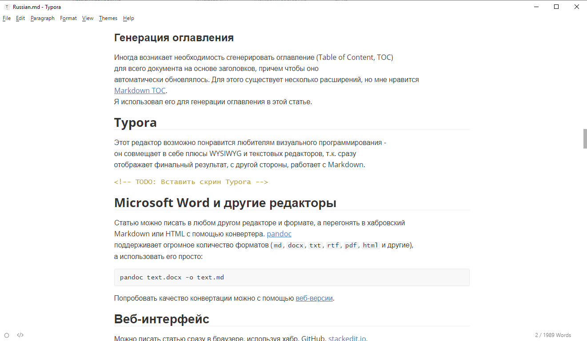

# Статьи - это тоже исходный код

Наконец-то высвободилось время написать что-нибудь на хабр.
Открываю браузер, создаю новый черновик, приступаю.
Но вместо этого смотрю на мигающий курсор и думаю:
как же неудобно набирать статью в этом текстовом поле без подсветки синтаксиса,
почему бы не воспользоваться любимым текстовым редактором?
Ок, альтабаюсь до VSCode и продолжаю... Но незадача: его формат маркдауна не
совсем совместим с форматом хабра.
Что же: придется обойтись без корректного предпросмотра, либо вообще вернуться
к функциональности хабра.

Или не придется? Почему бы не написать утилиту, которая конвертирует разные
форматы маркдаунов друг в друга, в частности GitHub -> Habr?
Такую [программу](https://github.com/KvanTTT/MarkConv) я в итоге разработал,
и стал использовать - теперь не надо копировать статьи в редактор хабра, чтобы
посмотреть как она выглядит. Из VSCode можно не вылезать.

Набивать текст в VSCode и пользоваться всем ассортиментом его плагинов - это удобно,
но мысли о неэффективном процессе создания статей не исчезли.
Раз уж я набираю текст в VSCode, то почему бы его сразу не комиттить в гит-репозиторий?
Это дает немало новых возможностей, которыми пользуются программисты:
версионирование, бекапы на локальные носители или веб-сервисы, правки от редакторов
и пользователей. А если уж работаем с GitHub, то почему бы не пойти еще дальше
и не внедрить непрерывную интеграцию для автоматической проверки
и конвертации статей в облаке?

В итоге я обнаружил, что больше занимаюсь разработкой, а не писательством.
Статья подробно описывает этот процесс и используемый инструментарий.
Кстати, [мой репозиторий](https://github.com/KvanTTT/Articles) есть на GitHub.

<cut>

<!-- TOC -->

- [Статьи - это тоже исходный код](#статьи---это-тоже-исходный-код)
- [Пишем](#пишем)
    - [Visual Studio Code](#visual-studio-code)
        - [Проверка синтаксиса](#проверка-синтаксиса)
        - [Проверка форматирования](#проверка-форматирования)
        - [Форматирование таблиц](#форматирование-таблиц)
        - [Генерация оглавления](#генерация-оглавления)
    - [Typora](#typora)
    - [Microsoft Word и другие редакторы](#microsoft-word-и-другие-редакторы)
    - [Веб-интерфейс](#веб-интерфейс)
- [Ковертируем](#ковертируем)
    - [Используем MarkConv](#используем-markconv)
    - [Дополнительные возможности MarkConv](#дополнительные-возможности-markconv)
        - [Проверка синтаксиса](#проверка-синтаксиса-1)
        - [Ограничение на размер текста относительно тега cut](#ограничение-на-размер-текста-относительно-тега-cut)
        - [Проверка абсолютных ссылок](#проверка-абсолютных-ссылок)
        - [Отображение локальных адресов ресурсов на абсолютные](#отображение-локальных-адресов-ресурсов-на-абсолютные)
        - [Кликабельная титульная картинка](#кликабельная-титульная-картинка)
- [Храним](#храним)
- [Вычитываем](#вычитываем)
- [Автоматизируем](#автоматизируем)
    - [GitHub Actions](#github-actions)
    - [AppVeyor](#appveyor)
- [Публикуем](#публикуем)
- [Заключение](#заключение)
- [Опросы](#опросы)
    - [Какой редактор используете?](#какой-редактор-используете)
    - [Где храните статьи?](#где-храните-статьи)
    - [Какой формат используйте?](#какой-формат-используйте)
    - [Что думайте о таком процессе разработки статей?](#что-думайте-о-таком-процессе-разработки-статей)
    - [Интересно ли узнать о деталях разработки конвертера MarkConv?](#интересно-ли-узнать-о-деталях-разработки-конвертера-markconv)

<!-- /TOC -->

# Пишем

Написание статьи начинается с текстового редактора. Их большое количество,
но я остановился на наиболее популярных и разнородных.

## Visual Studio Code


Возможности по написанию статей внушительны:
помимо неплохой встроенной поддержки Markdown в нем доступно большое количество
плагинов на любой вкус и цвет.

При работе над статьей слева отображается ее исходник,
а справа - то, во что она визуализируется, причем в реальном времени.
Для файлов формата Markdown и многих других есть подсветка синтаксиса.



О VSCode написано много статей и мануалов, в том числе и [на хабре](https://habr.com/ru/post/442666/),
поэтому не буду много расписывать о ее возможностях, а перечислю типы расширений,
которые оказались очень полезными для меня (этакие ReSharper для Visual Studio):

* Проверка синтаксиса
* Проверка форматирования
* Форматирование таблиц
* Генерация оглавления

### Проверка синтаксиса

Сильно снижает количество ошибок по невнимательности, экономит силы
редакторов, а также уменьшает количество негатива от читателей.
В VSCode можно использовать [Code Spell Checker](https://marketplace.visualstudio.com/items?itemName=streetsidesoftware.code-spell-checker) (русский словарь нужно устанавливать отдельно), а для текста на английском даже
[Grammarly](https://marketplace.visualstudio.com/items?itemName=znck.grammarly),
правда неофициально.

### Проверка форматирования

В данной статье текст - это исходный код, а значит к нему применимы
принципы форматирования. Расширение
[markdownlint](https://marketplace.visualstudio.com/items?itemName=DavidAnson.vscode-markdownlint)
проверяет код на соответствие стандартным правилам, с которыми
можно ознакомиться на
[странице репозитория этого расширения](https://github.com/markdownlint/markdownlint/blob/master/docs/RULES.md).

### Форматирование таблиц

В Markdown громоздкий и не особо удобный синтаксис для описания таблиц.
К счастью, существуют различные расширения, которые позволяют улучшить их
читабельность одним кликом. Например,
[Table Formatter](https://marketplace.visualstudio.com/items?itemName=shuworks.vscode-table-formatter).

### Генерация оглавления

Иногда возникает необходимость сгенерировать оглавление (Table of Content, TOC)
для всего документа на основе заголовков, причем чтобы оно
автоматически обновлялось. Для этого существует несколько расширений, но мне нравится
[Markdown TOC](https://marketplace.visualstudio.com/items?itemName=AlanWalk.markdown-toc).
Я использовал его для генерации оглавления в этой статье.

## Typora

Этот редактор возможно понравится любителям визуального программирования -
он совмещает в себе плюсы WYSIWYG и текстовых редакторов, т.к. сразу
отображает финальный результат и работает с Markdown.



## Microsoft Word и другие редакторы

Статью можно писать в любом другом редакторе и формате, а перегонять в хабровский
Markdown или HTML с помощью конвертера. [pandoc](https://pandoc.org/)
поддерживает огромное количество форматов (`md`, `docx`, `txt`, `rtf`, `pdf`, `html` и другие),
а использовать его просто:

```cmd
pandoc text.docx -o text.md
```

Попробовать качество конвертации можно с помощью [веб-версии](http://pandoc.org/try/).

## Веб-интерфейс

Можно писать статью сразу в браузере, используя хабр, GitHub, [stackedit.io](https://stackedit.io),
[dillinger.io](https://dillinger.io) и другие сервисы.
Но это не так удобно и не особо вписывается в процесс разработчика с
гитом и другими плюшками, зато дает возможность набирать текст хоть на планшете или телефоне.

# Ковертируем

После того как статья написана, ее нужно сконвертировать в формат
Habr. Этого можно было бы избежать, если бы формат хабра
полностью сочетался с [GitHub Flavored Markdown](https://github.github.com/gfm/),
который реализуется во многих других редакторах, в частности, в VSCode.
Однако существует несколько несоответствий,
самое важное из которых - неправильная обработка переносов строк. Из-за этого приходится
использовать однострочные абзацы, что плохо сочетается с системами контроля версий -
[diff](https://ru.wikipedia.org/wiki/Diff) раздувается и становится малоинформативным.
Есть и другие различия: реализация спойлеров, внутренних ссылок и
[прочие](https://github.com/limonte/dear-habr/issues?q=is:issue+is:open+label:markdown).

## Используем MarkConv

Конвертировать можно с помощью утилиты [MarkConv](https://github.com/KvanTTT/MarkConv)
следующим образом:

1. Устанавливаем [.NET Core](https://dotnet.microsoft.com/download) (если его еще нет)
2. Устанавливаем .NET Tool следующим образом:

<!-- Возможно надо будет заменить на nuget вместо myget -->

```
dotnet tool install -g MarkConv.Cli --version 1.2.0 --add-source https://www.myget.org/F/mark-conv/api/v3/index.json
```

3. Конвертируем статью в формат хабр-маркдауна следующим образом:

```
markconv -f <имярек.md> -o Habr
```

Утилиту можно запускать и на папке с md файлами - это используется
в непрерывной интеграции.

4. Статья <имярек.Habr.our.md> готова - ее можно копировать в черновик и публиковать.

## Дополнительные возможности MarkConv

MarkConv конвертирует не только в формат хабра, но и в формат [dev.to](https://dev.to/),
а также делает другие полезные проверки и замены.

### Проверка синтаксиса

В тексте в формате Markdown нет формальных ошибок - уместна любая последовательность символов.
Это и достоинство и недостаток - текст всегда можно прочитать, но
какие-то вещи могут ненамеренно отображаться некорректно.
Однако в таком тексте могут использоваться HTML секции, в которых могут быть ошибки
типа незакрытых тегов. В своих статьях я сразу нашел несколько:

```
[INFO] Converting of file /home/appveyor/projects/articles/Modern-Presentations-Format/Russian.md...
[WARN] Incorrect nesting: element </href> at [358,162..166) closes <a> at [358,14..15)
```

### Ограничение на размер текста относительно тега cut

На хабре есть резонные ограничения на размер текста до/после ката. MarkConv
проверяет их и выводит ошибку, если они нарушаются -
Хабр все равно такой текст не примет:

```
You need to insert <cut/> tag if the text contains more than 1000 characters
```

### Проверка абсолютных ссылок

Если задать флаг `--checklinks`, то будут проверяться все ссылки вида `http://`.
Это работает с некоторой задержкой и не всегда корректно - видимо сервисы детектируют DoS,
если запросов слишком много.

### Отображение локальных адресов ресурсов на абсолютные

Чтобы ресурсы не зависили от внешних сервисов (например, картинки),
то имеет смысл использовать тег `linkmap` следующим образом:

```md
<linkmap src=Markdown.svg dst=https://habrastorage.org/getpro/habr/post_images/a40/f88/64c/a40f8864c5f8db7888076cf30f5411f5.svg />
```

`src` - адрес локального ресурса, `dst` - удаленного.
При этом картинку нужно еще дублировать на сторонний сервис.
Таким образом, статья всегда будет правильно открываться локально,
даже если сервер с картинками упал, в том числе и [Habrastorage](https://web.habrastorage.org/en#ready).

Посмотреть как это работает можно на примере
[одной из моих статей](https://github.com/KvanTTT/Articles/edit/master/Modern-Presentations-Format/Links.ignore.md).

### Кликабельная титульная картинка

Часто заглавную картинку делают кликабельной - чтобы при клике открывалась
сама статья. Для этого достаточно добавить такую строчку в исходник:

```md
<linkmap src=HeaderImageLink dst=https://habr.com/путь-к-статье />
```

# Храним

Исходники написаны, а публикуемые файлы получены с помощью конвертера.
Теперь хотелось бы их сохранить в репозитории, но сначала нужно определиться
с его структурой. Я разработал такую:

* Каждая статья хранится в определенной папке. Название этой папки -
  перевод заголовка статьи, в котором пробелы заменены на дефисы, а
  запрещенные в url символы игнорируются. Для этой статьи названием будет
  `Article-is-also-code`.
* Сам `md` файл внутри этой папки именуется языком, на котором эта статья написана.
  Например, `Russian.md` или `English.md`.
* (Опционально) Локальные картинки и ресурсы хранятся либо в корневой
  папке статьи, либо в подпапке `Images` и маппятся с помощью утилиты MarkConv.

Теперь по передаваемой ссылке можно понять о чем статья и на каком языке она написана.
Например, для этой статьи ссылка такая:
<https://gitlab.ptsecurity.com/writers/Articles/blob/master/Article-is-also-code/Russian.md>.

В качестве навигации по документам можно использовать файл README.md в корне
репозитория, который содержит в себе список статей в хронологическом порядке,
даты и порталы публикаций, описания и другую информацию.

Чтобы раньше времени не светить статью, имеет смысл хранить ее в приватном репозиторий
до публикации. А после публикации пушить ветку в зеркальный публичный репозиторий.
В GitHub и GitLab такая функциональность бесплатная.

# Вычитываем

После того, как исходники статьи написаны и запушены, редакторы могут
сделать "ревью" статьи, т.е. вычитку. Можно использовать знакомые для
программиста инструменты: создавать issue, предлагать pull request и
даже принимать участие в дискуссиях - новой фиче GitHub.

После публикации статьи предлагать изменения сможет не только ограниченный круг лиц,
но и все зарегистрированные пользователи. Так можно удобно фиксить опечатки.

# Автоматизируем

Непрерывная интеграция - вишенка на торте любого более менее зрелого процесса разработки.
Благодаря ей, сторонние сервисы после каждого коммита проверяют, конвертируют,
архивируют статьи, а затем выкладывают их в собственное хранилище.
Готовый результат можно сразу копировать в черновик хабра, минуя запуск утилиты
на локальном компьютере. Таким образом, становится возможным
править статьи с помощью браузера, используя хоть планшет или телефон.

Я использую сервисы [GitHub Actions](https://github.com/features/actions)
и [AppVeyor](https://www.appveyor.com/).

## GitHub Actions

GitHub Actions удобно использовать когда вся разработка ведется на GitHub.
В репозитории со статьями достаточно создать файл по аналогии с
[.github/workflows/publish-articles.yml](https://github.com/KvanTTT/Articles/blob/master/.github/workflows/publish-articles.yml):

<details>
<summary>publish-articles.yml</summary>

```yml
name: Articles Converting and Publishing

on: [push, pull_request]

jobs:
  build:
    # Можно использовать и windows
    runs-on: ubuntu-latest

    steps:
      # Checks-out your repository under $GITHUB_WORKSPACE, so your job can access it
      - uses: actions/checkout@v2

      # Установка .NET Core
      - name: Install .NET Core
        uses: actions/setup-dotnet@v1
        with:
          dotnet-version: 3.1.101

      # Установка .NET Core Tool
      - name: Install MarkConv
        run: dotnet tool install -g MarkConv.Cli --version 1.2.0 --add-source https://www.myget.org/F/mark-conv/api/v3/index.json

      # Запуск утилиты MarkConv на все статьях в корневой папке
      - name: Run MarkConv
        run: markconv -f ./ -o Habr --checklinks

      # Публикация сконвертированных статей
      - name: Deploy Articles
        uses: actions/upload-artifact@v2
        with:
          name: articles
          path: ./_Output
```

</details>

## AppVeyor

Данный сервис для меня даже оказался удобней, поскольку он может публиковать статьи
по файлам, а не единым архивом.
Конфиг настройки находится в файле [appveyor.yml](https://github.com/KvanTTT/Articles/blob/master/appveyor.yml).

<details>
<summary>appveyor.yml</summary>

```yml
image:
- Ubuntu
version: "{build}"
skip_branch_with_pr: true

before_build:
- ps: |
    dotnet tool install -g MarkConv.Cli --version 1.2.0 --add-source https://www.myget.org/F/mark-conv/api/v3/index.json
build_script:
- ps: |
    markconv -f ./ -o Habr --checklinks
after_test:
- ps: |
    cd ./_Output
    foreach ($file in Get-ChildItem ./)
    {
        Push-AppveyorArtifact $file.Name
    }
```

</details>

# Публикуем

Артефакты получены, теперь можно копировать их на хабр и публиковать.
К сожалению, этот шаг пока что невозможно автоматизировать, потому что
["API Хабра закрыт на реконструкцию"](https://habr.com/ru/docs/help/api/).
Надеюсь в будущем публичный доступ восстановится и пальцедвижений станет еще меньше.

Кстати, по желанию статью можно публиковать и на другие сервисы,
в которых поддерживается Markdown, например на [dev.to](https://dev.to/).

# Заключение

Итак, я пишу статью в VSCode, храню ее в Git,
использую GitHub для разработки и автоматизирую с помощью GitHub Actions -
неплохой набор для программиста.

Описанные ворклфлоу и инструменты, возможно, не особо удобны для "одноразовых"
статей типа новостей, однако могут оказаться полезными для технических,
которые время от времени исправляются и обновляются.
Чтобы понять, имеет ли смысл развивать эту тему, я подготовил несколько опросов -
буду благодарен за любой выбор. Также пишите фидбек в комментах,
а может даже в [issue](https://github.com/KvanTTT/Articles/issues) на гитхабе.

В следующей статье я хотел бы рассказать о том, как разрабатывалась утилита для конвератции
MarkConv, о ее технических деталях, а также о возможном развитии.
Если вам, конечно, интересно.

# Опросы

В прикрепленных опросах имеется в виду основной вариант, если доступен только
одиночный выбор.

## Какой редактор используете?

1. Хабровский текстовый
2. Хабровский WYSIWYG
3. VSCode, либо другой текстовый блокнот
4. Typora, либо другой визуальный Markdown редактор
5. Google Docs, либо другой облачный сервис
6. Microsoft Word, либо другой оффлайн редактор

## Где храните статьи?

* Черновики на хабре
* Документы Google Docs, либо другой облачный сервис
* Локально на диске
* В Git репозитории

## Какой формат используйте?

1. Хабровский WYSIWYG
2. HTML
3. Markdown
4. Другой WYSIWYG (Word, Google Docs)
4. Другой текстовый (ReStructuredText, AsciiDoc, Latex)

## Что думайте о таком процессе разработки статей?

1. Устраивает существующая функциональность
2. Концепция интересная, но слишком много телодвижений
3. Возможно буду использовать для фундаментальных статей, но не одноразовых
   (новостных и хайповых)
4. Давно не хватало - буду пробовать использовать

## Интересно ли узнать о деталях разработки конвертера MarkConv?

1. Да
2. Нет