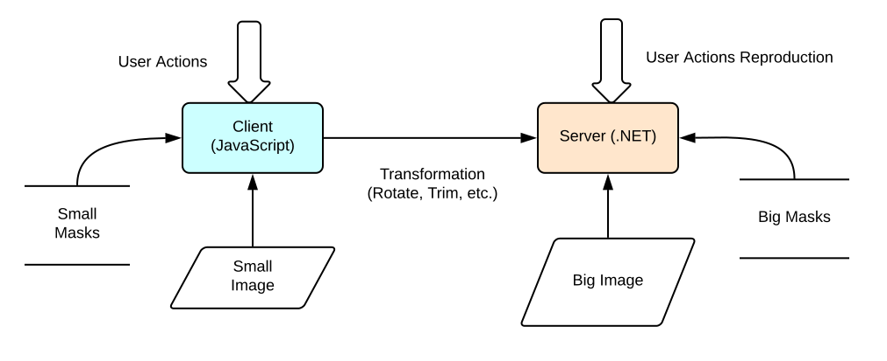
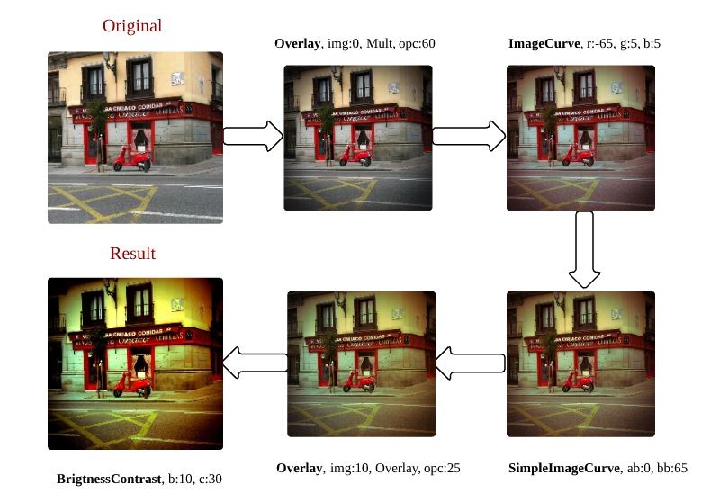

# Universal C\# Code for .NET and JavaScript

*Disclaimer: The original article was written in 2013, so some of this
material may not be relevant in 2017.*

## Introduction

Greetings. This topic is aimed at highlighting the details of
cross-platform development in C\#, particularly for .NET apps and web
browsers. The approach described in this article was implemented in
gfranq.com, the photo editing web service, which supports client- and
server-side image processing using filters as well as collage
functionality. This web service is not currently available.



## Contents

* [Goal](#goal)
    * [Description of Filters](#description-of-filters)
    * [Description of Collages](#description-of-collages)
* [Implementation](#implementation)
    * [Choosing a Platform for Photo Processing](#choosing-a-platform-for-photo-processing)
    * [Translating C\# into Javascript](#translating-c-into-javascript)
    * [Structure](#structure)
        * [Using alias](#using-alias)
        * [Links to Files](#links-to-files)
        * [Notes on .NET implementation](#notes-on-net-implementation)
            * [Using Dispose](#using-dispose)
            * [Using lock](#using-lock)
        * [Storing Masks in Memory](#storing-masks-in-memory)
    * [Notes on JavaScript implementation](#notes-on-javascript-implementation)
        * [Minification](#minification)
            * [Manual Minification](#manual-minification)
            * [Automated Minification](#automated-minification)
        * [Debug and Release Modes](#debug-and-release-modes)
        * [crossOrigin Property](#crossorigin-property)
    * [Optimizations](#optimizations)
        * [Using the Precalculated Values](#using-the-precalculated-values)
        * [Converting an Image to an Array of Pixels](#converting-an-image-to-an-array-of-pixels)
* [Code Examples](#code-examples)
    * [General](#general)
        * [Detecting Whether a String Is a Number](#detecting-whether-a-string-is-a-number)
        * [Integer Division](#integer-division)
        * [Rotating and Flipping an Image Using Canvas and Bitmap](#rotating-and-flipping-an-image-using-canvas-and-bitmap)
        * [Synchronous and Asynchronous Image Loading](#synchronous-and-asynchronous-image-loading)
    * [Script\# Only](#script-only)
        * [Detecting the Type and Version of a Browser](#detecting-the-type-and-version-of-a-browser)
        * [Rendering a Dash-dot Line](#rendering-a-dash-dot-line)
        * [Rotation Animation](#rotation-animation)
* [Conclusion](#conclusion)

## Goal

The challenge is to implement photo collage and filter-based photo
editing functionality on the client-side and, if possible, on the
server-side as well. For a start, I will cover how filters and collages
are implemented.

### Description of Filters

In the context of our project, **a filter** is a series of actions made
in Photoshop and applied to a particular photo. Below are the examples
of such actions: 

* Brightness adjustment
* Contrast adjustment
* Saturation adjustment
* Color curves adjustment
* Masking in different modes
* Framing
* ...

We need a certain format to describe these actions. Sure, there are
common formats such as JSON and XML but it was decided to create our own
format for the following reasons:

* Need for a platform-independent architecture of code (.NET,
    JavaScript, WinPhone, etc.)
* Need for a simple non-hierarchical format of filters, which makes it
    easy to write a parser
* XML and JSON data is more memory consuming (in this particular case)

Here is what the sequence of actions for the  **XPro Film** filter looks
like:



Apart from editing a photo with a filter, we needed to crop and rotate
the image. Yes, I knew that there are jQuery plugins to crop and rotate
images, but they seemed to be overloaded and deviating from the
universal architecture of the project.

### Description of Collages

**A collage** is an arrangement of several miniaturized photos into one
whole photo (with or without using mask). It was also necessary to allow
users to drag and drop available pictures to the collage, change their
position and scale. Your collage may look like this:


Collage feature implies using a simple format for storing rectangles
with relative coordinates from 0 to 1, the addresses of photos, and
image modification data. Relative coordinates are used because the same
client-side transformations are applied to large size pictures on the
server-side.

## Implementation

We had to choose the platform allowing users to work with filters and
collages

### Choosing a Platform for Photo Processing

There are several RIA technologies such as:

* Adobe Flash
* Microsoft Silverlight
* HTML 5 + JavaScript
* Native Client

For obvious reasons, Flash and HTML are the only technologies that
deserve attention as the rest of them are not cross-platform compatible.
Furthermore, the Silverlight client is beginning to die. Although I
really like the concept of  ~~salt~~ NaCl, unfortunately, this
technology is supported only by Chrome browser and it is not yet known
when it will be supported (and will it ever be supported) by other
popular browsers.

The choice was made in favor of trendy and progressive HTML5 platform,
which functionality is currently supported by iOS, as opposed to Flash.
This choice is also based on the fact that there are a lot of libraries,
which allow you to compile the C\# code into Javascript. You may also
use Visual Studio for this purpose. Details are given below.

### Translating C\# into Javascript

HTML 5 + JavaScript has been selected as a platform in the previous
section. So it leaves us a question, whether it is possible to write a
universal C\# code that could be compiled to both .NET and JavaScript.

Thus, a number of libraries to accomplish the task were found:

* JSIL
* SharpKit
* Script\#
* And some others available [on GitHub](https://github.com/jashkenas/coffee-script/wiki/List-of-languages-that-compile-to-JS).

As a result, it was decided to use **Script\#** due to the fact that
JSIL works directly with assemblies and generates less pure code (though
it supports a wider range of C\# language features) and SharpKit is a
commercial product. For a detailed comparison of these tools, see [the
question on stackoverflow](http://stackoverflow.com/q/11547471/1046374).

To sum up, ScriptSharp compared to manually written JavaScript has the
following pros and cons:

#### Advantages:

* Possibility to write a universal C\# code that could be compiled to
     .NET and other platforms (WinPhone, Mono)
* Development in a strongly-typed C\# language supporting OOP
* Support for IDE features (autocompletion and refactoring)
* Ability to detect the majority of errors at the compilation stage

#### Disadvantages:

* Redundancy and irregularity of the generated JavaScript code (due to
    mscorlib).
* Support for ISO-2 only (no function overloading or type, extension,
    and generics inference)

### Structure

The process of compiling the same C\# code into .NET and Javascript can
be illustrated by the following scheme:


Although .NET and HTML5 are completely different technologies, they also
have similar features. This also applies to working with graphics. For
example, .NET supports **Bitmap**, JavaScript supports its
analogue — **Canvas**. The same goes with **Graphics** , **Context**, and
arrays of pixels. In order to combine it all in one code, it was decided
to develop the following architecture:


Of course, it is not limited to two platforms. As a followup it is
planned to add support for WinPhone, and then, perhaps, Android and
iOS.

It should be noted that there are two types of graphic operations:

* **Using API functions** (DrawImage, Arc, MoveTo, LineTo). High
     performance and support for hardware acceleration are important
     competitive advantages. The drawback is that they can be
     implemented differently on different platforms.
* **Pixel by pixel.** Support for implementation of any effects and
    cross-platform coverage are among the benefits. The disadvantage
    is low performance. However, you can mitigate the disadvantages by
    parallelization, shaders, and precalculated tables (we will
    discuss it further in the next section on optimization).

As you can see, the abstract class **Graphics** describes all methods
for working with graphics; these methods are implemented for various
platforms in the derived class. The following
[aliases](http://msdn.microsoft.com/en-us/library/aa664765(v=vs.71).aspx)
were written to abstract from Bitmap and Canvas classes as well. The
WinPhone version also uses an [adapter pattern](https://en.wikipedia.org/wiki/Adapter_pattern).

#### Using alias

```CSharp
#if SCRIPTSHARP
using System.Html;
using System.Html.Media.Graphics;
using System.Runtime.CompilerServices;
using Bitmap = System.Html.CanvasElement;
using Graphics = System.Html.Media.Graphics.CanvasContext2D;
using ImageData = System.Html.Media.Graphics.ImageData;
using Image = System.Html.ImageElement;
#elif DOTNET
using System.Drawing;
using System.Drawing.Imaging;
using System.Drawing.Drawing2D;
using Bitmap = System.Drawing.Bitmap;
using Graphics = System.Drawing.Graphics;
using ImageData = System.Drawing.Imaging.BitmapData;
using Image = System.Drawing.Bitmap;
#endif
```

Unfortunately, it’s impossible to create aliases for unsafe types and
arrays, in other words, [Alias to pointer (byte\*) in C\#](http://stackoverflow.com/q/13489903/1046374):

```CSharp
using PixelArray = byte*, using PixelArray = byte[]
```

To perform rapid processing of pixels using unmanaged C\# code, while at
the same time compiling it to Script\#, we introduced the following
scheme with the help of directives:

```CSharp
#if SCRIPTSHARP
	PixelArray data = context.GetPixelArray();
#elif DOTNET
	byte* data = context.GetPixelArray();
#endif
```

The data array is subsequently used to implement various pixel by pixel
operations (such as masking, fisheye, saturation adjustment, and so on),
both parallelized and not.

#### Links to Files

A separate project is added to the solution for each platform, but, of
course, Mono, Script\#, and even Silverlight can not refer to the usual
.NET assemblies. Fortunately, Visual Studio has a mechanism for
adding links to files, which allows you to reuse the same code in
different projects.

Compiler directives (`DOTNET`, `SCRIPTSHARP`) are defined in the project
properties in Conditional Compilation Symbols.

### Notes on .NET Implementation

The above abstractions and aliases helped us to write the C\# code with
low redundancy. Further, I want to point out the problems with .NET and
JavaScript platforms that we faced when developing the solution
code.

#### Using Dispose

Please note that inclusion of any instance of a C\# class, which
implements the IDisposable interface, requires calling
 **Dispose** method or applying [Using statement](https://msdn.microsoft.com/en-us/library/yh598w02.aspx). In
this project, these classes are Bitmap and Context. What I’ve said above
is not just the theory, it actually has a practical application:
Processing a large number of large size photos (up to 2400 x 2400 dpi)
on ASP.NET Developer Server x86 resulted in out of memory exception. The
issue was resolved after adding Dispose in the right places. Some other
helpful advices on image manipulation are given in the following
article [20 Image Resizing
Pitfalls](http://www.nathanaeljones.com/blog/2009/20-image-resizing-pitfalls) и [.NET Memory Leak: To dispose or not to dispose, that’s the 1 GB question](https://blogs.msdn.microsoft.com/tess/2009/02/03/net-memory-leak-to-dispose-or-not-to-dispose-thats-the-1-gb-question/).

#### Using Lock

In JavaScript, there is a difference between already uploaded image with
tag `img`, for which you can specify the source and loading event, and
canvas tagged  `canvas`, on which you can draw something. In .NET
these elements are represented by the same Bitmap class. Thus, aliases
Bitmap and Image in .NET point to the same class System.Drawing.Bitmap
as shown above.

Nevertheless, this division into img and canvas in JavaScript was very
helpful in .NET version as well. The point is that filters use preloaded
masks from different threads; thus, the **lock** pattern is required to
avoid the exception during synchronization (image is copied
with **lock**  and the result is used without locking):

```CSharp
internal static Bitmap CloneImage(Image image)
{
#if SCRIPTSHARP
	Bitmap result = (Bitmap)Document.CreateElement("canvas");
	result.Width = image.Width;
	result.Height = image.Height;
	Graphics context = (Graphics)result.GetContext(Rendering.Render2D);
	context.DrawImage(image, 0, 0);
	return result;
#else
	Bitmap result;
	lock (image)
		result = new Bitmap(image);
	return result;
#endif
}
```

After all, **lock** should also be used when accessing the properties of
a synchronized object (In fact, any properties are methods).

#### Storing Masks in Memory

To speed up the processing, all potentially used masks for filters are
loaded into memory when the server starts. No matter what format the
mask is, the Bitmap uploaded to the server uses 4\*2400\*2400 or \~24 MB
of memory (the maximum image size is 2400\*2400; the number of bytes per
pixel is 4). All masks for filters (\~30) and collages (40) will consume
1.5 GB — that’s not quite a lot for the server; however, as the number of
masks grows this amount may increase considerably. In the future, we
will possibly use compression techniques for masks stored in memory (in
.jpg and .png formats) followed by decompression when necessary.
Actually, the size can be reduced up to 300 times. An additional
advantage of this approach is that copying of the compressed images goes
faster compared to large ones; thus,  **lock** operation will take less
time and threads will be blocked less often.

### Notes on JavaScript Implementation

#### Minification

I refused to use the term "obfuscation" for the following reason: this
term is barely applicable to a fully open-source language, which in our
case is JavaScript. However, anonymization of identifiers can mess up
code readability and logic. And most importantly, this
technique will significantly reduce the size of the script (the
compressed version is \~80 KB).

There are two approaches to JavaScript minification:

* **Manual minification,** which is performed at the generation stage
     using ScriptSharp.
* **Automated minification,** which is performed after the generation
     stage using external tools such as Google Closure Compiler and
     Yui.

##### Manual Minification

To shorten the names of methods, classes, and attributes we used this
syntax prior to declaration of the above mentioned entities. Of course,
there’s no need to do that if you are working with methods that are
called from external scripts and classes (public).

```CSharp
#if SCRIPTSHARP && !DEBUG
    [ScriptName("a0")]
#endif
```

Anyway, local variables could not be minified. These constructs pollute
the code and impair code readability, which is also a serious
disadvantage. However, this technique can significantly reduce the
amount of generated JavaScript code and mess it up as well.

Another disadvantage is that you need to keep an eye on such short names
if they rename the method and field names (especially, overridden names
in the child classes) because in this case Script\# won't care about
repetitive names. However, it won’t allow duplicated classes.

By the way, minification functionality for private and internal methods
and fields was already added to the developed version of the
Script\#.

##### Automated Minification

Although there are lots of tools for JavaScript minification, I used the
Google Closure Compiler for its brand and good quality of compression.
The disadvantage of Google's minification tool is that it can not
compress CSS files; by contrast,
[YUI](http://yui.github.com/yuicompressor/css.html) meets this
challenge successfully. In fact, Script\# can also minify scripts but
handles this challenge much worse than GCC.

Google’s minification tool has several levels of compression:
whitespace, simple, and advanced. We’ve chosen Simple level for the
project; although, Advanced level allows us to achieve the maximum
quality of compression, it requires code written in such a manner so
that methods are accessible from outside the class. This minification
was partially performed manually using Script\#.

#### Debug and Release Modes

Debug и release libraries were added to ASP.NET pages as follows:

```html
<% if (Gfranq.JavaScriptFilters.HtmlHelper.IsDebug)
   { %>
    <script src="Scripts/mscorlib.debug.js" ></script>
    <script src="Scripts/imgProcLib.debug.js" ></script>
<% }
   else
   { %>
    <script src="Scripts/mscorlib.js" ></script>
    <script src="Scripts/imgProcLib.js" ></script>
<% } %>
```

In this project, we minified both scripts and filter description
files.

#### crossOrigin Property

To access the pixels of some particular image, we need to convert it to
canvas first. But this may lead to a Cross Origin Request Security
(CORS) error. In our case, the problem was resolved as follows:

* Setting the `crossOrigin = ''` attribute on the server-side.
* Adding a specific header to the HTTP package on the server-side.

Since ScriptSharp does not support this property for img elements, the
following code was written:

```CSharp
[Imported]
internal class AdvImage
{
	[IntrinsicProperty]
	internal string CrossOrigin
	{
		get { return string.Empty; }
		set { }
	}
}
```

Then, we'll use it like this:

```JavaScript
((AdvImage)(object)result).CrossOrigin = "";
```

This technique allows you to add any feature to the object without
compilation errors. Particularly, [wheelDelta property is not
implemented yet](http://stackoverflow.com/q/13572711/1046374) in
ScriptSharp (at least in version 0.7.5). This property indicates the
scroll wheel amount, which is used for creating collages. That’s why it
was implemented this way. Such a dirty hack with the properties is no
good; normally, you need to make changes to the project. But just for
the record, I haven't yet figured out a way to compile ScriptSharp from
source.

Such images require the server to return the following headers in its
response headers (in Global.asax):

```CSharp
Response.AppendHeader("Access-Control-Allow-Origin", "\*");
```

For more information about the Cross Origin Request Security
visit [this link](http://enable-cors.org/).

### Optimizations

#### Using the Precalculated Values

We used optimization for some operations such as brightness, contrast,
and color curves adjustment via the preliminary calculation of the
resulting color components (r, g, b) for all possible values and further
use of the obtained arrays to change the colors of pixels directly. It
should be noted that this kind of optimization is suitable only for
operations in which the color of the resulting pixel is not affected by
adjacent pixel.

The calculation of the resulting color components for all possible
values:

```CSharp
for (int i = 0; i < 256; i++)
{
	r[i] = ActionFuncR(i);
	g[i] = ActionFuncG(i);
	b[i] = ActionFuncB(i);
}
```

The use of precalculated color components:

```CSharp
for (int i = 0; i < data.Length; i += 4)
{
	data[i] = r[data[i]];
	data[i + 1] = g[data[i + 1]];
	data[i + 2] = b[data[i + 2]];
}
```

If such table operations go one by one, then there’s no need to
calculate intermediate images—you may pass only the color component
arrays. As the code worked fairly quickly on both client- and
server-side, it was decided to put the implementation of this
optimization aside. Furthermore, the optimization caused some unwanted
behavior. However, I’ll give you a listing of the optimization:

<table>
    <tr>
        <td>Original code </td>
        <td>Optimized code</td>
    </tr>
    <tr>
    <td>
<pre>
// Calculation of values for the first table.
for (int i = 0; i &lt; 256; i++)
{
      r[i] = ActionFunc1R(i);
      g[i] = ActionFunc1G(i);
      b[i] = ActionFunc1B(i);
}
// ...<br>
// Calculation of the resulting intermediate image.
for (int i = 0; i &lt; data.Length; i += 4)
{
      data[i] = r[data[i]];
      data[i + 1] = g[data[i + 1]];
      data[i + 2] = b[data[i + 2]];
}
// ...<br>
// Calculation of values for the second table.
for (int i = 0; i &lt; 256; i++)
{
      r[i] = ActionFunc2R(i);
      g[i] = ActionFunc2G(i);
      b[i] = ActionFunc2B(i);
}
// ...<br>
// Calculation of the resulting image.
for (int i = 0; i &lt; data.Length; i += 4)
{
      data[i] = r[data[i]];
      data[i + 1] = g[data[i + 1]];
      data[i + 2] = b[data[i + 2]];
}
</pre>
    </td>
    <td valign="top">
<pre>
//  Calculation of values for the first table.
for (int i = 0; i &lt; 256; i++)
{
      r[i] = ActionFunc1R(i);
      g[i] = ActionFunc1G(i);
      b[i] = ActionFunc1B(i);
}
// ...<br>
// Calculation of values for the second table.
tr = r.Clone();
tg = g.Clone();
tb = b.Clone();
for (int i = 0; i &lt; 256; i++)
{
      r[i] = tr[ActionFunc2R(i)];
      g[i] = tg[ActionFunc2G(i)];
      b[i] = tb[ActionFunc2B(i)];
}
// ...<br>
// Calculation of the resulting image.
for (int i = 0; i &lt; data.Length; i += 4)
{
      data[i] = r[data[i]];
      data[i + 1] = g[data[i + 1]];
      data[i + 2] = b[data[i + 2]];
}
</pre>
    </td>
    </tr>
</table>

But even this is not all If you have a look at the table on the right,
you will notice that new arrays are created using Clone method.
Actually, you can just change the pointers to the old and new arrays
instead of copying the array itself (this recalls the analogy of [double buffering](https://en.wikipedia.org/wiki/Multiple_buffering#Double_buffering_in_computer_graphics)).

#### Converting an Image to an Array of Pixels

JavaScript profiler in Google Chrome revealed that the GetImageData
function (which is used to convert the canvas to the array of pixels)
runs long enough. This information, by the way, can be found in various
articles on Canvas optimization in JavaScript.

However, the number of calls of this function can be minimized. Namely,
we can use the same array of pixels for pixel by pixel operations, by
analogy with the previous optimization.

## Code Examples

In the examples below, I will provide the fragments of code that I found
interesting and useful. To keep the article from being too long, I’ve
hidden the examples under a spoiler.

### General

#### Detecting Whether a String Is a Number

<details>
  <summary>Source Code</summary>

```CSharp
internal static bool IsNumeric(string n)
{
#if !SCRIPTSHARP
	return ((Number)int.Parse(n)).ToString() != "NaN";
#else
	double number;
	return double.TryParse(n, out number);
#endif
}
```

</details>

#### Integer Division

<details>
  <summary>Source Code</summary>

```CSharp
internal static int Div(int n, int k)
{
	int result = n / k;
#if SCRIPTSHARP
	result = Math.Floor(n / k);
#endif
	return result;
}
```

</details>

#### Rotating and Flipping an Image Using Canvas and Bitmap

Please note that in html5 canvas images can be rotated 90 and 180 degrees only using matrices, while .NET provides enhanced functionality. Thus, an appropriate precise function for working with pixels was written.

It is also worth noting that an any side 90-degree rotation in the .NET version may return incorrect results. Therefore, you need to create a new `Bitmap` after using the `RotateFlip` function.

<details>
  <summary>Source Code</summary>

```CSharp
public static Bitmap RotateFlip(Bitmap bitmap, RotFlipType rotFlipType)
{
#if SCRIPTSHARP
	int t, i4, j4, w, h, c;

	if (rotFlipType == RotFlipType.RotateNoneFlipNone)
		return bitmap;

	GraphicsContext context;
	PixelArray data;

	if (rotFlipType == RotFlipType.RotateNoneFlipX)
	{
		context = GraphicsContext.GetContext(bitmap);
		data = context.GetPixelArray();
		w = bitmap.Width;
		h = bitmap.Height;

		for (int i = 0; i < h; i++)
		{
			c = (i + 1) * w * 4 - 4;
			for (int j = 0; j < w / 2; j++)
			{
				i4 = (i * w + j) * 4;
				j4 = j * 4;

				t = (int)data[i4]; data[i4] = data[c - j4]; data[c - j4] = t;
				t = (int)data[i4 + 1]; data[i4 + 1] = data[c - j4 + 1]; data[c - j4 + 1] = t;
				t = (int)data[i4 + 2]; data[i4 + 2] = data[c - j4 + 2]; data[c - j4 + 2] = t;
				t = (int)data[i4 + 3]; data[i4 + 3] = data[c - j4 + 3]; data[c - j4 + 3] = t;
			}
		}
		context.PutImageData();
	}
	else if (rotFlipType == RotFlipType.Rotate180FlipNone || rotFlipType == RotFlipType.Rotate180FlipX)
	{
		context = GraphicsContext.GetContext(bitmap);
		data = context.GetPixelArray();
		w = bitmap.Width;
		h = bitmap.Height;
		c = w * 4 - 4;
		int dlength4 = data.Length - 4;
		for (int i = 0; i < data.Length / 4 / 2; i++)
		{
			i4 = i * 4;
			if (rotFlipType == RotFlipType.Rotate180FlipNone)
				j4 = i4;
			else
				j4 = (Math.Truncate((double)i / w) * w + (w - i % w)) * 4;

			t = (int)data[j4]; data[j4] = data[dlength4 - i4]; data[dlength4 - i4] = t;
			t = (int)data[j4 + 1]; data[j4 + 1] = data[dlength4 - i4 + 1]; data[dlength4 - i4 + 1] = t;
			t = (int)data[j4 + 2]; data[j4 + 2] = data[dlength4 - i4 + 2]; data[dlength4 - i4 + 2] = t;
			t = (int)data[j4 + 3]; data[j4 + 3] = data[dlength4 - i4 + 3]; data[dlength4 - i4 + 3] = t;
		}
		context.PutImageData();
	}
	else
	{
		Bitmap tempBitmap = PrivateUtils.CreateCloneBitmap(bitmap);
		GraphicsContext tempContext = GraphicsContext.GetContext(tempBitmap);
		PixelArray temp = tempContext.GetPixelArray();

		t = bitmap.Width;
		bitmap.Width = bitmap.Height;
		bitmap.Height = t;
		context = GraphicsContext.GetContext(bitmap);
		data = context.GetPixelArray();

		w = tempBitmap.Width;
		h = tempBitmap.Height;
		if (rotFlipType == RotFlipType.Rotate90FlipNone || rotFlipType == RotFlipType.Rotate90FlipX)
		{
			c = w * h - w;
			for (int i = 0; i < temp.Length / 4; i++)
			{
				t = Math.Truncate((double)i / h);
				if (rotFlipType == RotFlipType.Rotate90FlipNone)
					i4 = i * 4;
				else
					i4 = (t * h + (h - i % h)) * 4;
				j4 = (c - w * (i % h) + t) * 4; //j4 = (w * (h - 1 - i4 % h) + i4 / h) * 4;

				data[i4] = temp[j4];
				data[i4 + 1] = temp[j4 + 1];
				data[i4 + 2] = temp[j4 + 2];
				data[i4 + 3] = temp[j4 + 3];
			}
		}
		else if (rotFlipType == RotFlipType.Rotate270FlipNone || rotFlipType == RotFlipType.Rotate270FlipX)
		{
			c = w - 1;
			for (int i = 0; i < temp.Length / 4; i++)
			{
				t = Math.Truncate((double)i / h);
				if (rotFlipType == RotFlipType.Rotate270FlipNone)
					i4 = i * 4;
				else
					i4 = (t * h + (h - i % h)) * 4;
				j4 = (c + w * (i % h) - t) * 4; // j4 = w * (1 + i4 % h) - i4 / h - 1;

				data[i4] = temp[j4];
				data[i4 + 1] = temp[j4 + 1];
				data[i4 + 2] = temp[j4 + 2];
				data[i4 + 3] = temp[j4 + 3];
			}
		}
		context.PutImageData();
	}

	return bitmap;
#elif DOTNET
	Bitmap result = null;
	switch (rotFlipType)
	{
		case RotFlipType.RotateNoneFlipNone:
			result = bitmap;
			break;
		case RotFlipType.Rotate90FlipNone:
			bitmap.RotateFlip(RotateFlipType.Rotate90FlipNone);
			result = new Image(bitmap);
			bitmap.Dispose();
			break;
		case RotFlipType.Rotate270FlipNone:
			bitmap.RotateFlip(RotateFlipType.Rotate270FlipNone);
			result = new Image(bitmap);
			bitmap.Dispose();
			break;
		case RotFlipType.Rotate180FlipNone:
			bitmap.RotateFlip(RotateFlipType.Rotate180FlipNone);
			result = bitmap;
			break;
		case RotFlipType.RotateNoneFlipX:
			bitmap.RotateFlip(RotateFlipType.RotateNoneFlipX);
			result = bitmap;
			break;
		case RotFlipType.Rotate90FlipX:
			bitmap.RotateFlip(RotateFlipType.Rotate90FlipX);
			result = new Image(bitmap);
			bitmap.Dispose();
			break;
		case RotFlipType.Rotate180FlipX:
			bitmap.RotateFlip(RotateFlipType.Rotate180FlipX);
			result = bitmap;
			break;
		case RotFlipType.Rotate270FlipX:
			bitmap.RotateFlip(RotateFlipType.Rotate270FlipX);
			result = new Image(bitmap);
			bitmap.Dispose();
			break;
	}

	return result;
#endif
}
```

</details>

#### Synchronous and Asynchronous Image Loading

Note that in the Script\# version we specify a different function `CollageImageLoad`, which is called after loading an image, whereas in the .NET version these processes take place simultaneously (from a file system or Internet).

<details>
  <summary>Source Code</summary>

```CSharp
public CollageData(string smallMaskPath, string bigMaskPath, List<CollageDataPart> dataParts)
{
	SmallMaskImagePath = smallMaskPath;
	BigMaskImagePath = bigMaskPath;
#if SCRIPTSHARP
	CurrentMask = PrivateUtils.CreateEmptyImage();
	CurrentMask.AddEventListener("load", CollageImageLoad, false);
	CurrentMask.Src = CurrentMaskImagePath;
#else
	CurrentMask = PrivateUtils.LoadBitmap(CurrentMaskImagePath);
	if (!CurrentMaskImagePath.Contains("http://") && !CurrentMaskImagePath.Contains("https://"))
		CurrentMask = Bitmap(CurrentMaskImagePath);
	else
	{
		var request = WebRequest.Create(CurrentMaskImagePath);
		using (var response = request.GetResponse())
			using (var stream = response.GetResponseStream())
				CurrentMask = (Bitmap)Bitmap.FromStream(stream);
	}
#endif
	DataParts = dataParts;
}
```

</details>

### Script\# Only

#### Detecting the Type and Version of a Browser

This function is used to determine drag & drop capabilities in different browsers. I’ve tried to use [modernizr](http://modernizr.com/), but it returned that Safari and (in my case, it was a Win version) IE9 implement it. In practice, these browsers fail to implement drag & drop capabilities correctly.

<details>
  <summary>Source Code</summary>

```CSharp
internal static string BrowserVersion
{
	get
	{
		DetectBrowserTypeAndVersion();
		return _browserVersion;
	}
}

private static void DetectBrowserTypeAndVersion()
{
	if (!_browserDetected)
	{
		string userAgent = Window.Navigator.UserAgent.ToLowerCase();
		if (userAgent.IndexOf("opera") != -1)
			_browser = BrowserType.Opera;
		else if (userAgent.IndexOf("chrome") != -1)
			_browser = BrowserType.Chrome;
		else if (userAgent.IndexOf("safari") != -1)
			_browser = BrowserType.Safari;
		else if (userAgent.IndexOf("firefox") != -1)
			_browser = BrowserType.Firefox;
		else if (userAgent.IndexOf("msie") != -1)
		{
			int numberIndex = userAgent.IndexOf("msie") + 5;
			_browser = BrowserType.IE;
			_browserVersion = userAgent.Substring(numberIndex, userAgent.IndexOf(';', numberIndex));
		}
		else
			_browser = BrowserType.Unknown;
		_browserDetected = true;
	}
}
```

</details>

#### Rendering a Dash-dot Line

This code is used for a rectangle for cropping images. Thanks for the ideas to everyone who responded to this [question on stackoverflow](http://stackoverflow.com/q/4576724/1046374).

<details>
  <summary>Source Code</summary>

```CSharp
internal static void DrawDahsedLine(GraphicsContext context, double x1, double y1, double x2, double y2, int[] dashArray)
{
	if (dashArray == null)
		dashArray = new int[2] { 10, 5 };

	int dashCount = dashArray.Length;
	double dx = x2 - x1;
	double dy = y2 - y1;
	bool xSlope = Math.Abs(dx) > Math.Abs(dy);
	double slope = xSlope ? dy / dx : dx / dy;

	context.MoveTo(x1, y1);
	double distRemaining = Math.Sqrt(dx * dx + dy * dy);
	int dashIndex = 0;
	while (distRemaining >= 0.1)
	{
		int dashLength = (int)Math.Min(distRemaining, dashArray[dashIndex % dashCount]);
		double step = Math.Sqrt(dashLength * dashLength / (1 + slope * slope));
		if (xSlope)
		{
			if (dx < 0) step = -step;
			x1 += step;
			y1 += slope * step;
		}
		else
		{
			if (dy < 0) step = -step;
			x1 += slope * step;
			y1 += step;
		}
		if (dashIndex % 2 == 0)
			context.LineTo(x1, y1);
		else
			context.MoveTo(x1, y1);
		distRemaining -= dashLength;
		dashIndex++;
	}
}
```

</details>

#### Rotation Animation

`setInterval` function is used to implement image rotation animation. Note that the result image is calculated during the animation so that there are no lags at the end of the animation.

<details>
  <summary>Source Code</summary>

```CSharp
public void Rotate(bool cw)
{
	if (!_rotating && !_flipping)
	{
		_rotating = true;
		_cw = cw;
		RotFlipType oldRotFlipType = _curRotFlipType;
		_curRotFlipType = RotateRotFlipValue(_curRotFlipType, _cw);

		int currentStep = 0;
		int stepCount = (int)(RotateFlipTimeSeconds * 1000 / StepTimeTicks);
		Bitmap result = null;
		_interval = Window.SetInterval(delegate()
		{
			if (currentStep < stepCount)
			{
				double absAngle = GetAngle(oldRotFlipType) + currentStep / stepCount * Math.PI / 2 * (_cw ? -1 : 1);
				DrawRotated(absAngle);
				currentStep++;
			}
			else
			{
				Window.ClearInterval(_interval);
				if (result != null)
					Draw(result);
				_rotating = false;
			}
		}, StepTimeTicks);

		result = GetCurrentTransformResult();
		if (!_rotating)
			Draw(result);
	}
}

private void DrawRotated(double rotAngle)
{
	_resultContext.FillColor = FillColor;
	_resultContext.FillRect(0, 0, _result.Width, _result.Height);

	_resultContext.Save();

	_resultContext._graphics.Translate(_result.Width / 2, _result.Height / 2);
	_resultContext._graphics.Rotate(-rotAngle);
	_resultContext._graphics.Translate(-_origin.Width / 2, -_origin.Height / 2);
	_resultContext._graphics.DrawImage(_origin, 0, 0);

	_resultContext.Restore();
}

private void Draw(Bitmap bitmap)
{
	_resultContext.FillColor = FillColor;
	_resultContext.FillRect(0, 0, _result.Width, _result.Height);

	_resultContext.Draw2(bitmap, (int)((_result.Width - bitmap.Width) / 2), (int)((_result.Height - bitmap.Height) / 2));
}
```

</details>

## Conclusion

This article describes how C\# language (combining unmanaged code and
compilation for javascript) can be used to create a really
cross-platform solution. Despite the focus on .NET and JavaScript,
compiling to Android, iOS (by using Mono), and Windows Phone is also
possible based on this approach, which, of course, has its pitfalls. The
code is a bit redundant due to its universality, but it does not affect
performance as graphic operations usually take significantly more time.

To my mind, this article will be useful enough even without the source
code. You are welcome to comment and ask questions.
