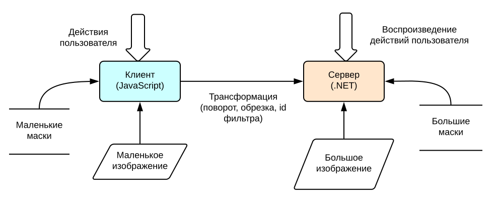
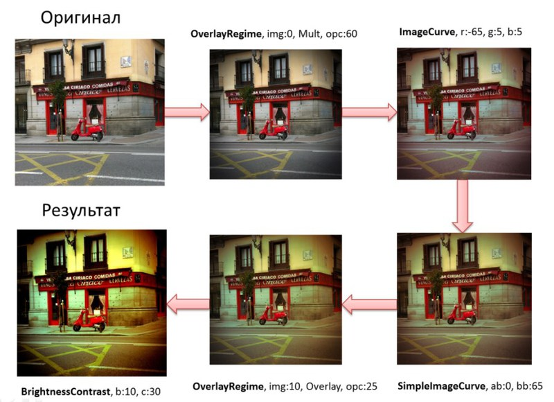

# Универсальный код под .NET и JavaScript

## Введение

В 2013 году я работал в веб-сервисе по публикации и обработки фотографий GFRANQ.
Фильтры и преобразования у нас описывались в файле с параметрами и коэффициентами,
вся обработка осуществлялась на сервере. В процессе развития
сервиса, возник вопрос о поддержке этих преобразований для превью и
на клиенте, т.е. в веб-браузере. Вся разработка велась на C#, и мы задумались, а
можно ли использовать один и тот же код одновременно на сервере и клиенте?
После исследования существующих библиотек и проб мы уверенно сказали себе
"да" и приступили к реализации подхода с универсальным кодом.

Зачем же нужна эта статья? Ведь с 2013 года прошло 6 лет, и многие технологии потеряли
свою актуальность ([Script#](https://github.com/nikhilk/scriptsharp))? С другой
стороны, появились новые. Например, [Bridge.NET](https://bridge.net/) или
[Razor](https://blazor.net/) на основе модной [WebAssembly](https://webassembly.org/).

Тем не менее, какие-то наработки и идеи вполне могут использоваться и сейчас.
В данной статье я попытался описать их максимально развернуто. Надеюсь, упоминания
Silverlight и Flash вызовут улыбку с ноткой ностальгии, а не желание критиковать
старые решения. Так или иначе, они внесли свой вклад в развитие.



<cut text="Содержание и контент - под катом"/>

## Содержание

<!-- TOC -->

- [Введение](#введение)
- [Содержание](#содержание)
- [Цель](#цель)
  - [Описание фильтров](#описание-фильтров)
  - [Описание коллажей](#описание-коллажей)
- [Реализация](#реализация)
  - [Выбор платформы для обработки фотографии](#выбор-платформы-для-обработки-фотографии)
  - [Трансляция C# в JavaScript](#трансляция-c-в-javascript)
    - [Достоинства](#достоинства)
    - [Недостатки](#недостатки)
  - [Структура](#структура)
    - [Использование alias](#использование-alias)
    - [Ссылки на файлы](#ссылки-на-файлы)
  - [Заметки о .NET реализации](#заметки-о-net-реализации)
    - [Использование Dispose](#использование-dispose)
    - [Использование lock](#использование-lock)
    - [Хранение масок в памяти](#хранение-масок-в-памяти)
  - [Заметки о JavaScript реализации](#заметки-о-javascript-реализации)
    - [Минификация](#минификация)
      - [Минификация вручную](#минификация-вручную)
      - [Минификация автоматически](#минификация-автоматически)
    - [Debug & Release режимы](#debug--release-режимы)
    - [Свойство crossOrigin](#свойство-crossorigin)
  - [Оптимизации](#оптимизации)
    - [Использование предвычисленных значений](#использование-предвычисленных-значений)
    - [Преобразование изображение в массив пикселей](#преобразование-изображение-в-массив-пикселей)
- [Примеры кода](#примеры-кода)
  - [Общие](#общие)
    - [Определение, является ли строка числом](#определение-является-ли-строка-числом)
    - [Целочисленное деление](#целочисленное-деление)
    - [Поворот и обращение изображения на Canvas и Bitmap соответственно](#поворот-и-обращение-изображения-на-canvas-и-bitmap-соответственно)
    - [Асинхронная и синхронная загрузка картинок](#асинхронная-и-синхронная-загрузка-картинок)
  - [Только Script](#только-script)
    - [Определение типа и версии браузера](#определение-типа-и-версии-браузера)
    - [Отрисовка пунктирной линии](#отрисовка-пунктирной-линии)
    - [Анимация вращения изображения](#анимация-вращения-изображения)
- [Заключение](#заключение)

<!-- /TOC -->

## Цель

Итак, была поставлена задача реализации обработки фотографий фильтрами и
создания коллажей на клиенте, а также, по возможности, на сервере. Для
начала я расскажу как у нас представлены фильтры и коллажи.

### Описание фильтров

**Фильтр** в нашем проекте представляется последовательностью действий
(action), подготовленных в Photoshop, примененных к определенной
фотографии. Действие может быть например одно из:

* Изменение яркости
* Изменение контрастности
* Изменение насыщенности
* Коррекций цветовых кривых
* Наложение масок с различными режимами
* Наложение рамок
* ...

Для того, чтобы описать все эти действия нужен определенный формат.
Конечно, существуют стандартные форматы, типа JSON и XML, но было решено
разработать собственный формат по следующим причинам:

* Универсальность кода для всех платформ (.NET, JavaScript, WinPhone и
    др.).
* Формат фильтров простой, не имеющий иерархической структуры, что
    позволяет легко написать парсер для него.
* XML и JSON больше весят (для данного случая).

Например вот как выглядит последовательность действий для фильтра **XPro
Film**:


Кроме обработки фотографий фильтром, нужно было еще реализовать обрезку
и поворот изображения. Да, я знал, что существуют jQuery плагины для
реализации поворота и обрезки, но, во-первых, они оказались слишком
перегруженными, а, во-вторых, не вписывались в универсальную архитектуру
проекта.

### Описание коллажей

**Коллаж** же представляется в виде нескольких миниатюрных фотографий,
объединенных в одну с использованием маски или без. При этом нужно было
предоставить возможность перетаскивания доступных фоток на коллаж и
менять их положение и масштаб. Коллаж может выглядеть например так:


Для коллажа тоже используется свой простой формат, хранящий набор
прямоугольников в относительных координатах от `0` до `1`, адреса
фотографий, а также их трансформации. Относительные координаты
используются потому что на сервере та же самая клиентские трансформации
применяется к большим фоткам.

## Реализация

Итак, нужно было выбрать платформу, на которой функциональность фильтров
и коллажей работала у пользователей.

### Выбор платформы для обработки фотографии

Существует следующие RIA технологии:

* Adobe Flash
* Microsoft Silverlight
* HTML 5 + JavaScript
* Native Client

Из всего этого списка по вполне очевидным причинам заслуживают внимания
в настоящее время только Flash и HTML 5, так как все остальные не
кроссплатформенны. А Silverlight еще и потихоньку отмирает. Хотя
концепция ~~соли~~ NaCl мне очень нравится, но, увы, существует он
только на Chrome, и не известно когда будет и будет ли поддерживаться он
остальными популярными браузерами. Итак, в качестве платформы была
выбрана модная и развивающаяся HTML 5, которая потенциально работает еще
и на iOS, в отличие от Flash. Также такой выбор обосновывается еще и
тем, что существует много библиотек, которые позволяют преобразовывать
C# в JavaScript, в том числе и в Visual Studio. Об этом, впрочем, будет
рассказываться дальше.

### Трансляция C# в JavaScript

В предыдущем разделе была выбрана платформа для разработки: HTML 5 +
JavaScript. Но возник вопрос, а можно ли написать универсальный C# код,
который мог бы компилиться и под .NET и под JavaScript? Таким образом
были найдены несколько библиотек для реализации поставленной задачи:

* JSIL
* SharpKit
* Script#
* И другие, которые можно посмотреть например [в этом списке на
    github](https://github.com/jashkenas/coffee-script/wiki/List-of-languages-that-compile-to-JS).

В итоге было решено использовать **Script#** из-за того, что JSIL
работает непосредственно со сборками и генерирует менее чистый код (хотя
поддерживает больше возможностей C#), а SharpKit является коммерческим.
Подробное сравнение подобных инструментов можно увидеть в [вопросе JSIL
vs Script# vs SharpKit на
stackoverflow](http://stackoverflow.com/q/11547471/1046374) . Резюмируя,
хочу выделить следующие плюсы и минусы использования ScriptSharp по
сравнению с написанием JavaScript вручную:

#### Достоинства

* Возможность написания универсального кода под .NET и другие
платформы (WP, Mono).
* Разработка на строго типизированном языке C# с возможностями ООП.
* Поддержка возможностей IDE для разработки (автодополнение,
  рефакторинг).
* Определение многих ошибок на этапе компиляции.

#### Недостатки

* Избыточность и нестандартность генерируемого JavaScript (из-за
    mscorlib).
* Поддержка только спецификации ISO-2 (отсутствие перегрузки функций,
    вывода типов, расширений, генериков и другого).

### Структура

Компиляция под .NET и JavaScript одного и того же кода может быть
представлена в виде следующей схемы:


Несмотря на то, что .NET и HTML5 это совершенно разные технологии, у них
есть и похожие черты. Это относится и к работе с графикой. Например, в
.NET есть **Bitmap**, а в JavaScript аналогом ему является **canvas**.
Также и с **Graphics** и **Context**, и массивами пикселей. Для того
чтобы объединить все это в одном коде, было решено разработать следующую
архитектуру:


Разумеется дело не ограничивается двумя платформами. В дальнейшем
планируется добавить поддержку WP, а потом, возможно, Android и iOS.
Стоит отметить, что существует два типа графических операций:

* **Использующие функции API** (DrawImage, Arc, MoveTo, LineTo).
    Преимуществом является высокая скорость работы и возможное
    аппаратное ускорение. Недостатком - они могут быть реализованы
    по-разному на различных платформах.
* **Попиксельные.** Преимуществом является возможность реализации
    любых эффектов и унифицированная работа на всех платформах.
    Недостатком - низкая скорость работы. Однако недостатки можно
    нивелировать путем распараллеливания, использования шейдеров и
    использованием заранее рассчитанных таблиц (о чем будет рассказано
    дальше в разделе про оптимизацию).

Как видим, в абстрактом классе **Graphics** описаны все методы для
работы с графикой, а в производных классах они реализованы для различных
платформ. Для того, чтобы абстрагироваться и от таких классов как Bitmap
и Canvas были написаны следующие
[алиасы](http://msdn.microsoft.com/en-us/library/aa664765(v=vs.71).aspx).
Также в разрабатываемой WP версии используется еще и [паттерн
адаптер](http://ru.wikipedia.org/wiki/%D0%90%D0%B4%D0%B0%D0%BF%D1%82%D0%B5%D1%80_(%D1%88%D0%B0%D0%B1%D0%BB%D0%BE%D0%BD_%D0%BF%D1%80%D0%BE%D0%B5%D0%BA%D1%82%D0%B8%D1%80%D0%BE%D0%B2%D0%B0%D0%BD%D0%B8%D1%8F)).

#### Использование alias

```cs
#if SCRIPTSHARP
using System.Html;
using System.Html.Media.Graphics;
using System.Runtime.CompilerServices;
using Bitmap = System.Html.CanvasElement;
using Graphics = System.Html.Media.Graphics.CanvasContext2D;
using ImageData = System.Html.Media.Graphics.ImageData;
using Image = System.Html.ImageElement;
#elif DOTNET
using System.Drawing;
using System.Drawing.Imaging;
using System.Drawing.Drawing2D;
using Bitmap = System.Drawing.Bitmap;
using Graphics = System.Drawing.Graphics;
using ImageData = System.Drawing.Imaging.BitmapData;
using Image = System.Drawing.Bitmap;
#endif
```

Однако в C# к сожалению нельзя сделать алиасы на небезопасные типы и
массивы, т.е. так ([Alias to pointer (byte\*) in
C#](http://stackoverflow.com/q/13489903/1046374)):

```cs
using PixelArray = byte*, using PixelArray = byte[]
```

И для того чтобы иметь возможность использовать неуправляемый код в C#
для быстрой обработки пикселей, при этом одновременно компилирующемся в
Script#, была введена такая схема с помощью директив:

```cs
#if SCRIPTSHARP
	PixelArray data = context.GetPixelArray();
#elif DOTNET
	byte* data = context.GetPixelArray();
#endif
```

В дальнейшем массив data используется для различных попиксельных
операций (таких как наложение масок, рыбий глаз, изменение насыщенности
и другие), распараллеленых и нет.

#### Ссылки на файлы

Для каждой платформы в солюшн добавляется отдельный проект, но, понятное
дело, проекты Mono, Script# и даже Silverlight не могут ссылаться на
обычную .NET сборку. К счастью в Visual Studio существует механизм
добавления ссылок на файлы, что позволяет повторно использовать один и
тот же код в разных проектах. А указание директив компиляции (DOTNET,
SCRIPTSHARP и т.д.) добавляется в свойствах проекта в Conditional
Compilation Symbols.

### Заметки о .NET реализации

Благодаря вышеупомянутым абстракциям и алиасам, был написан код C# с
низким уровнем избыточности. Однако далее я хочу обратить внимание на
проблемы платформ .NET и JavaScript с которыми нам пришлось столкнуться
при разработке, но которые были успешно решены.

#### Использование Dispose

Хочется обратить внимание на то, что для любого экземпляра C# класса,
реализующего интерфейс IDisposable, всегда нужно вызывать **Dispose**
после его использования или использовать паттерн **using**. В данном
проекте такими классами являлись Bitmap и Context. Это не только мои
слова и просто теория, но и практика: На ASP.NET Developer Server x86
сервере обработка большого количества больших фотографий (до 2400\*2400)
приводила к исключению связанному с памятью. После расстановки Dispose в
нужных местах, проблема исчезла. Об этом и о многих других советах по
обработке изображений также пишут в статье [20 Image Resizing
Pitfalls](http://www.nathanaeljones.com/blog/2009/20-image-resizing-pitfalls)
и [.NET Memory Leak: To dispose or not to dispose, that’s the 1 GB
question](http://blogs.msdn.com/b/tess/archive/2009/02/03/net-memory-leak-to-dispose-or-not-to-dispose-that-s-the-1-gb-question.aspx).

#### Использование lock

В JavaScript существует разделение между уже загруженной картинкой с
тегом **img**, которому можно задавать источник и событие загрузки и
между полотном с тегом canvas, на котором можно что-то рисовать. Однако
в .NET все представляется одним классом Bitmap. Таким образом, алиасы
Bitmap и Image в .NET указывают на один и тот же класс
System.Drawing.Bitmap как это можно увидеть выше. Тем не менее это
разделение в JavaScript на img и canvas очень помогло и в .NET версии в
дальнейшем. Дело в том, что для фильтров используются предварительно
загруженные маски, которые используются разными потоками, а
следовательно для них нужно использовать паттерн **lock** во избежание
исключения синхронизации (копирование изображения происходит с lock, а
дальше результат используется без блокировки):

```cs
internal static Bitmap CloneImage(Image image)
{
#if SCRIPTSHARP
	Bitmap result = (Bitmap)Document.CreateElement("canvas");
	result.Width = image.Width;
	result.Height = image.Height;
	Graphics context = (Graphics)result.GetContext(Rendering.Render2D);
	context.DrawImage(image, 0, 0);
	return result;
#else
	Bitmap result;
	lock (image)
		result = new Bitmap(image);
	return result;
#endif
}
```

Не стоит забывать, что lock нужно использовать и в случае обращения к
свойствам синхронизируемого объекта (потому что любые свойства это по
сути методы).

#### Хранение масок в памяти

При старте сервера все потенциально используемые маски для фильтров
загружаются в память для ускорения обработки. Не стоит забывать, что
какой бы формат не имела маска, на сервере загруженный Bitmap занимает
`4 * 2400 * 2400` ≈ 24 Мб (максимальный размер изображения `2400 * 2400`,
кол-во байт на пиксель - 4), а значит все маски для фильтров (≈30 штук)
и коллажей (40 штук) будет занимать в памяти ≈1.5 Гб, что в принципе не
много для сервера, однако при увеличении количества масок, это число
может значительно увеличиться. Так что в будущем, возможно, нужно будет
использовать сжатие масок в памяти (в виде форматов .jpg, .png) с
последующей распаковкой их во время использования, особенно учитывая,
что размер при этом можно уменьшить примерно в 300 раз. Дополнительным
преимуществом такого подхода является то, что сжатое изображение
копировать быстрее большого, а значит на операцию **lock** будет уходить
меньше времени и потоки будут меньше блокироваться.

### Заметки о JavaScript реализации

#### Минификация

Я специально не употребил слово "обфускация" в заголовке данного
раздела, поскольку этот термин для языка со все время открытыми
исходниками, которым в данном случае является JavaScript, слабоприменим.
Однако запутать логику и читаемость кода можно путем "обезличивания"
различных идентификаторов (не будем сейчас говорить об извращенных
способов, продемонстрированных [в одном из
топиков](http://habrahabr.ru/post/112530/)). Ну и главное, такая
методика позволит существенно уменьшить размер скрипта (сейчас в сжатом
виде он весит ≈80 Кб). Существует два подхода минификации JavaScript в
нашем случае:

* **Вручную**. На этапе генерации, используя ScriptSharp.
* **Автоматически**. После этапа генерации. Для этого используются
    внешние инструменты, такие как Google Closure Compiler, Yui.

##### Минификация вручную

Для того чтобы укоротить названия методов, классов и атрибутов,
использовалась такая синтаксическая конструкция непосредственно перед
объявлениями этих сущностей. Естественно для методов, которые вызываются
из внешних скриптов и классов (public), такое делать конечно же не
нужно.

```cs
#if SCRIPTSHARP && !DEBUG
    [ScriptName("a0")]
#endif
```

Однако локальные переменные при этом все равно нельзя минифицировать.
Также недостатком является засорение кода такими конструкциями и, как
следствие, ухудшение читаемости кода. Однако данная методика позволяет
существенно уменьшить и запутать генерируемый JavaScript код. Еще одним
недостатком является то, что за такими короткими именами нужно следить,
если они переименовывают названия методов (особенно перегруженных
абстрактных в потомках) и полей, потому что в этом случае Script# не
будет ругаться на повторяющиеся имена. Однако дублирующихся классов он
не допустит. Кстати, в разрабатывающейся версии Script# вроде бы уже
добавили минификацию private и internal методов и полей.

##### Минификация автоматически

Для минификации JavaScript существует множество утилит, однако я
воспользовался Google Closure Compiler в силу бренда, хорошего качества
сжатия. Однако недостатком Google минификатором является то, что он не
может сжимать CSS файлы, зато
[YUI](http://yui.github.com/yuicompressor/css.html) например может. На
самом деле Script# тоже минифицирует скрипты, но делает это существенно
хуже Google Closure. Стоит отметить, что у Google минификатора существует несколько
уровней сжатия: Whitespace, Simple и Advanced. В проекте был выбран
уровень Simple, поскольку хотя и при Advanced можно достигнуть
максимального качества сжатия, для него нужно писать кода особым
образом, чтобы методы и классы были доступны извне. Ну и частично такая
минификация была сделана вручную с помощью Script#. Если вы
интересуетесь Google Closure минификатором, то рекомендую просмотреть
[данный список](http://javascript.ru/optimize/google-closure-compiler)
русскоязычных статей.

#### Debug & Release режимы

Подключение debug и release версий библиотек к ASP.NET страницам
делалось следующим образом:

```html
<% if (Gfranq.JavaScriptFilters.HtmlHelper.IsDebug)
   { %>
    <script src="Scripts/mscorlib.debug.js" ></script>
    <script src="Scripts/imgProcLib.debug.js" ></script>
<% }
   else
   { %>
    <script src="Scripts/mscorlib.js" ></script>
    <script src="Scripts/imgProcLib.js" ></script>
<% } %>
```

Кстати, в нашем проекте минифицировались не только скрипты, но и файлы
описания фильтров тоже.

#### Свойство crossOrigin

Для того, чтобы можно было иметь доступ к пикселям какого-то
изображения, его нужно преобразовать сначала в canvas. Однако при этом
может возникнуть ошибка кроссдоменного доступа (CORS). В нашем случае
данная проблема была разрешена следующим образом:

* Проставление `crossOrigin = ''` на клиенте.
* Добавление специального заголовка к пакету http на сервере.

Но так как ScriptSharp не поддерживает такого свойства для img
элементов, был написан такой код:

```cs
[Imported]
internal class AdvImage
{
	[IntrinsicProperty]
	internal string CrossOrigin
	{
		get { return string.Empty; }
		set { }
	}
}
```

А использовать его потом так:

```js
((AdvImage)(object)result).CrossOrigin = "";
```

Стоит отметить, что подобная техника позволяет добавить любое свойство к
объекту без ошибки компиляции. В частности, в ScriptSharp еще [не
реализовано свойство
wheelDelta](http://stackoverflow.com/q/13572711/1046374) (во всяком
случае в версии 0.7.5), отображающее величину вращения колесика
(используется в коллажах). Поэтому оно было реализовано подобным
образом. На самом деле такой грязный хак со свойствами - это плохо, а по
хорошему нужно вносить форки в проект. Но я пока честно говоря не совсем
разобрался как компилить ScriptSharp из исходников. На сервере для таких
изображений нужно возвращать такие заголовки (в Global.asax):

```cs
Response.AppendHeader("Access-Control-Allow-Origin", "\*");
```

Более подробно о кроссдоменном доступе к ресурсам можно почитать
[здесь](http://enable-cors.org/).

### Оптимизации

#### Использование предвычисленных значений

Для некоторых операций, например изменение яркости, контрастности и
цветовых кривых была применена оптимизация, заключающаяся в
предварительном вычислении результирующих компонент цвета (r, g, b) для
всевозможных значений, а затем использование полученных массивов для
изменения непосредственно цветов пикселей. Однако стоит отметить, что
такая оптимизация подходит только для операций, в которых на цвет
результирующего пикселя не влияют соседние. Вычисление компонент цвета
для всевозможных значений:

```cs
for (int i = 0; i < 256; i++)
{
	r[i] = ActionFuncR(i);
	g[i] = ActionFuncG(i);
	b[i] = ActionFuncB(i);
}
```

Использование предварительно вычисленных компонент цвета:

```cs
for (int i = 0; i < data.Length; i += 4)
{
	data[i] = r[data[i]];
	data[i + 1] = g[data[i + 1]];
	data[i + 2] = b[data[i + 2]];
}
```

Стоит отметить, что если такие табличные операции идут подряд, то
промежуточные изображения вообще можно не вычислять, а передавать только
массивы компонент цветов. Но в силу того, что на клиенте и сервере код
работал и так довольно быстро, пока что было решено не реализовывать
такую оптимизацию. К тому же существовали некоторые другие проблемы
из-за нее. Однако листинг такой оптимизации я все же приведу:

<table>
    <tr>
        <td>Original code </td>
        <td>Optimized code</td>
    </tr>
    <tr>
    <td>
<pre>
// Вычисление первой таблицы.
for (int i = 0; i &lt; 256; i++)
{
      r[i] = ActionFunc1R(i);
      g[i] = ActionFunc1G(i);
      b[i] = ActionFunc1B(i);
}
// ...<br>
// Вычисление результирующего промежуточного изображения.
for (int i = 0; i &lt; data.Length; i += 4)
{
      data[i] = r[data[i]];
      data[i + 1] = g[data[i + 1]];
      data[i + 2] = b[data[i + 2]];
}
// ...<br>
// Вычисление второй таблицы.
for (int i = 0; i &lt; 256; i++)
{
      r[i] = ActionFunc2R(i);
      g[i] = ActionFunc2G(i);
      b[i] = ActionFunc2B(i);
}
// ...<br>
// Вычисление результирующего изображения.
for (int i = 0; i &lt; data.Length; i += 4)
{
      data[i] = r[data[i]];
      data[i + 1] = g[data[i + 1]];
      data[i + 2] = b[data[i + 2]];
}
</pre>
    </td>
    <td valign="top">
<pre>
// Вычисление первой таблицы.
for (int i = 0; i &lt; 256; i++)
{
      r[i] = ActionFunc1R(i);
      g[i] = ActionFunc1G(i);
      b[i] = ActionFunc1B(i);
}
// ...<br>
// Вычисление второй таблицы.
tr = r.Clone();
tg = g.Clone();
tb = b.Clone();
for (int i = 0; i &lt; 256; i++)
{
      r[i] = tr[ActionFunc2R(i)];
      g[i] = tg[ActionFunc2G(i)];
      b[i] = tb[ActionFunc2B(i)];
}
// ...<br>
// Вычисление результирующего изображения.
for (int i = 0; i &lt; data.Length; i += 4)
{
      data[i] = r[data[i]];
      data[i + 1] = g[data[i + 1]];
      data[i + 2] = b[data[i + 2]];
}
</pre>
    </td>
    </tr>
</table>

Однако даже это еще не все. Если посмотреть на правую таблицу, то можно
заметить, что новые массивы там создаются с помощью Clone. На самом деле
массив можно не копировать, а просто менять указатели на старый и новый
массивы (тут вспоминается аналогия с [двойной
буферизацией](http://ru.wikipedia.org/wiki/%D0%94%D0%B2%D0%BE%D0%B9%D0%BD%D0%B0%D1%8F_%D0%B1%D1%83%D1%84%D0%B5%D1%80%D0%B8%D0%B7%D0%B0%D1%86%D0%B8%D1%8F)).

#### Преобразование изображение в массив пикселей

Профилировщиком JavaScript в Google Chrome было выявлено, что функция
GetImageData (которая используется для преобразования canvas в массив
пикселей) выполняется достаточно долго, о чем, впрочем, можно почитать в
различных статьях по оптимизации Canvas в JavaScript. Однако количество
вызовов данной функции тоже можно минимизировать. А именно, использовать
один и тот массив пикселей для попиксельных операций, по аналогии с
предыдущей оптимизацией.

## Примеры кода

Здесь я опишу примеры кода, которые показались мне интересными и
полезными. Чтобы статья не получилась слишком длинной, я заключил их в
спойлеры.

### Общие

#### Определение, является ли строка числом

```cs
internal static bool IsNumeric(string n)
{
#if !SCRIPTSHARP
	return ((Number)int.Parse(n)).ToString() != "NaN";
#else
	double number;
	return double.TryParse(n, out number);
#endif
}
```

#### Целочисленное деление

```cs
internal static int Div(int n, int k)
{
	int result = n / k;
#if SCRIPTSHARP
	result = Math.Floor(n / k);
#endif
	return result;
}
```

#### Поворот и обращение изображения на Canvas и Bitmap соответственно

Обратите внимание, что в html5 canvas нет функций
поворота изображения на 90, 180 градусов, кроме как с использованием
матриц, а в .NET есть. Так что была написана соответствующая точная
функция, работающая с пикселями. Также стоит отметить, что в .NET версии
поворот на 90 градусов в любую сторону может привести к неправильным
результатам. Поэтому после использования функции RotateFlip в данных
случаях нужно создавать новый Bitmap.

<details>
<summary>Source Code</summary>

```cs
public static Bitmap RotateFlip(Bitmap bitmap, RotFlipType rotFlipType)
{
#if SCRIPTSHARP
	int t, i4, j4, w, h, c;

	if (rotFlipType == RotFlipType.RotateNoneFlipNone)
		return bitmap;

	GraphicsContext context;
	PixelArray data;

	if (rotFlipType == RotFlipType.RotateNoneFlipX)
	{
		context = GraphicsContext.GetContext(bitmap);
		data = context.GetPixelArray();
		w = bitmap.Width;
		h = bitmap.Height;

		for (int i = 0; i < h; i++)
		{
			c = (i + 1) * w * 4 - 4;
			for (int j = 0; j < w / 2; j++)
			{
				i4 = (i * w + j) * 4;
				j4 = j * 4;

				t = (int)data[i4]; data[i4] = data[c - j4]; data[c - j4] = t;
				t = (int)data[i4 + 1]; data[i4 + 1] = data[c - j4 + 1]; data[c - j4 + 1] = t;
				t = (int)data[i4 + 2]; data[i4 + 2] = data[c - j4 + 2]; data[c - j4 + 2] = t;
				t = (int)data[i4 + 3]; data[i4 + 3] = data[c - j4 + 3]; data[c - j4 + 3] = t;
			}
		}
		context.PutImageData();
	}
	else if (rotFlipType == RotFlipType.Rotate180FlipNone || rotFlipType == RotFlipType.Rotate180FlipX)
	{
		context = GraphicsContext.GetContext(bitmap);
		data = context.GetPixelArray();
		w = bitmap.Width;
		h = bitmap.Height;
		c = w * 4 - 4;
		int dlength4 = data.Length - 4;
		for (int i = 0; i < data.Length / 4 / 2; i++)
		{
			i4 = i * 4;
			if (rotFlipType == RotFlipType.Rotate180FlipNone)
				j4 = i4;
			else
				j4 = (Math.Truncate((double)i / w) * w + (w - i % w)) * 4;

			t = (int)data[j4]; data[j4] = data[dlength4 - i4]; data[dlength4 - i4] = t;
			t = (int)data[j4 + 1]; data[j4 + 1] = data[dlength4 - i4 + 1]; data[dlength4 - i4 + 1] = t;
			t = (int)data[j4 + 2]; data[j4 + 2] = data[dlength4 - i4 + 2]; data[dlength4 - i4 + 2] = t;
			t = (int)data[j4 + 3]; data[j4 + 3] = data[dlength4 - i4 + 3]; data[dlength4 - i4 + 3] = t;
		}
		context.PutImageData();
	}
	else
	{
		Bitmap tempBitmap = PrivateUtils.CreateCloneBitmap(bitmap);
		GraphicsContext tempContext = GraphicsContext.GetContext(tempBitmap);
		PixelArray temp = tempContext.GetPixelArray();

		t = bitmap.Width;
		bitmap.Width = bitmap.Height;
		bitmap.Height = t;
		context = GraphicsContext.GetContext(bitmap);
		data = context.GetPixelArray();

		w = tempBitmap.Width;
		h = tempBitmap.Height;
		if (rotFlipType == RotFlipType.Rotate90FlipNone || rotFlipType == RotFlipType.Rotate90FlipX)
		{
			c = w * h - w;
			for (int i = 0; i < temp.Length / 4; i++)
			{
				t = Math.Truncate((double)i / h);
				if (rotFlipType == RotFlipType.Rotate90FlipNone)
					i4 = i * 4;
				else
					i4 = (t * h + (h - i % h)) * 4;
				j4 = (c - w * (i % h) + t) * 4; //j4 = (w * (h - 1 - i4 % h) + i4 / h) * 4;

				data[i4] = temp[j4];
				data[i4 + 1] = temp[j4 + 1];
				data[i4 + 2] = temp[j4 + 2];
				data[i4 + 3] = temp[j4 + 3];
			}
		}
		else if (rotFlipType == RotFlipType.Rotate270FlipNone || rotFlipType == RotFlipType.Rotate270FlipX)
		{
			c = w - 1;
			for (int i = 0; i < temp.Length / 4; i++)
			{
				t = Math.Truncate((double)i / h);
				if (rotFlipType == RotFlipType.Rotate270FlipNone)
					i4 = i * 4;
				else
					i4 = (t * h + (h - i % h)) * 4;
				j4 = (c + w * (i % h) - t) * 4; // j4 = w * (1 + i4 % h) - i4 / h - 1;

				data[i4] = temp[j4];
				data[i4 + 1] = temp[j4 + 1];
				data[i4 + 2] = temp[j4 + 2];
				data[i4 + 3] = temp[j4 + 3];
			}
		}
		context.PutImageData();
	}

	return bitmap;
#elif DOTNET
	Bitmap result = null;
	switch (rotFlipType)
	{
		case RotFlipType.RotateNoneFlipNone:
			result = bitmap;
			break;
		case RotFlipType.Rotate90FlipNone:
			bitmap.RotateFlip(RotateFlipType.Rotate90FlipNone);
			result = new Image(bitmap);
			bitmap.Dispose();
			break;
		case RotFlipType.Rotate270FlipNone:
			bitmap.RotateFlip(RotateFlipType.Rotate270FlipNone);
			result = new Image(bitmap);
			bitmap.Dispose();
			break;
		case RotFlipType.Rotate180FlipNone:
			bitmap.RotateFlip(RotateFlipType.Rotate180FlipNone);
			result = bitmap;
			break;
		case RotFlipType.RotateNoneFlipX:
			bitmap.RotateFlip(RotateFlipType.RotateNoneFlipX);
			result = bitmap;
			break;
		case RotFlipType.Rotate90FlipX:
			bitmap.RotateFlip(RotateFlipType.Rotate90FlipX);
			result = new Image(bitmap);
			bitmap.Dispose();
			break;
		case RotFlipType.Rotate180FlipX:
			bitmap.RotateFlip(RotateFlipType.Rotate180FlipX);
			result = bitmap;
			break;
		case RotFlipType.Rotate270FlipX:
			bitmap.RotateFlip(RotateFlipType.Rotate270FlipX);
			result = new Image(bitmap);
			bitmap.Dispose();
			break;
	}

	return result;
#endif
}
```

</details>

#### Асинхронная и синхронная загрузка картинок

<details>
<summary>Source Code</summary>

Обратите внимание, что в ScriptSharp версии
указывается другая функция CollageImageLoad, которая вызовется после
загрузки изображения, в то время как в .NET версии все происходит
синхронно (из файловой системы или интернета).

```cs
public CollageData(string smallMaskPath, string bigMaskPath, List<CollageDataPart> dataParts)
{
	SmallMaskImagePath = smallMaskPath;
	BigMaskImagePath = bigMaskPath;
#if SCRIPTSHARP
	CurrentMask = PrivateUtils.CreateEmptyImage();
	CurrentMask.AddEventListener("load", CollageImageLoad, false);
	CurrentMask.Src = CurrentMaskImagePath;
#else
	CurrentMask = PrivateUtils.LoadBitmap(CurrentMaskImagePath);
	if (!CurrentMaskImagePath.Contains("http://") && !CurrentMaskImagePath.Contains("https://"))
		CurrentMask = Bitmap(CurrentMaskImagePath);
	else
	{
		var request = WebRequest.Create(CurrentMaskImagePath);
		using (var response = request.GetResponse())
			using (var stream = response.GetResponseStream())
				CurrentMask = (Bitmap)Bitmap.FromStream(stream);
	}
#endif
	DataParts = dataParts;
}
```

</details>

### Только Script#

#### Определение типа и версии браузера

Эта функция используется например для определения
возможностей drag & drop в различных браузерах (я пробовал использовать
[modernizr](http://modernizr.com/), но он возвращал что Safari (в моем
случае для Win) и IE9 реализуют его. Однако на практике оказалось, что
эти браузеры реализуют drag & drop не совсем правильно).

<details>
<summary>Source Code</summary>

```cs
internal static string BrowserVersion
{
	get
	{
		DetectBrowserTypeAndVersion();
		return _browserVersion;
	}
}

private static void DetectBrowserTypeAndVersion()
{
	if (!_browserDetected)
	{
		string userAgent = Window.Navigator.UserAgent.ToLowerCase();
		if (userAgent.IndexOf("opera") != -1)
			_browser = BrowserType.Opera;
		else if (userAgent.IndexOf("chrome") != -1)
			_browser = BrowserType.Chrome;
		else if (userAgent.IndexOf("safari") != -1)
			_browser = BrowserType.Safari;
		else if (userAgent.IndexOf("firefox") != -1)
			_browser = BrowserType.Firefox;
		else if (userAgent.IndexOf("msie") != -1)
		{
			int numberIndex = userAgent.IndexOf("msie") + 5;
			_browser = BrowserType.IE;
			_browserVersion = userAgent.Substring(numberIndex, userAgent.IndexOf(';', numberIndex));
		}
		else
			_browser = BrowserType.Unknown;
		_browserDetected = true;
	}
}
```

</details>

#### Отрисовка пунктирной линии

Используется для прямоугольника при обрезке
изображений. За идеи спасибо всем, кто отвечал в этом [вопросе на
stackoverflow](http://stackoverflow.com/q/4576724/1046374).

<details>
  <summary>Source Code</summary>

```cs
internal static void DrawDahsedLine(GraphicsContext context, double x1, double y1, double x2, double y2, int[] dashArray)
{
	if (dashArray == null)
		dashArray = new int[2] { 10, 5 };

	int dashCount = dashArray.Length;
	double dx = x2 - x1;
	double dy = y2 - y1;
	bool xSlope = Math.Abs(dx) > Math.Abs(dy);
	double slope = xSlope ? dy / dx : dx / dy;

	context.MoveTo(x1, y1);
	double distRemaining = Math.Sqrt(dx * dx + dy * dy);
	int dashIndex = 0;
	while (distRemaining >= 0.1)
	{
		int dashLength = (int)Math.Min(distRemaining, dashArray[dashIndex % dashCount]);
		double step = Math.Sqrt(dashLength * dashLength / (1 + slope * slope));
		if (xSlope)
		{
			if (dx < 0) step = -step;
			x1 += step;
			y1 += slope * step;
		}
		else
		{
			if (dy < 0) step = -step;
			x1 += slope * step;
			y1 += step;
		}
		if (dashIndex % 2 == 0)
			context.LineTo(x1, y1);
		else
			context.MoveTo(x1, y1);
		distRemaining -= dashLength;
		dashIndex++;
	}
}
```

</details>

#### Анимация вращения изображения

Для анимации вращения изображения используется
функция `setInterval`. Обратите внимание, что просчет результирующего
изображения `result` происходит во время анимации, чтобы не было небольших
лагов в конце анимации.

<details>
<summary>Source Code</summary>

```cs
public void Rotate(bool cw)
{
	if (!_rotating && !_flipping)
	{
		_rotating = true;
		_cw = cw;
		RotFlipType oldRotFlipType = _curRotFlipType;
		_curRotFlipType = RotateRotFlipValue(_curRotFlipType, _cw);

		int currentStep = 0;
		int stepCount = (int)(RotateFlipTimeSeconds * 1000 / StepTimeTicks);
		Bitmap result = null;
		_interval = Window.SetInterval(delegate()
		{
			if (currentStep < stepCount)
			{
				double absAngle = GetAngle(oldRotFlipType) + currentStep / stepCount * Math.PI / 2 * (_cw ? -1 : 1);
				DrawRotated(absAngle);
				currentStep++;
			}
			else
			{
				Window.ClearInterval(_interval);
				if (result != null)
					Draw(result);
				_rotating = false;
			}
		}, StepTimeTicks);

		result = GetCurrentTransformResult();
		if (!_rotating)
			Draw(result);
	}
}

private void DrawRotated(double rotAngle)
{
	_resultContext.FillColor = FillColor;
	_resultContext.FillRect(0, 0, _result.Width, _result.Height);

	_resultContext.Save();

	_resultContext._graphics.Translate(_result.Width / 2, _result.Height / 2);
	_resultContext._graphics.Rotate(-rotAngle);
	_resultContext._graphics.Translate(-_origin.Width / 2, -_origin.Height / 2);
	_resultContext._graphics.DrawImage(_origin, 0, 0);

	_resultContext.Restore();
}

private void Draw(Bitmap bitmap)
{
	_resultContext.FillColor = FillColor;
	_resultContext.FillRect(0, 0, _result.Width, _result.Height);

	_resultContext.Draw2(bitmap, (int)((_result.Width - bitmap.Width) / 2), (int)((_result.Height - bitmap.Height) / 2));
}
```

</details>

## Заключение

В данной статье было показано какой большой кросплатформенностью может
обладать C#, совмещая в себе с одной стороны неуправляемый код, а с
другой - компиляцию под JavaScript. Несмотря на то, что был сделан
основной упор на .NET и JavaScript, компиляция под Android, iOS (с
помощью Mono) и Windows Phone также возможна на основе описанного
подхода, естественно со своими подводными камнями. Конечно, избыточный
код при такой универсальности существует, однако на деле он никак не
влияет на производительность, поскольку графические операции занимают
гораздо больше времени.