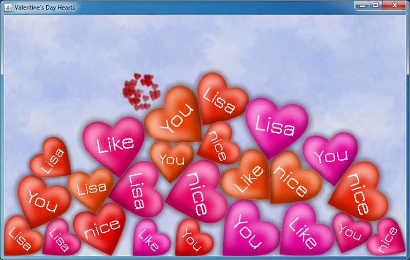
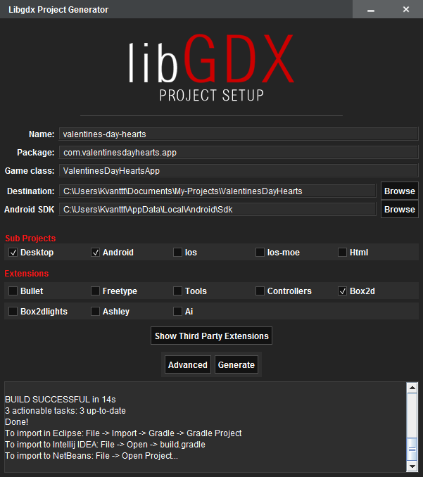
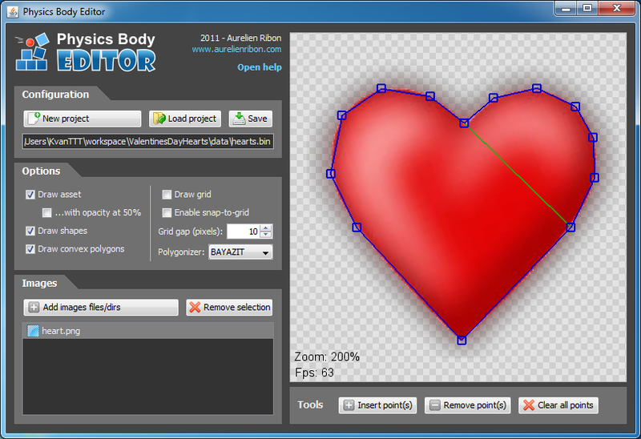
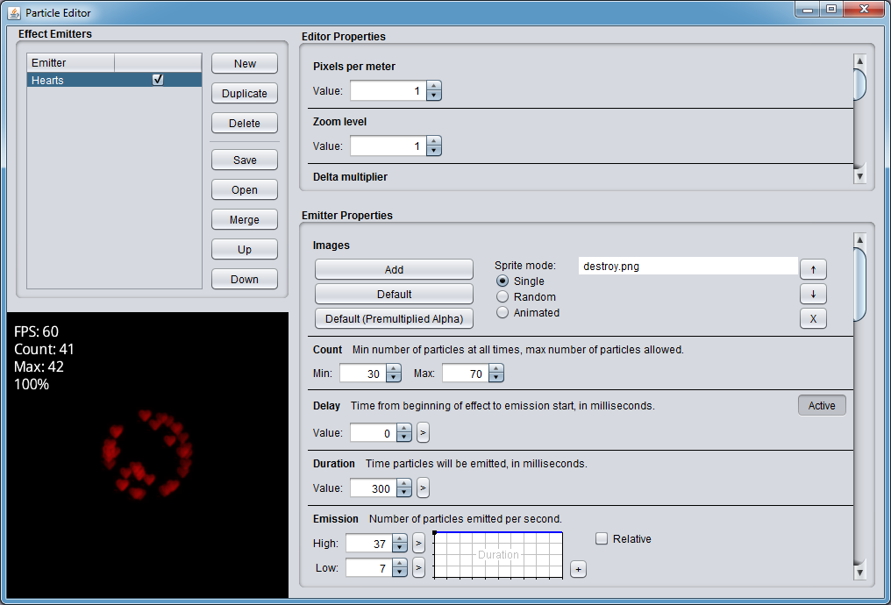

<linkmap src=HeaderImageLink dst=https://habr.com/en/post/440298 />
<include src=Links.ignore.md />

# Valentine's Day Application on Libgdx

Every year there are a lot of articles dedicated to Valentine's Day. I also
decided to get involved in this topic and create something original and unusual.
The idea was to create a simple Android application with hearts that would have
their physical models and interact with each other. Then I added text, sounds,
particles and some other effects. The resulting app was working and quite
original! In this article I will describe the creation process, as well as the
capabilities and pitfalls of the [**libgdx**](https://libgdx.badlogicgames.com/)
library.

.

<cut/>

## Contents

* [Programs and tools](#programs-and-tools)
* [Hello World](#hello-world)
* [General](#general)
* [Textures](#textures)
* [Fonts](#fonts)
* [Physics](#physics)
* [Particle system](#particle-system)
* [Sounds](#sounds)
* [Conclusion](#conclusion)
* [Source code and executables](#source-code-and-executables)

## Programs and tools

To implement this idea, I used the following programs and libraries:

1. [**IntelliJ IDEA**](http://en.wikipedia.org/wiki/IntelliJ_IDEA) - an IDE for
   cross-platform applications. Alternatively you can use
   [Android Studio](https://developer.android.com/studio/),
   [Eclipse](https://www.eclipse.org/).
2. [**libgdx**](https://libgdx.badlogicgames.com/) - a cross-platform (PC, Mac,
   Linux, Android) Java-library for developing games and other graphical
   applications. This library is distributed under the Apache License 2.0. Some
   code snippets were optimized using JNI (for example, Box2d).
3. [**box2d-editor**](https://github.com/MovingBlocks/box2d-editor) - an editor
   for creating physical models used in the physical engine `box2d`, which is built
   into `libgdx`. Here it will be used for matching the image of the heart with
   its physical model.
4. [**Hiero bitmap font generator**](https://github.com/libgdx/libgdx/wiki/Hiero) -
   a program to convert vector fonts to raster (since in `libgdx` only raster fonts
   are supported).
5. [**Particle Editor**](https://github.com/libgdx/libgdx/wiki/2D-Particle-Editor) -
   an editor for creating particle systems, developed by the creator of `libgdx`.
   It is used for particles in the "explosion" effect during the destruction of
   the heart.
6. [**Paint.NET**](http://www.getpaint.net/index.html) - an image editor,
   it was used to edit the image of the heart and to create the background.

All these programs and components are freely distributed, and this is a big
plus. I have chosen `libgdx`, because, firstly, I already have some experience
with it, and, secondly, using `libgdx` you have no need in a slow Android
emulator, since it is cross-platform and allows testing applications in native
Java environment and then compiling them for Android.

## Hello World

First, I’ll tell in a few words how to create libgdx projects. Using
`gdx-setup.jar`, generate a project template (based on Gradle), which specifies
target platforms. Currently, `Desktop`, `Android`, `Ios`, `Html` are supported.
To be honest, I failed to try the last two of them, as I don't have an iOS
device, and there are some difficulties with HTML that I haven't resolved yet.



You can also select the extensions you will use. In our case, this is the Box2d
physics library.

However, all this is described in the wiki: [Creating a libgdx
project](https://github.com/libgdx/libgdx/wiki/Project-Setup-Gradle).

After generation, three folders are created:

* core
* desktop
* android

In the last two, `DesktopLauncher` and `AndroidLauncher` respectively are
placed, which look like this:

```java
public class DesktopLauncher {
	public static void main (String[] arg) {
		LwjglApplicationConfiguration config = new LwjglApplicationConfiguration();
		config.width = 800;
		config.height = 480;
		new LwjglApplication(new ValentinesDayHeartsApp(), config);
	}
}
```

```java
public class AndroidLauncher extends AndroidApplication {
	@Override
	protected void onCreate (Bundle savedInstanceState) {
		super.onCreate(savedInstanceState);
		AndroidApplicationConfiguration config = new AndroidApplicationConfiguration();
		initialize(new ValentinesDayHeartsApp(), config);
	}
}
```

There will be no more code specifically for the Android platform, which is a
great advantage of the chosen library. It only remains to allow vibration and
disable sleep mode (to prevent the application state from being reset) in the
`AndroidManifest.xml` configuration. And also set the landscape orientation so
that the world will not turn upside down:

```html
<uses-permission android:name="android.permission.VIBRATE"/>
<uses-permission android:name="android.permission.WAKE_LOCK"/>
```

and

```html
android:screenOrientation="landscape"
```

The common code is stored in the `core` folder. The main class called
`ValentinesDayHeartsApp` implements `ApplicationListener` interface (for
handling initialization events, rendering, finalization and other states) and
`InputProcessor` interface (for handling user input).

That's all, the skeleton is ready! Now our application will run on both PC and
Android.

## General

The project has a simple structure: in the `ValentinesDayHeatsApp` class, the
`create`, `render`, `dispose`, `touchDown` methods are overridden. The `create`
method initializes all resources (textures, fonts, particles, sounds) and
creates the physical world. In the `render` method, rendering of all objects of
the world occurs:

```java
@Override
public void render() {
    updatePhysics();
    updateBackground();
    updateSprites();
    updateParticles();
    refresh();
    renderBackground();
    renderHearts();
    renderFonts();
    renderParticles();
}
```

In the `dispose` method, all resources are released. Yes, yes, despite the fact
that Java has automatic garbage collection, unmanaged resources (Box2d objects
and some others) still need to be manually released. The `touchDown` method is
triggered by a touch or a mouse click. It works like this: if a touch point
intersects with a heart, the heart is deleted. Otherwise, a new heart is created
in the touch point. The `Heart` object has the following properties:

* `Body` - a physical model.
* `Sprite` - a graphical model (sprite).
* `String` - a text displayed on the heart.
* `Font` - a font.
* `ParticleEffect` - particles created when destroying the heart.
* `BreakSound` - a sound of destroying the heart.

Next, I will describe the components of the application in more detail.

## Textures

First of all, I needed to find or draw the heart. Fortunately, I easily googled
it and then edited it a bit: added a glow and a transparent background. To load
textures in `libgdx`, I used the `Texture` class. Since the same texture can be
used several times, additional `Sprite` objects were used. They were drawn using
the `render` method. The position of the sprite and the angle are the parameters
of rendering and the physical model of the heart. For a change, I decided to
draw the hearts in different shades. I used the HSL palette, which allows to
manipulate hue, saturation and lightening, not color components like RGB. The
formula for RGB -\> HSL and HSL -\> RGB conversion can be easily found, and I
used the methods from the article [Manipulating colors in
.NET](http://www.codeproject.com/Articles/19045/Manipulating-colors-in-NET-Part-1)
on Java. All conversions are in `prepareHeartsTextures`, `prepareHslData` and
`generateHeartTexture` methods. Here is the example:

```java
Pixmap pixmap = new Pixmap(fileHandle);
float[][][] result = new float[pixmap.getWidth()][pixmap.getHeight()][4];
for (int i = 0; i < pixmap.getWidth(); i++)
    for (int j = 0; j < pixmap.getHeight(); j++) {
        int color = pixmap.getPixel(i, j);
        float r = (float)((color >> 24) & 0xFF) / 255.0f;
        float g = (float)((color >> 16) & 0xFF) / 255.0f;
        float b = (float)((color >> 8) & 0xFF) / 255.0f;
        float a = (float)(color & 0xFF) / 255.0f;
        result[i][j] = ColorUtils.RgbToHsl(r, g, b, a);
    }
return result;
```

Unfortunately, the Android app starts with some delay due to the generation of
textures with different shades.

## Fonts

Since `libgdx` can only work with raster fonts, I used **Hiero Bitmap Font
Generator** (version 5), which creates images of all characters in the PNG
format, and the FNT file, which contains information about the coordinates of
each character in the image. Here is the screenshot of this program: 

After the necessary files are generated, the font can be used in the libgdx
application as follows:

```java
font = new BitmapFont(
Gdx.files.internal("data/Jura-Medium.fnt"),
Gdx.files.internal("data/Jura-Medium.png"), false);
font.setColor(Color.WHITE);
```

And then render it like that:

```java
font.draw(spriteBatch, heart.String, screenPosition.x, screenPosition.y);
```

When rendering, I encountered some difficulties: for example, the font cannot be
rendered at an angle, as it can be done with a sprite. To solve this problem,
you need to change the projection matrix of `SpriteBatch`, and then render the
font as follows:

```java
Matrix4 projection = spriteBatch.getProjectionMatrix();
projection.setToOrtho2D(0, 0, WorldWidth, WorldHeight);
projection.translate(tmpVector1.x, tmpVector1.y, 0);
projection.rotate(0, 0, 1, body.getAngle() / (float)Math.PI * 180);
projection.translate(-tmpVector1.x, -tmpVector1.y, 0);
Vector2 stringSize = heart.getStringSize();
tmpVector1.add(heart.Size.x / PhysWorldWidth * WorldWidth * CenterDisplacement.x
				   - stringSize.x * 0.5f,
				   heart.Size.y /  PhysWorldHeight * WorldHeight * CenterDisplacement.y
				   + stringSize.y);
spriteBatch.begin();
BitmapFont.BitmapFontData fontData = font.getData();
fontData.setScale(heart.Size.x * FontSizeHeartSizeCoef.x, heart.Size.y * FontSizeHeartSizeCoef.y);
font.draw(spriteBatch, heart.String, tmpVector1.x, tmpVector1.y);
fontData.setScale(1, 1);
spriteBatch.end();
```

## Physics

As a physics engine, **box2d** was used.

To match the image of the heart with its physical model, I used
**box2d-editor**: .

Using this program, I created a polygon of the heart, which was automatically
broken into convex polygons. The physical model is a set of coordinates of these
polygons in JSON format.

Further, this file is used in our application (loading occurs in the `addHeart`
method). libgdx can only load files in binary format. Fortunately, the
[BodyEditorLoader.java](https://gist.github.com/zudov/5566204) class was found,
which can be used to load the model from JSON (i.e. textual representation) as
well.

Do not forget to set the density, friction and elasticity of the body:

```java
FixtureDef fdef = new FixtureDef();
fdef.density = 0.75f;
fdef.friction = 1.0f;
fdef.restitution = 0.4f;

bodyLoader.attachFixture(body, "Heart", fdef, newWidth);
body.resetMassData();
```

Now our hearts have a physical shell!

In order for the hearts not to fly off the screen, we can add four static
rectangles on the sides of our little world. On mobile devices, it is advisable
to set the gravity based on the device orientation:

```java
if (Gdx.app.getType() == ApplicationType.Android) {
    gravity.x = -Gdx.input.getPitch() / 90.0f;
    gravity.y = Gdx.input.getRoll() / 90.0f;
    gravity.mul(gravityCoef);
    world.setGravity(gravity);
}
```

## Particle system

In `libgdx`, the particle system is specified using special files that can be
generated in the editor: .

As you can see, this editor has a lot of settings: you can load different
textures, change the lifetime, the form of spreading, transparency and other
parameters. I made heart-shaped particles, which will appear when you tap the
screen and destroy one large physical heart. In the application, working with
particles occurs as follows:

### Initialization

```java
ParticleEffect effect = new ParticleEffect();
effect.load(Gdx.files.internal("data/destroy.p"), Gdx.files.internal("data"));
```

### Beginning of the life cycle

It is important not to forget about `start` without which the particles will not
be displayed:

```java
effect.setPosition(.., ..);
effect.start();
```

## Sounds

Sounds are loaded as follows:

```java
sound = Gdx.audio.newSound(Gdx.files.internal("path/to/file"));
```

And then are played like this:

```java
sound.play(1);
```

What could be easier? However, there are also pitfalls. For some reason, the
files can be loaded only in the OGG format and **96 kbit/s** bitrate.

## Conclusion

I hope that the techniques described in this article will be useful to many of
you for developing games using `libgdx`. You can use the source code and
resources. Send applications for Valentine's Day to your sweethearts :)

It is worth noting that the text displayed on the hearts can be changed in the
`data/words.txt` file. It works even without recompilation.

## Source code and executables

* Source code: <https://github.com/KvanTTT/ValentinesDayHearts>
* Cross-platform executable JAR file:
[ValentinesDayHearts-1.1.jar](https://github.com/KvanTTT/ValentinesDayHearts/releases/download/1.1/ValentinesDayHearts-1.1.jar)
* APK file for Android:
[ValentinesDayHearts-1.1.apk](https://github.com/KvanTTT/ValentinesDayHearts/releases/download/1.1/ValentinesDayHearts-1.1.apk)
