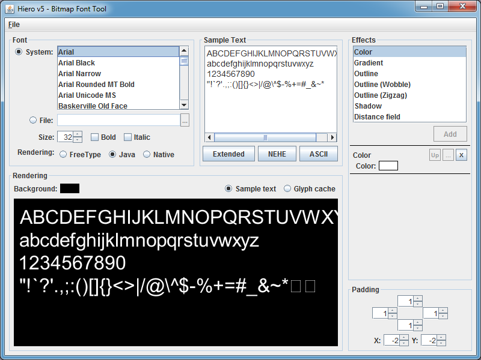

# Приложение в честь Дня святого Валентина на libgdx

Привет, Хабр! Вспомнил я тут недавно, что скоро **День святого
Валентина** и на хабре год назад (и не только) были какие-то топики,
касающиеся его. Я решил поддержать данную традицию и сделать в этом году
тоже что-нибудь оригинальное и необычное, а позже написать об этом
топик. И решил я создать простенькое приложение под Android с
сердечками, которые бы имели свои физические модели и взаимодействовали
друг с другом. Это было легко и быстро реализовано. Далее я добавил текст,
звуки, частицы и некоторые другие красивости. В результате получилось даже
что-то вменяемое и оригинальное, о чем я и поспешу рассказать в этой статье,
а заодно и описать замечательную кроссплатформенную библиотеку **libgdx**.

.

## Содержание

* [Программы и инструменты](#Программы-и-инструменты)
* [Hello World](#hello-world)
* [Общее](#Общее)
* [Текстуры](#Текстуры)
* [Шрифты](#Шрифты)
* [Физика](#Физика)
* [Система частиц](#Система-частиц)
* [Звуки](#Звуки)
* [Заключение](#Заключение)
* [Исходники и исполняемые файлы](#Исходники-и-исполняемые-файлы)

## Программы и инструменты

Для реализации своей задумки я использовал
следующие программы и библиотеки:

1. [**Eclipse**](http://ru.wikipedia.org/wiki/Eclipse_(среда_разработки)) -
   свободная интегрированная среда разработки модульных и
   кроссплатформенных приложений. Также возможно подходят [IntelliJ
   IDEA](http://ru.wikipedia.org/wiki/IntelliJ_IDEA) и
   [NetBeans](http://ru.wikipedia.org/wiki/NetBeans).
2. [**ADT Plugin for
   Eclipse**](http://developer.android.com/sdk/eclipse-adt.html) -
   плагин для eclipse, позволяющий создавать и компилировать проекты
   под Android.
3. [**libgdx**](https://libgdx.badlogicgames.com/) - кроссплатформенная
   (PC, Mac, Linux, Android) Java-библиотека для разработки игр и не
   только. Эта библиотека распространяется под лицензией Apache License
   2.0. Некоторые участки кода оптимизированы с помощью JNI (например
   Box2d).
4. [**box2d-editor**](https://github.com/MovingBlocks/box2d-editor) -
   Редактор для создания физических моделей, используемых в физическом
   движке box2d, который встроен в libgdx. Здесь он будет
   использоваться для сопоставления рисунка сердечка и его физической
   модели.
5. [**Hiero bitmap font
   generator**](https://github.com/libgdx/libgdx/wiki/Hiero) -
   Программа для конвертации векторных шрифтов в растровые (поскольку
   только такие могут использоваться в libgdx).
6. [**Particle
   Editor**](https://github.com/libgdx/libgdx/wiki/2D-Particle-Editor) - редактор
   для создания систем частиц, написанный автором libgdx. У нас он
   будте использоваться для создания эффекта во время уничтожения
   сердечка.
7. [**Paint.NET**](http://www.getpaint.net/index.html) я использовал
   для редактирования изображения сердечка, найденного на просторах
   интернета, и создания фона.

Как видим, все программы и компоненты свободно распространяются, а это
большой плюс. Мой выбор пал на библиотеку libgdx, потому что, во-первых,
я уже имею некоторый опыт работы с ней, а, во-вторых, при ее использовании
отпадает необходимость в тормознутом android эмуляторе, поскольку она является
кроссплатформенной и позволяет тестировать приложения в нативном java окружением
с последующей компиляцией под зелененького.

## Hello World

Итак, сначала я в двух словах расскажу как создавать проекты на libgdx в
eclipse. Для десктопа создается обычный Java проект (`File -> New ->
Java Project`) и добавляются необходимые внешние libgdx библиотеки
(Правый клик на проекте `-> Java Build Path -> Libraries`). Их четыре:

* gdx.jar
* gdx-backend-jogl.jar
* gdx-backend-jogl-natives.jar
* gdx-natives.jar

Затем создается Android проект (`File -> New ->
Other -> Android Project`), аналогично добавляются библиотеки:

* gdx.jar
* gdx-backend-android.jar
* armeabi
* armeabi-v7a

Затем добавляется ссылка на наш первый созданный
проект (Правый клик на проекте `-> Java Build Path -> Projects`). После
этого в первом проекте (пусть он называется `ValentinesDayHearts`) нужно
создать класс `ValentinesDayHearts`, который будет реализовывать
интерфейсы `ApplicationListener` (для обработки событий инициализации,
рендера, финализации и других состояний), а также `InputProcessor`
(для того, чтобы обрабатывать пользовательский ввод). Далее создаем
класс `DesktopStarter` с точкой входа `main`:

```java
public static void main(String[] args) {
    new JoglApplication(new ValentinesDayHearts(), "Valentine's Day Hearts", 800, 480, false);
}
```

И в проекте под Android создается `ValentinesDayHeartsActivity`:

```java
public class ValentinesDayHeartsActivity extends AndroidApplication {
    @Override
    public void onCreate(Bundle savedInstanceState) {
        super.onCreate(savedInstanceState);
        initialize(new ValentinesDayHearts(), false);
    }
}
```

Больше кода в android проекте не будет.

Единственно, нужно добавить разрешения (permissions) в конфигурацию приложения
Android (вибрация и запрещение спящего режима, чтобы не сбрасывалось состояние приложения),
а также установить альбомную ориентацию (чтобы мир не переворачивался):

```html
<uses-permission android:name="android.permission.VIBRATE"/>
<uses-permission android:name="android.permission.WAKE_LOCK"/>
```

и

```html
android:screenOrientation="landscape"
```

Все, каркас готов! Теперь данное приложение будет компилиться и под PC и
под Android.

## Общее

Данное приложение небольшое по размеру и имеет простую структуру: в
классе ValentinesDayHeats перегружаются методы `create`, `render`, `dispose`,
`touchDown`. В методе `create` происходит инициализация всех ресурсов
(текстуры, шрифты, частицы, звуки), создание физического мира. В методе
`render` происходит просчет и отрисовка всех объектов мира:

```java
@Override
public void render() {
	updatePhysics();
	updateBackground();
	updateSprites();
	updateParticles();
	refresh();
	renderBackground();
	renderHearts();
	renderFonts();
	renderParticles();
}
```

В методе `dispose` - освобождение всех ресурсов. Да, да, несмотря на
то, что в java есть сборка мусора, неуправляемые ресурсы (объекты Box2d
и некоторые другие) все равно надо освобождать в ручную. Правда в связи
со спешкой я не особо заморачивался с этим. Метод `touchDown`
срабатывает на клик мышкой или прикосновение к тачскрину. Если точка
соприкосновения пересекается с некоторым сердечком, то оно удаляется. В
противном случае, новое сердечко создается в месте клика. Объект
\"сердце\" `Heart` имеет следующие свойства:

* **Body** - физическая модель.
* **Sprite** - графическая модель (спрайт).
* **String** - отображаемый на сердце текст.
* **Font** - шрифт, которым рисуется текст.
* **ParticleEffect** - создающиеся при уничтожении частицы.
* **BreakSound** - звук при уничтожении.

Далее я вкратце опишу аспекты разрабатываемого приложения.

## Текстуры

Первоочередной задачей являлась задача поиска или создания графических
ресурсов. Недолго думая, я нагуглил изображение сердечка и немного его
подредактировал (добавил свечение и сделал прозрачный фон). Для
загрузки текстур в libgdx используется класс `Texture`, но, так одну и
ту же текстуру могут использовать несколько раз, вводятся дополнительные
объекты `Sprite`. Спрайты же отрисовываются в методе `render`.
Параметрами отрисовки являются позиция спрайта и его угол. Эти параметры
являются параметрами физической модели сердечка. Для разнообразия я
решил сделать так, чтобы сердца имели цвета с различными оттенками.
Для этого я использовал палитру HSL, которая позволяет манипулировать оттенком,
насыщенностью и осветленностью, а не непосредственно цветами как RGB.
Формулу преобразования RGB -\> HSL и HSL -\> RGB можно легко нагуглить, а я же
переписал методы некой [C\# библиотеки](http://www.codeproject.com/Articles/19045/Manipulating-colors-in-NET-Part-1)
на Java. В моем коде все преобразования цвета находятся в методах
`prepareHeartsTextures`, `prepareHslData` и
`generateHeartTexture`. Вот пример одного из методов:

```java
Pixmap pixmap = new Pixmap(fileHandle);
float[][][] result = new float[pixmap.getWidth()][pixmap.getHeight()][4];
for (int i = 0; i < pixmap.getWidth(); i++)
	for (int j = 0; j < pixmap.getHeight(); j++) {
		int color = pixmap.getPixel(i, j);
		float r = (float)((color >> 24) & 0xFF) / 255.0f;
		float g = (float)((color >> 16) & 0xFF) / 255.0f;
		float b = (float)((color >> 8) & 0xFF) / 255.0f;
		float a = (float)(color & 0xFF) / 255.0f;
		result[i][j] = ColorUtils.RgbToHsl(r, g, b, a);
	}
return result;
```

Кстати, из-за этих генераций текстур с разными оттенками, Android
приложение загружается с некоторой задержкой.

## Шрифты

Так как libgdx умеет работать только с растровыми шрифтами, я
использовал программу **Hiero Bitmap Font Generator**, которая создает
изображения всех символов в формате png и файл fnt, который содержит
информацию о координатах каждого символа на изображении. Вот скрин этой
программы: 

После того, как необходимые файлы сгенерированы, шрифт можно
использовать в нашем libgdx приложении так:

```java
font = new BitmapFont(
Gdx.files.internal("data/Jura-Medium.fnt"),
Gdx.files.internal("data/Jura-Medium.png"), false);
font.setColor(Color.WHITE);
```

и потом рендерить так:

```java
font.draw(spriteBatch, heart.String, screenPosition.x, screenPosition.y);
```

При рендере я столкнулся с некоторыми тонкостями: например, шрифт нельзя
рендерить под углом, как это можно делать со спрайтом. Для решения этой
проблемы нужно изменять проективную матрицу у `SpriteBatch`, а затем
рендерить шрифт следующим образом:

```java
projection.translate(rotationCenter.x, rotationCenter.y, 0);
projection.rotate(0, 0, 1, body.getAngle() / (float)Math.PI * 180);
projection.translate(-rotationCenter.x, -rotationCenter.y, 0);

spriteBatch.begin();
font.setScale(heart.Size.x * FontSizeHeartSizeCoef.x, heart.Size.y * FontSizeHeartSizeCoef.y);
font.draw(spriteBatch, heart.String, screenPosition.x, screenPosition.y);
font.setScale(1, 1);
spriteBatch.end();
```

## Физика

Думаю, что по box2d любой желающий сможет найти много материала в интернете.
Так что подробно на нем останавливаться не буду,
а лучше расскажу о взаимодействии libgdx и box2d и создании физической
модели для сердечка. Для сопоставления графической и физической моделей
я воспользовался **box2d-editor**: 
Данная программа генерирует файл в форматах bin, xml или json.
Далее эти файлы используются в приложении (загрузка происходит в методе `addHeart`).
При загрузке моделей я столкнулся с проблемой, что загруженные тела не вращаются.
Немного погуглив, я понял, что для этого им нужно задать плотность,
трение и упругость. Но данное действие не исправило проблему. Позже
решение все-таки было найдено: после присвоения вышеупомянутых
характеристик телу, нужно вызывать функцию `resetMassData`:

```java
BodyDef heartBodyDef = new BodyDef();
heartBodyDef.type = BodyType.DynamicBody;
heartBodyDef.angle = ..;
heartBodyDef.position.x = ..;
heartBodyDef.position.y = ..;
Body body = world.createBody(heartBodyDef);

fixtureAtlas.createFixtures(body, "heart.png", newWidth, newHeight);
for (int j = 0; j < body.getFixtureList().size(); j++) {
	Fixture fixture = body.getFixtureList().get(j);
	
	fixture.setFilterData(filter);
	fixture.setFriction(0.75f);
	fixture.setDensity(1.0f);
	fixture.setRestitution(0.4f);
}
 
body.resetMassData();
```

Для того, чтобы сердца не улетали за экран, по бокам в нашем мирке
просто создаются четыре статичных прямоугольника. На Android телефонах
хорошо бы менять гравитацию в зависимости от ориентации телефона,
подумал я. Сказано, сделано:

```java
if (Gdx.app.getType() == ApplicationType.Android) {
	gravity.x = -Gdx.input.getPitch() / 90.0f;
	gravity.y = Gdx.input.getRoll() / 90.0f;
	gravity.mul(gravityCoef);
	world.setGravity(gravity);
}
```

## Система частиц

В libgdx система частиц задается с помощью специальных файлов, которые
могут быть сгенерированы в редакторе: .

Как видно, этот редактор имеет достаточно много настроек: можно
загружать различные текстуры, менять время жизни, форму распространения,
прозрачность и другие. Я же сделал частицы в виде сердечек,
которые будут появляться при нажатии и уничтожении одного физического
сердечка. В приложении я работаю с частицами следующим образом:

### Инициализация

```java
ParticleEffect effect = new ParticleEffect();
effect.load(Gdx.files.internal("data/destroy.p"), Gdx.files.internal("data"));
```

### Начало жизненного цикла

Важно не забыть про `start` без которого частицы не будут отображаться:

```java
effect.setPosition(.., ..);
effect.start();
```

## Звуки

Звуки загружаются следующим образом:

```java
sound = Gdx.audio.newSound(Gdx.files.internal(путь к файлу));
```

и затем проигрываются так:

```java
sound.play(1);
```

Казалось бы, что может быть проще? Ан нет - здесь тоже есть свои
подводные камни. Дело в том, что у меня почему-то загружались файлы
только в формате **.ogg** и битрейте **96 кБит/сек**. Не знаю почему, но
загрузка других файлов не работала.

## Заключение

Надеюсь описанные в статье знания будут полезны многим, и они пригодятся в
для разработки игр с использованием libgdx. Исходники и ресурсы разрешается
использовать всем. А также дарите готовые приложения на День святого Валентина
своим половинкам :)

Стоит отметить, что все слова, отображаемые на сердечках, можно менять в
файле `data/words.txt`. Это работает даже без перекомпиляции.

## Исходники и исполняемые файлы

* [Исходники](https://github.com/KvanTTT/ValentinesDayHearts)
* [Кроссплатформенный jar исполняемый
файл](https://github.com/KvanTTT/ValentinesDayHearts/releases/download/1.0/ValentinesDayHearts.zip)
* [Apk файл для Android](https://github.com/KvanTTT/ValentinesDayHearts/releases/download/1.0/ValentinesDayHeartsAndroid.apk)