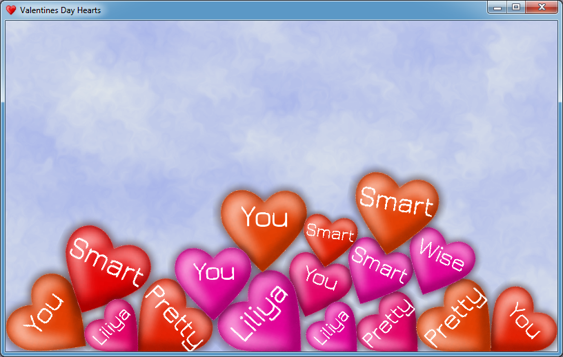
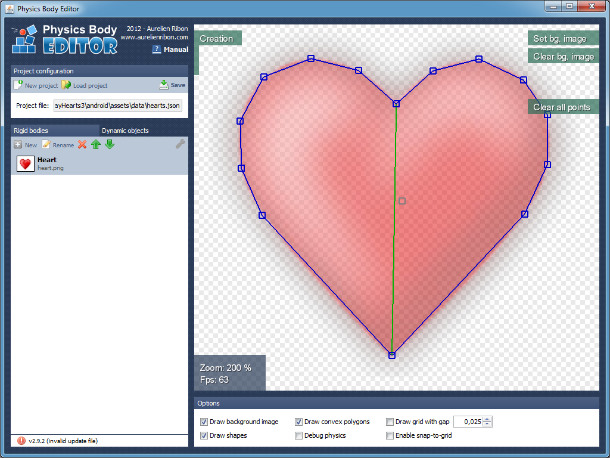

<linkmap src=HeaderImageLink dst=https://habr.com/ru/post/137861 />
<include src=Links.ignore.md />

# Приложение в честь Дня святого Валентина на libgdx

Периодически появляются топики, посвященные дню Валентина.
В этом году я тоже решился включиться в эту тему и сделать что-нибудь оригинальное
и необычное. Было решено создать простенькое приложение под Android с сердечками,
которые бы имели свои физические модели и взаимодействовали
друг с другом. Позже я добавил текст, звуки, частицы и некоторые другие красивости.
В результате получилось даже что-то вменяемое и оригинальное!
В данной статье описывается процесс создания вместе описанием возможностей и
подводных камней библиотеки **libgdx**.

.

<cut/>

## Содержание

* [Программы и инструменты](#Программы-и-инструменты)
* [Hello World](#hello-world)
* [Общее](#Общее)
* [Текстуры](#Текстуры)
* [Шрифты](#Шрифты)
* [Физика](#Физика)
* [Система частиц](#Система-частиц)
* [Звуки](#Звуки)
* [Заключение](#Заключение)
* [Исходники и исполняемые файлы](#Исходники-и-исполняемые-файлы)

## Программы и инструменты

Для реализации задумки использовались следующие программы и библиотеки:

1. [**IntelliJ IDEA**](http://ru.wikipedia.org/wiki/IntelliJ_IDEA) -
   свободная среда разработки модульных и кроссплатформенных приложений.
   В качестве альтернативы подходит [Android Studio](https://developer.android.com/studio/),
   [Eclipse](https://www.eclipse.org/).
3. [**libgdx**](https://libgdx.badlogicgames.com/) - кроссплатформенная
   (PC, Mac, Linux, Android) Java-библиотека для разработки игр и не
   других графических приложений. Эта библиотека распространяется под лицензией
   Apache License 2.0. Некоторые участки кода оптимизированы с помощью JNI (например
   Box2d).
4. [**box2d-editor**](https://github.com/MovingBlocks/box2d-editor) -
   Редактор для создания физических моделей, используемых в физическом
   движке box2d, который встроен в libgdx. Здесь он будет
   использоваться для сопоставления рисунка сердечка и его физической
   модели.
5. [**Hiero bitmap font generator**](https://github.com/libgdx/libgdx/wiki/Hiero) -
   Программа для конвертации векторных шрифтов в растровые (поскольку
   в libgdx поддерживаются только растровые).
6. [**Particle Editor**](https://github.com/libgdx/libgdx/wiki/2D-Particle-Editor) -
   редактор для создания систем частиц от автора libgdx. Используется для частиц
   в эффекте "взрыва" при уничтожении сердечка.
7. [**Paint.NET**](http://www.getpaint.net/index.html) - использовался
   для редактирования изображения сердечка и создания фона.

Все программы и компоненты свободно распространяются, а это
большой плюс. Мой выбор пал на библиотеку libgdx, потому что, во-первых,
я уже имею некоторый опыт работы с ней, а, во-вторых, при ее использовании
отпадает необходимость в медленном Android эмуляторе, поскольку она является
кроссплатформенной и позволяет тестировать приложения в нативном java окружением
с последующей компиляцией под "зелененького".

## Hello World

Сначала я в двух словах расскажу как создавать проекты libgdx.
С помощью `gdx-setup.jar` генерируется шаблон проекта (на основе Grandle),
в котором указываются нужные целевые платформы.
В настоящий момент поддерживаются `Desktop`, `Android`, `Ios`, `Html`.
Правда последние два попробовать не удалось, т.к. не обладаю Ios операционной системой,
а с Html возникли сложности, решить которые пока что не удалось.


Также сразу же можно выбрать используемые расширения. В нашем случае - это библиотека
физики Box2d.

Впрочем, все это подробно расписано в вики: [Creating a libgdx project](https://github.com/libgdx/libgdx/wiki/Project-Setup-Gradle).

После генерации создается три папки:

* core
* desktop
* android

В двух последних помещаются лаунчеры под соответствующие платформы
`DesktopLauncher` и `AndroidLauncher`, которые выглядят так:

```java
public class DesktopLauncher {
	public static void main (String[] arg) {
		LwjglApplicationConfiguration config = new LwjglApplicationConfiguration();
		config.width = 800;
		config.height = 480;
		new LwjglApplication(new ValentinesDayHeartsApp(), config);
	}
}
```

```java
public class AndroidLauncher extends AndroidApplication {
	@Override
	protected void onCreate (Bundle savedInstanceState) {
		super.onCreate(savedInstanceState);
		AndroidApplicationConfiguration config = new AndroidApplicationConfiguration();
		initialize(new ValentinesDayHeartsApp(), config);
	}
}
```

Специфичного под Android кода больше не будет, что является большим достоинством
выбранной библиотеки. Единственно, нужно разрешить вибрацию и запрет спящего режима
(чтобы мир не сбрасывался ) в конфигурации `AndroidManifest.xml`.
А также установить альбомную ориентацию, чтобы мир не переворачивался:

```html
<uses-permission android:name="android.permission.VIBRATE"/>
<uses-permission android:name="android.permission.WAKE_LOCK"/>
```

и

```html
android:screenOrientation="landscape"
```

В core хранится общий код. Главным классом является `ValentinesDayHeartsApp`,
который реализует интерфейсы `ApplicationListener`
для обработки событий инициализации, рендера, финализации и других состояний
и `InputProcessor` для того чтобы можно было обрабатывать пользовательский ввод.

Все, каркас готов! Теперь данное приложение будет работать и под PC и под Android.

## Общее

Проект имеет простую структуру: в классе `ValentinesDayHeatsApp` перегружаются
методы `create`, `render`, `dispose`, `touchDown`. В методе `create` происходит
инициализация всех ресурсов (текстуры, шрифты, частицы, звуки),
создание физического мира. В методе `render` происходит просчет и отрисовка всех
объектов мира:

```java
@Override
public void render() {
    updatePhysics();
    updateBackground();
    updateSprites();
    updateParticles();
    refresh();
    renderBackground();
    renderHearts();
    renderFonts();
    renderParticles();
}
```

В методе `dispose` - освобождение всех ресурсов. Да, да, несмотря на
то, что в Java есть автоматическая сборка мусора, неуправляемые ресурсы (объекты
Box2d и некоторые другие) все равно необходимо освобождать вручную. Метод `touchDown`
срабатывает на клик мышкой или прикосновение к тачскрину. Работает так: если точка
соприкосновения пересекается с некоторым сердечком, то оно удаляется. В
противном случае, новое сердечко создается в месте клика. Объект
\"сердце\" `Heart` имеет следующие свойства:

* `Body` - физическая модель.
* `Sprite` - графическая модель (спрайт).
* `String` - отображаемый на сердце текст.
* `Font` - шрифт, которым рисуется текст.
* `ParticleEffect` - создающиеся при уничтожении частицы.
* `BreakSound` - звук при уничтожении.

Далее я опишу компоненты приложения подробней.

## Текстуры

Сперва надо было найти или создать непосредственно само сердечко. К счастью, я
его легко нагуглил, а затем немного отредактировал: добавил свечение и
прозрачный фон. Для загрузки текстур в libgdx использовал класс `Texture`.
Так как одна и та же текстура может быть задействована несколько раз, использовались
дополнительные объекты `Sprite`. Они отрисовываются в методе `render`.
Позиция спрайта и угол являются параметрами отрисовки и физической
модели сердечка. Для разнообразия я решил сделать так, чтобы сердца имели цвета
с различными оттенками. Для этого использовалась палитра HSL, которая позволяет
манипулировать оттенком, насыщенностью и осветленностью, а не непосредственно
компонентами цвета как RGB. Формулу преобразования RGB -\> HSL и HSL -\> RGB
можно легко найти, а я портировал методы из статьи
[Manipulating colors in .NET](http://www.codeproject.com/Articles/19045/Manipulating-colors-in-NET-Part-1)
на Java. Все преобразования находятся в методах
`prepareHeartsTextures`, `prepareHslData` и `generateHeartTexture`. Вот пример одного:

```java
Pixmap pixmap = new Pixmap(fileHandle);
float[][][] result = new float[pixmap.getWidth()][pixmap.getHeight()][4];
for (int i = 0; i < pixmap.getWidth(); i++)
    for (int j = 0; j < pixmap.getHeight(); j++) {
        int color = pixmap.getPixel(i, j);
        float r = (float)((color >> 24) & 0xFF) / 255.0f;
        float g = (float)((color >> 16) & 0xFF) / 255.0f;
        float b = (float)((color >> 8) & 0xFF) / 255.0f;
        float a = (float)(color & 0xFF) / 255.0f;
        result[i][j] = ColorUtils.RgbToHsl(r, g, b, a);
    }
return result;
```

К сожалению, Android приложение загружается с некоторой задержкой из-за генерации
текстур с разными оттенками.

## Шрифты

Так как libgdx умеет работать только с растровыми шрифтами, я
использовал программу **Hiero Bitmap Font Generator** (версия 5), которая создает
изображения всех символов в формате *png* и файл *fnt*, который содержит
информацию о координатах каждого символа на изображении. Вот скрин этой
программы: 

После того как необходимые файлы сгенерированы, шрифт можно использовать в
libgdx приложении следующим образом:

```java
font = new BitmapFont(
Gdx.files.internal("data/Jura-Medium.fnt"),
Gdx.files.internal("data/Jura-Medium.png"), false);
font.setColor(Color.WHITE);
```

и потом рендерить так:

```java
font.draw(spriteBatch, heart.String, screenPosition.x, screenPosition.y);
```

При рендере я столкнулся с некоторыми нюансами: например, шрифт нельзя
рендерить под углом, как это можно делать со спрайтом. Для решения этой
проблемы нужно изменять проективную матрицу у `SpriteBatch`, а затем
рендерить шрифт следующим образом:

```java
Matrix4 projection = spriteBatch.getProjectionMatrix();
projection.setToOrtho2D(0, 0, WorldWidth, WorldHeight);
projection.translate(tmpVector1.x, tmpVector1.y, 0);
projection.rotate(0, 0, 1, body.getAngle() / (float)Math.PI * 180);
projection.translate(-tmpVector1.x, -tmpVector1.y, 0);
Vector2 stringSize = heart.getStringSize();
tmpVector1.add(heart.Size.x / PhysWorldWidth * WorldWidth * CenterDisplacement.x
				   - stringSize.x * 0.5f,
				   heart.Size.y /  PhysWorldHeight * WorldHeight * CenterDisplacement.y
				   + stringSize.y);
spriteBatch.begin();
BitmapFont.BitmapFontData fontData = font.getData();
fontData.setScale(heart.Size.x * FontSizeHeartSizeCoef.x, heart.Size.y * FontSizeHeartSizeCoef.y);
font.draw(spriteBatch, heart.String, tmpVector1.x, tmpVector1.y);
fontData.setScale(1, 1);
spriteBatch.end();
```

## Физика

В качестве физического движка использовался **box2d**.

Для сопоставления графической и физической моделей сердца
я использовал **box2d-editor**: 

С помощью данной программы я создал полигон сердечка, который автоматически
разбился на выпуклые многоугольники. Физическая модель по сути представляет
собой набор координат этих многоугольников в формате json.

Далее этот файл используются в приложении (загрузка происходит в методе `addHeart`).
libgdx умеет загружать файлы только в бинарном формате. К счастью, был найден
класс [BodyEditorLoader.java](https://gist.github.com/zudov/5566204),
с помощью которого можно загрузить модель и из JSON, т.е. текстового представления.

Не забываем задать плотность, трение и упругость телу:

```java
FixtureDef fdef = new FixtureDef();
fdef.density = 0.75f;
fdef.friction = 1.0f;
fdef.restitution = 0.4f;

bodyLoader.attachFixture(body, "Heart", fdef, newWidth);
body.resetMassData();
```

Все, теперь сердца обладают еще и физической оболочкой!

Для того, чтобы сердца не улетали за экран, по бокам в нашем мирке
просто создаются четыре статичных прямоугольника. На мобильных устройствах
целесообразно менять гравитацию в зависимости от ориентации:

```java
if (Gdx.app.getType() == ApplicationType.Android) {
    gravity.x = -Gdx.input.getPitch() / 90.0f;
    gravity.y = Gdx.input.getRoll() / 90.0f;
    gravity.mul(gravityCoef);
    world.setGravity(gravity);
}
```

## Система частиц

В libgdx система частиц задается с помощью специальных файлов, которые
могут быть сгенерированы в редакторе: .

Как видно, этот редактор имеет достаточно много настроек: можно
загружать различные текстуры, менять время жизни, форму распространения,
прозрачность и другие параметры. Я же сделал частицы в виде сердечек,
которые будут появляться при нажатии и уничтожении одного большого физического
сердечка. В приложении работа с частицами происходит следующим образом:

### Инициализация

```java
ParticleEffect effect = new ParticleEffect();
effect.load(Gdx.files.internal("data/destroy.p"), Gdx.files.internal("data"));
```

### Начало жизненного цикла

Важно не забыть про `start` без которого частицы не будут отображаться:

```java
effect.setPosition(.., ..);
effect.start();
```

## Звуки

Звуки загружаются следующим образом:

```java
sound = Gdx.audio.newSound(Gdx.files.internal("path/to/file"));
```

и затем проигрываются так:

```java
sound.play(1);
```

Казалось бы, что может быть проще? Однако здесь также есть свои
подводные камни. Дело в том, что почему-то загружались файлы
только в формате **.ogg** и битрейте **96 кБит/сек**.

## Заключение

Надеюсь описанные в статье знания будут полезны многим, и они пригодятся в
для разработки игр с использованием libgdx. Исходники и ресурсы разрешается
использовать всем. Дарите приложения на День святого Валентина своим половинкам :)

Стоит отметить, что все слова, отображаемые на сердечках, можно менять в
файле `data/words.txt`. Это работает даже без перекомпиляции.

## Исходники и исполняемые файлы

* Исходники: <https://github.com/KvanTTT/ValentinesDayHearts>
* Кроссплатформенный jar исполняемый
файл: [ValentinesDayHearts-1.1.jar](https://github.com/KvanTTT/ValentinesDayHearts/releases/download/1.1/ValentinesDayHearts-1.1.jar)
* Apk файл для Android: [ValentinesDayHearts-1.1.apk](https://github.com/KvanTTT/ValentinesDayHearts/releases/download/1.1/ValentinesDayHearts-1.1.apk)